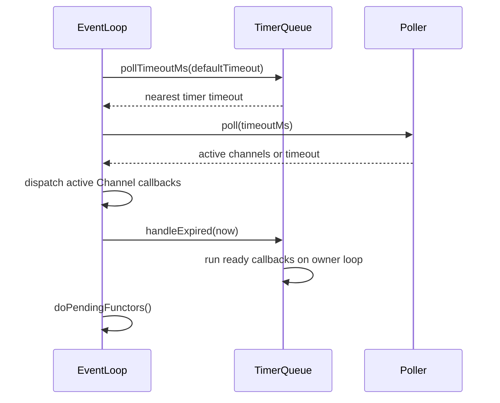

# TimerQueue —— 工程级源码拆解

## 1. 类定位

* **角色**：为单个 EventLoop 提供**基于 poll timeout 的定时任务管理**
* **层级**：Reactor 层（核心底层）
* 支持 one-shot 和 repeating 定时器，回调在 owner loop 线程执行

## 2. 解决的问题

**核心问题**：如何在 Reactor 框架中高效地管理多个定时器？

当前选择 poll timeout 而非 timerfd 的原因：
- 保持 Linux epoll 与 Windows select 后端共享同一 TimerQueue 实现
- 定时器仍由 owner EventLoop 驱动，不引入后台调度线程
- `TimerQueue` 不再拥有额外 fd/Channel，生命周期边界更窄
- 多个 timer 仍只需维护一个按到期时间排序的 map，EventLoop 每轮 poll 前取最近超时

## 3. 对外接口

| 方法 | 用途 | 线程安全 |
|------|------|----------|
| `addTimer(cb, when, interval)` | 添加定时器 | 跨线程安全 |
| `cancel(timerId)` | 取消定时器 | 跨线程安全 |

## 4. 核心成员变量

```cpp
EventLoop* loop_;                              // 所属 EventLoop
std::atomic<std::int64_t> nextSequence_;       // 定时器 ID 递增计数器（跨线程安全）
TimerMap timers_;                              // {Timestamp, sequence} → TimerPtr 有序映射
std::unordered_map<int64_t, TimerPtr> timersById_;  // sequence → TimerPtr 快速查找
```

### Timer 结构

```cpp
struct Timer {
    TimerCallback callback;          // 到期回调
    Timestamp expiration;            // 到期时间
    Duration interval;               // 重复间隔（0 = one-shot）
    int64_t sequence;                // 唯一 ID
    bool canceled{false};            // 是否已取消
    bool inQueue{true};              // 是否在 timers_ 中
};
```

## 5. 执行流程

### 5.1 添加定时器

```
addTimer(cb, when, interval):
  ├─ timer = make_shared<Timer>(cb, when, interval, nextSequence_++)
  ├─ timerId = TimerId(timer->sequence)
  ├─ isInLoopThread()? → addTimerInLoop(timer)
  │   else → runInLoop(addTimerInLoop(timer))
  └─ return timerId

addTimerInLoop(timer):
  ├─ timer->inQueue = true
  ├─ timersById_[seq] = timer
  ├─ timers_[{when, seq}] = timer
  └─ 下一轮 EventLoop::loop() 会用 timers_.begin() 计算 poll timeout
```

### 5.2 定时器触发

```
EventLoop::loop():
  ├─ timeoutMs = timerQueue_->pollTimeoutMs(defaultTimeout)
  ├─ poller_->poll(timeoutMs, activeChannels)
  ├─ dispatch active Channel callbacks
  ├─ timerQueue_->handleExpired(now)
  │   ├─ expired = getExpired(now)
  │   ├─ for timer in expired:
  │   │   if (!timer->canceled):
  │   │       timer->callback()
  │   └─ reset(expired, now)
  └─ doPendingFunctors()
```

### 5.3 getExpired

```cpp
std::vector<TimerPtr> getExpired(Timestamp now) {
    TimerKey sentry{now, INT64_MAX};       // 上界哨兵
    auto end = timers_.upper_bound(sentry); // 第一个 > now 的位置
    // timers_.begin() → end 就是所有已到期的
    for (it = begin; it != end; ++it) {
        it->second->inQueue = false;
        expired.push_back(it->second);
    }
    timers_.erase(begin, end);
    return expired;
}
```

### 5.4 reset（重复定时器）

```cpp
void reset(expired, now) {
    for (timer : expired) {
        if (timer->repeat() && !timer->canceled && timersById_ 中还存在) {
            timer->expiration = now + timer->interval;
            insert(timer);           // 重新插入 timers_
        } else {
            timersById_.erase(seq);  // one-shot 或已取消，清理
        }
    }
    // 不直接操作 OS timer fd；下一轮 EventLoop poll 前重新计算 timeout。
}
```

### 5.5 取消定时器

```
cancelInLoop(timerId):
  ├─ 在 timersById_ 中查找
  ├─ timer->canceled = true
  ├─ if (timer->inQueue):
  │   ├─ timers_.erase({expiration, seq})
  │   └─ timer->inQueue = false
  │   └─ timersById_.erase(seq)
  │   └─ 下一轮 poll 前自然重新计算 timeout
  └─ else:
      └─ timersById_.erase(seq)      // 已被 getExpired 取出
```

## 6. 关键交互关系

```
EventLoop
  │ owns
  ▼
TimerQueue
  │ owns
  └─ timers_ / timersById_ (timer metadata)
```

| 类 | 关系 |
|----|------|
| **EventLoop** | 拥有 TimerQueue，调用 addTimer/cancel |
| **Poller** | EventLoop 根据 TimerQueue 最近到期时间设置 poll timeout |
| **TcpServer** | 间接使用（IdleTimeout 通过 EventLoop::runAfter） |

## 7. 关键设计点

### 双索引结构

- `timers_`：`map<{Timestamp, seq}, TimerPtr>`，按到期时间排序，支持高效 getExpired
- `timersById_`：`unordered_map<seq, TimerPtr>`，支持 O(1) cancel

### TimerKey 包含 sequence

同一时刻可能有多个 timer 到期。`{Timestamp, sequence}` 保证唯一性和稳定顺序。

### canceled + inQueue 双标志

- `canceled`：标记已取消（即使已在 getExpired 返回列表中也能跳过）
- `inQueue`：标记是否在 timers_ 中（避免重复 erase）

### shared_ptr<Timer>

Timer 可能同时被 timers_、timersById_、getExpired 返回的 vector 持有，
shared_ptr 保证不会悬空。

### 跨平台 poll timeout 驱动

TimerQueue 不再注册 fd 到 Poller。EventLoop 仍保持固定执行顺序：



## 8. 潜在问题

### 大量定时器的性能

`std::map` 的 insert/erase 是 O(log n)。对于数万个定时器，可考虑时间轮（timing wheel）。
当前 v1 追求正确性，map 足够。

### 系统时钟调整

使用 `std::chrono::steady_clock`，不受系统时间调整影响。

## 9. 极简实现

```cpp
class MinimalTimerQueue {
    std::map<Timestamp, std::function<void()>> timers_;
public:
    void addTimer(std::function<void()> cb, Timestamp when) {
        timers_[when] = cb;
    }
    int pollTimeoutMs(int defaultTimeout) const {
        if (timers_.empty()) return defaultTimeout;
        return millisecondsUntil(timers_.begin()->first);
    }
    void handleExpired() {
        auto now = Timestamp::now();
        auto end = timers_.upper_bound(now);
        for (auto it = timers_.begin(); it != end; ++it)
            it->second();
        timers_.erase(timers_.begin(), end);
    }
};
```

## 10. 面试角度

**Q: 为什么现在用 poll timeout 而不是 timerfd？**
A: 为了让 Linux epoll 和 Windows select 共享同一 TimerQueue 语义，并避免 TimerQueue 拥有平台特定 fd。定时器仍在 owner EventLoop 上执行，没有绕开 reactor 调度。

**Q: 如何处理同一时刻多个 timer 到期？**
A: TimerKey 是 `{Timestamp, sequence}`，sequence 保证唯一性。getExpired 用 upper_bound 一次取出所有。

**Q: 取消一个已经 fire 但还没执行回调的 timer？**
A: getExpired 后、callback 执行前检查 `timer->canceled`。cancelInLoop 中设置 canceled=true，如果 timer 已不在 map 中（inQueue=false），只清理 timersById_ 索引。
