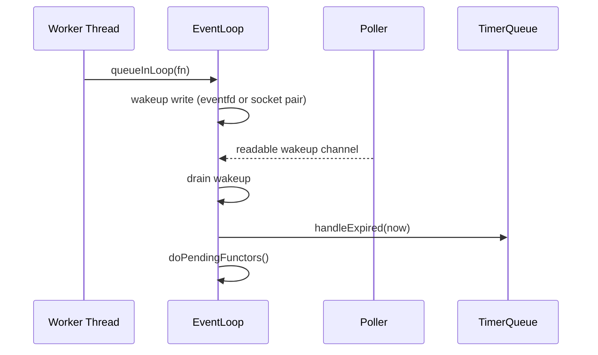

# Windows / VS2026 跨平台移植设计

## Intent

本次移植让 mini-trantor 在 Windows + Visual Studio 2026 / MSVC 下可构建，
同时保持现有 reactor 语义：Channel、Poller、EventLoop、TimerQueue、
TcpConnection 的线程归属和生命周期规则不变。

## 后端选择

- Linux: `Poller::newDefaultPoller()` 返回 `EPollPoller`。
- Windows: `Poller::newDefaultPoller()` 返回 `SelectPoller`。
- `Channel` 暴露 backend-neutral 事件：`kReadEvent`、`kWriteEvent`、`kErrorEvent`、`kCloseEvent`。
- `EPollPoller` 负责 epoll event 与 Channel event 的双向转换。
- `SelectPoller` 负责 WinSock `select()` fd_set 与 Channel event 的转换。

## Wakeup 与 Timer



Windows 没有 `eventfd` / `timerfd`。因此：

- `EventLoop` 在 Windows 使用 WinSock loopback socket pair 作为 wakeup 句柄。
- `TimerQueue` 不再注册 timer fd，而是让 EventLoop 在每轮 poll 前计算最近超时。
- 所有 timer callback 仍由 owner EventLoop 执行。

## Unsupported Platform Features

- `SignalWatcher` 基于 Linux `signalfd`，Windows 构造时显式抛出 unsupported。
- Linux UDP PMTU error queue / raw ICMP listener 在 Windows 上保持 capability=false。
- 这些 unsupported path 不影响普通 TCP/UDP、HTTP/WebSocket/RPC/KCP 编译。

## Build

```powershell
cmake --preset windows-vs2026-x64
cmake --build --preset windows-vs2026-x64
ctest --preset windows-vs2026-x64
```

如 OpenSSL 由 vcpkg 提供：

```powershell
cmake --preset windows-vs2026-x64 `
  -DCMAKE_TOOLCHAIN_FILE="$env:VCPKG_ROOT/scripts/buildsystems/vcpkg.cmake"
```

## Core Module Change Gate

1. **Loop / Thread**: `EventLoop` 仍由创建它的 owner thread 拥有；`SelectPoller`、`TimerQueue`、wakeup Channel 都只在该 owner thread 被驱动。
2. **Ownership / Release**: `EventLoop` owns `Poller`、`TimerQueue`、wakeup descriptors；`Poller` observes `Channel` and never owns it；`Socket` owns `SocketFd` unless `releaseFd()` transfers it upward.
3. **Re-entrant Callbacks**: Channel read/write/error/close callbacks、timer callbacks、pending functors 仍可能 re-enter public APIs such as `send()` / `shutdown()` / `queueInLoop()`，但 mutation 继续通过 owner loop。
4. **Cross-thread Operations**: `runInLoop()` / `queueInLoop()` / `quit()` / TCP send-shutdown paths marshal through EventLoop wakeup. Windows wakeup uses socket pair; Linux keeps eventfd.
5. **Test File Mapping**:
   - `tests/contract/event_loop/test_event_loop.cpp`
   - `tests/contract/timer_queue/test_timer_queue.cpp`
   - `tests/contract/channel/test_channel_contract.cpp`
   - `tests/contract/poller/test_poller_contract.cpp`
   - `tests/contract/tcp_connection/test_tcp_connection.cpp`
   - `tests/contract/tcp_client/test_tcp_client.cpp`
   - `tests/contract/tcp_server/test_tcp_server.cpp`
