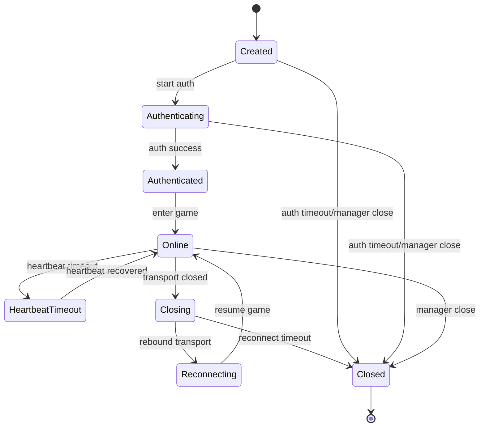
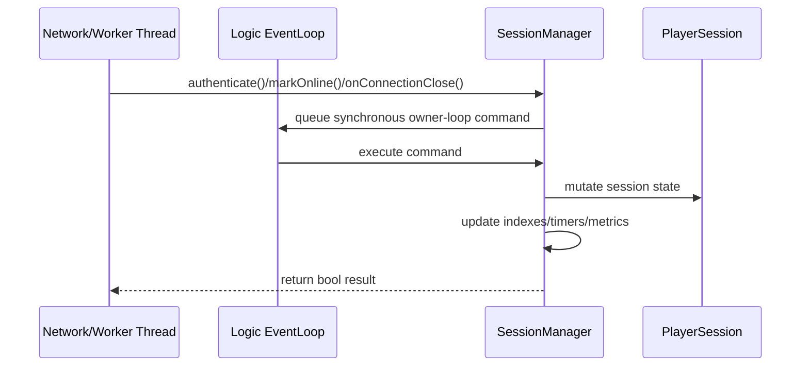
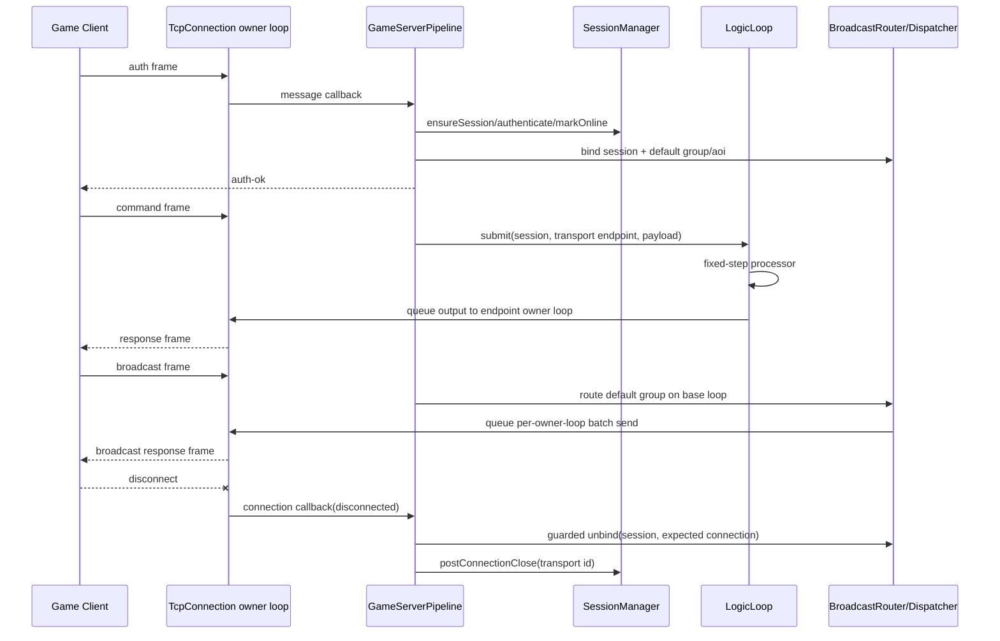
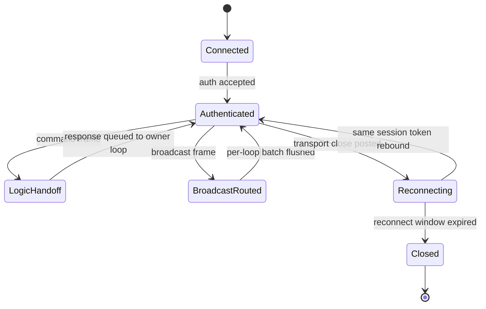
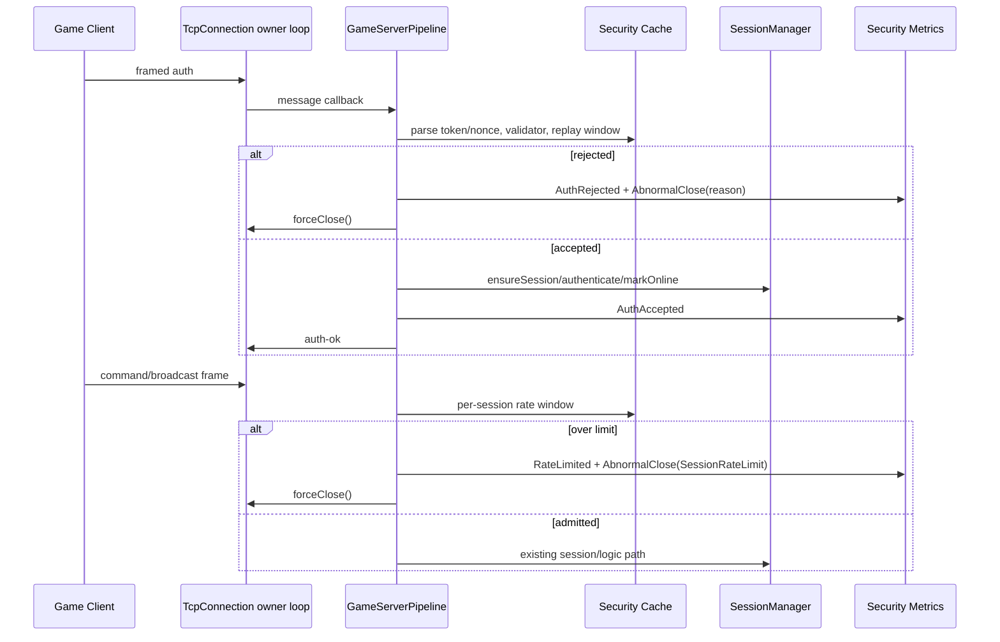

# 游戏服务器网络底座生命周期硬化说明

本说明记录游戏服务器网络底座审计后落地的生命周期与线程亲和修复。目标不是引入新的调度模型，而是把现有 Reactor 语义收紧成可测试契约。

## Intent Reference

- `rules/thread_affinity_rules.md`
- `rules/ownership_rules.md`
- `docs/roadmap_game_server_network_base_execution_plan.md`
- `intents/architecture/threading_model.intent.md`
- `intents/architecture/lifetime_rules.intent.md`
- `intents/modules/game_backpressure_policy.intent.md`
- `intents/modules/game_gateway_security.intent.md`
- `intents/modules/kcp_transport.intent.md`
- `intents/modules/path_mtu_cache.intent.md`
- `intents/modules/path_mtu_signal_authentication.intent.md`
- `intents/modules/platform_path_mtu_signal.intent.md`
- `intents/modules/metrics_exporter.intent.md`
- `intents/modules/udp.intent.md`
- `intents/modules/tcp_server.intent.md`
- `intents/modules/tcp_client.intent.md`

## PlayerSession 状态图



## SessionManager 跨线程状态推进



约束：
- `PlayerSession` 状态迁移由 `SessionManager` 收口；当存在 owner logic loop 且调用者不在该线程时，同步 marshal 到 logic loop 后执行。
- 网络热路径若不需要立即获得 bool 结果，应使用 `postConnectionClose()` / `postRefreshHeartbeat()` 这类 fire-and-forget 入口，避免 I/O 线程等待 logic loop。
- `post...` 入口会先进入 `SessionManager` 内部事件队列，并在队列从空变非空时只安排一次 owner-loop drain；同一阻塞窗口内的多条断连/心跳事件会合并处理。
- 每次异步事件 drain 会通过 `SessionMetricEvent::AsyncEventsDrained` 上报 pending event 数、drained event 数和最老事件排队延迟。
- 查询接口仍提供线程安全快照，但不得借查询返回的 `PlayerSessionPtr` 在外层绕过 manager 执行业务状态推进。
- 重连窗口 timer 只在 logic loop 上创建、取消和过期处理。

## 延迟任务生命周期令牌

```mermaid
sequenceDiagram
    participant Caller as Any Thread
    participant Loop as Owner EventLoop
    participant Obj as Lifecycle-sensitive Object

    Caller->>Obj: public API
    Obj->>Loop: queue lambda(this + weak lifetime token)
    Obj->>Obj: destructor resets token
    Loop->>Loop: drain queued lambda
    Loop->>Obj: lock token before using this
    alt token alive
        Obj->>Obj: execute owner-loop work
    else token expired
        Loop-->>Loop: drop stale work
    end
```

适用对象：
- `TcpServer` 广播、会话注册、启动监听、drain timeout 回调。
- `BroadcastRouter` 与 `BroadcastDispatcher` 的跨 loop 入队。
- `TransportManager`、`KcpTransport`、`UdpServer` 的跨线程 post。
- `GameServerPipeline` 的 server callback 与输入批处理 continuation。
- `LogicLoop` 的启动、tick 和停止回调。

重连/顶号场景下，旧连接的 close callback 可能晚于新连接的同 token 绑定到达。`GameServerPipeline` 断连清理广播路由时必须携带原始 connection 作为 expected owner；`BroadcastRouter` 只在当前记录仍指向该 connection 时才注销 session，避免旧连接迟到 close 抹掉新连接的房间/AOI 广播路由。

`GameServerPipeline` 还通过 `GamePipelineMetricEvent::InputBatchProcessed` 上报每次 framed input 批处理的 frame 数、消耗字节、剩余缓冲和是否安排 continuation；通过 `GamePipelineMetricEvent::LogicSubmitResult` 上报 command frame 是否成功进入 `LogicLoop` 以及当时 backlog。

## 游戏网络 handoff 生命周期





约束：
- `GameServerPipeline` 只绑定默认网络切片：framing、auth/session、logic handoff、broadcast route 和基础指标；它不拥有业务状态、账号系统、房间/AOI 空间状态、Actor/Scene 或 DB/Redis proxy。
- command frame 从连接 owner loop 进入 `LogicLoop` 后，processor 只能在 logic loop 线程执行；默认输出必须再 marshal 回目标 connection/endpoint owner loop 发送。
- 多客户端交错 command 必须按各自 `sessionToken` 和 `transportSessionId` 回写到正确 endpoint；一个连接断开只清理该 connection 当前仍拥有的 broadcast route，不得影响其他 session。
- 同 token reconnect / rebind 下，旧连接迟到 close 只能通过 guarded unbind 观察当前路由是否仍指向旧 connection；若已经绑定到新 connection，旧 close 不得删除新路由。
- Broadcast group/aoi id 在当前底座中只是网络 bucket，不代表业务 AOI/房间状态；真正的 Actor/Scene/Room/DB/Redis 等上层系统必须在 out-of-core 项目中实现。
- 直接验证文件：`tests/integration/game/test_game_server_handoff_contract.cpp`、`tests/contract/logic/test_logic_loop_timing_contract.cpp`、`tests/contract/net/test_tcp_server_broadcast_router_contract.cpp`。

`LogicLoop` 默认输出回写路径通过两段指标形成闭环：
- `LogicLoopMetricEvent::OutputDispatched` 在 logic loop 线程上报输出 batch 数、成功排队数、丢弃数和输出字节数。
- `LogicLoopMetricEvent::OutputSent` 在目标 connection/endpoint owner loop 上报单条输出发送和 queue-to-send 延迟。

游戏层背压 Stage B 将策略面推进到输入与逻辑 admission：
- `GameServerPipeline` 在连接 owner loop 检查 per-connection input buffer hard limit，超限时通过 `forceClose()` 走现有关闭路径，并发出 `GameBackpressureMetricEvent::InputRejected`。
- framed input 达到单批 frame budget 后继续通过 owner-loop continuation 让出当前事件处理，并发出 `GameBackpressureMetricEvent::InputDeferred`。
- `LogicLoop::submitWithResult()` 返回显式 admission 结果；旧 `submit()` 仍保留为 bool 兼容入口。
- `GameCommandQueue::tryEnqueue()` 在队列锁保护下原子检查 backlog / oldest-lag hard limit，避免检查与入队之间被并发提交穿透。
- logic admission 的 accept/reject 决策通过 `GameBackpressureMetricSample` 回到 logic loop 上报，metric callback 仍只能观察，不应改变策略状态。

游戏层背压 Stage C 将策略面补齐到默认输出与广播：
- `LogicLoop` 默认 output send 在 logic loop 上检查单条 payload hard queued-bytes，超限时不进入目标 owner loop，并发出 `GameBackpressureMetricEvent::OutputDropped`。
- 已进入目标 connection/endpoint owner loop 的输出会在真实 send 前检查 queue-to-send latency hard limit，超限时丢弃并在目标 owner loop 发出 `OutputDropped`。
- 成功进入默认输出发送路径的消息在目标 owner loop 发出 `GameBackpressureMetricEvent::OutputQueued`，与原有 `LogicLoopMetricEvent::OutputSent` 共同形成策略决策和实际发送的两层观测。
- `TcpServer` 提供通用 broadcast admission hook；hook 在 base loop 完成 route 后、`BroadcastDispatcher` dispatch 前执行，不让 game 层策略反向污染 net 层类型。
- `GameServerPipeline` 把 broadcast fanout/payload hard limit 装配到 admission hook 中，拒绝时不分发到任何目标 io loop，并发出 `BroadcastRejected`。

游戏层背压 Stage D 将 output / broadcast 从单纯 hard-limit 推进到 soft-zone 降级：
- priority 元数据是值语义字段，默认值为 normal；packet flags `0` 继续映射为 normal priority，保持旧客户端和旧测试行为。
- `LogicLoop` 默认 output 路径在 logic loop 上先按 payload soft/adaptive threshold 判断是否丢弃低优先级消息；进入目标 owner loop 后再按 queue-to-send latency soft/adaptive threshold 判断是否丢弃。
- broadcast admission 在 base loop route 后、dispatch 前按 fanout/payload soft/adaptive threshold 判断是否拒绝低优先级 fanout；拒绝后不会创建 per-loop dispatch。
- soft-zone 降级必须发出 `GameBackpressureMetricEvent::OutputDropped` 或 `BroadcastRejected`，action 为 `DropLowPriority`，reason 指向对应 soft threshold。
- adaptive soft threshold 只在配置了 hard limit 且显式开启 adaptive 时生效；它不改变 hard-limit 拒绝语义，只让 soft-zone 优先级门槛随压力上升。

轻量压测入口 `tests/integration/benchmark/test_game_server_metrics_smoke.cpp` 将 `GameServerPipeline`、`LogicLoop`、`SessionManager` 和 `TcpServer` 广播指标串成同一条端到端链路，验证 auth、command、broadcast burst、session 异步事件 drain 与默认逻辑输出回写的观测闭环。

`MetricsExporter` 在该闭环上提供可替换聚合层：
- `MetricsExporter` 是 counter / histogram 的抽象写入接口，不拥有 loop、connection 或 session。
- `InMemoryMetricsExporter` 用内部 mutex 聚合跨 owner loop 的观测值，适合 CI、benchmark 和本地诊断。
- `TaggedMetricsExporter` 只持有 sink exporter shared ownership 和静态 label 值；它不捕获 loop、connection、session 或 pipeline。
- `MetricsHookRecorder` 把现有 typed hook callback 转成 exporter 写入；返回的 callback 捕获 exporter shared ownership，而不是捕获 recorder 或 reactor 对象。
- `renderPrometheusText()` 只消费 `MetricsSnapshot` 值拷贝，并把 counter / histogram snapshot 渲染为无依赖 text exposition；它不应在 owner-loop hot hook callback 中执行。
- 当前 exporter 不启动 scrape/push 网络端点，不做采样、percentile sketch、持久化或告警；这些属于后续 exporter 扩展。

## 游戏网关安全入口



约束：
- `GameSecurityOptions` 默认关闭；关闭时 auth payload 不按 delimiter 拆分，保持旧的 `payload == sessionToken` 行为。
- 开启 replay protection 时，auth payload 可按 `session|nonce` 解析；replay key 是 `(sessionToken, nonce)`，同 session 使用新 nonce 仍可走 sticky reconnect。
- auth validator 在连接 owner loop 上执行，必须轻量；它只能决定 admission，不能在回调中拥有 session 或执行阻塞账号查询。
- replay cache 和 per-session rate map 归 `GameServerPipeline` 所有；因同一 pipeline 可能服务多个 I/O loop，内部通过 `securityMutex_` 显式同步。
- 所有拒绝路径都通过 `TcpConnection::forceClose()` 回到原关闭路径，并发出 `GameSecurityMetricSample`，其中 reason 区分 empty token、oversize、validator reject、replay、unauthenticated frame、invalid frame 与 session rate limit。
- `MetricsHookRecorder::makeGameSecurityCallback()` 将 security hook 映射到 exporter counter/histogram；recorder 不拥有 pipeline、connection 或 session。

## UDP/KCP 停止路径

```mermaid
sequenceDiagram
    participant Caller as Caller Thread
    participant Loop as Owner EventLoop
    participant Udp as UdpServer/UdpSocket
    participant Kcp as KcpTransport

    Caller->>Udp: stop()/destructor
    Udp->>Loop: synchronous stop if off-loop
    Loop->>Udp: disable socket callbacks and clear sessions
    Caller->>Kcp: stop()
    Kcp->>Loop: synchronous stop if off-loop
    Loop->>Kcp: cancel flush timer and detach sessions
```

约束：
- `UdpServer` 的 started 状态是显式生命周期闸门；停止后跨线程发送请求被丢弃。
- 停止后的 UDP 发送闸门同时覆盖 sessionId 发送和直接 peer address 发送；即使底层 fd 尚未析构，也不能继续向外发 datagram。
- `UdpSocket` 的 read handler 受 `maxDatagramsPerRead` 约束；单次读批次到达预算后立即返回 owner loop，避免突发 UDP 输入长时间占用同一轮事件处理。
- UDP read-batch metric 在 owner loop 同步上报 datagram 数、字节数、读批次耗时和预算是否用尽；metric callback 必须轻量。
- `KcpTransport::stop()` 会把外部仍持有的 session 标记为 closed，并清除 owner 指针；stop 后 session 发送与 raw peer address 发送都会在 owner loop 闸门处丢弃。
- KCP 固定安全 MTU 分片在 owner loop send path 中完成；每个 fragment 仍是独立可靠 frame，进入同一 in-flight / ACK / retransmission 状态机。
- KCP fragment assembly 属于 `KcpTransport::SessionFlowState`，与 `nextRecvSeq`、pending packets 和 in-flight packets 同 owner loop 管理；只有完整应用 payload 重组成功后才触发 message callback。
- `KcpTransportOptions` 在构造期归一化 initial RTO、max RTO、retry budget、safe datagram payload 和 application payload 上限；flush tick 只读取该不可变策略，不引入跨线程动态共享调参。
- KCP selective ACK payload 由 owner-loop `pendingPackets` 派生，只用于发送端回收已经到达接收端的乱序 in-flight packet；message callback 仍只在 `nextRecvSeq` 连续推进后触发。
- KCP MTU probe state 属于 `SessionFlowState`，由 owner-loop flush tick 发起、重试和黑洞冷却；probe control frame 不占用 data seq，不触发 message callback，成功后只提升该 session 的 datagram payload size，失败后保持已确认安全尺寸并在 `mtuProbeBlackholeCooldown` 内抑制立即重复探测。
- KCP transport-local MTU path cache 归 `KcpTransport` owner loop 所有；开启后按 peer address 复用 confirmed datagram payload size 与黑洞 cooldown，只 seed 后续同 peer session，不拥有 session、不触发 callback，`stop()` 时随 flow/cache 状态清理。
- KCP shared MTU path cache 通过 `KcpTransportOptions::sharedMtuPathCache` 显式注入；`transport::PathMtuCache` 内部用 mutex 保护跨 owner loop 访问，只保存值语义 peer MTU/cooldown hint，不拥有 socket、loop、session 或 game 对象，单个 `KcpTransport::stop()` 不清理外部共享缓存。
- UDP path MTU failure signal 属于 `UdpSocket` 的低层事件；platform PMTU signal plumbing 通过 `PathMtuSignalAdapter` 收口，Linux 下可通过 `IP_RECVERR` / `IPV6_RECVERR` + `MSG_ERRQUEUE` 从 owner-loop `EPOLLERR` 回调读取；adapter 现在公开 platform capability facts、generic configure/drain alias 和 connected-socket MTU query hook，使 BSD/Windows 等后续 source 可以在不改变 KCP 语义的情况下补齐。local `sendTo()` 的 `EMSGSIZE` 会同步上报给调用方所在路径。该 callback 携带 peer、failed UDP payload size、suggested safe UDP payload size、errno、signal source 和 bounded quoted UDP payload prefix；它不保存 session/transport/game 对象，也不解析 KCP session。
- UDP raw ICMP Packet Too Big listener 是 Linux IPv4/IPv6 best-effort 能力；raw socket 和 Channel 由 `UdpSocket` 持有，enable/disable 必须在 owner loop 上执行，收到 ICMP/ICMPv6 后按 quoted IP/UDP header 和本地 UDP source port 过滤，再发出同一个 `PathMtuFailure` value event，并保留 bounded quoted UDP payload prefix 作为上层认证证据。缺少 `CAP_NET_RAW` 或平台不支持时启用返回 false，不影响普通 UDP/KCP 探测路径。
- KCP explicit path MTU failure signal 通过 `KcpTransport::notifyPathMtuFailure()` 进入；调用可跨线程，但实际降级 current datagram payload size、取消匹配 in-flight probe、进入 cooldown 和更新 MTU path cache 都在 owner loop 内完成；若注入 shared cache，写入的是共享值语义 hint，仍不转移 session/socket ownership；`enablePlatformPathMtuSignals` 会把 `UdpSocket` 的 Linux error queue / local `EMSGSIZE` 事件接入同一 owner-loop path MTU failure path；`enableRawIcmpPathMtuSignals` 会在 `start()` 的 owner loop 分支启用 UDP-owned IPv4 raw ICMP listener，启用失败视为非致命降级；`enablePathMtuSignalAuthentication` 开启后，raw ICMP event 必须带有匹配当前 peer session id 的 quoted KCP frame prefix 才会改变 MTU/probe/cache state，显式三参数 `notifyPathMtuFailure(peer, ...)` 仍作为可信人工/测试信号保留。
- KCP congestion-window preview state 属于 `SessionFlowState`；开启后，reliable data frame 只有进入 `inFlight` 后才会发送和参与重传，超出窗口的 frame 保留在 owner-loop `sendQueue`，ACK 到达后按 seq 顺序 drain，timeout 会把窗口回退到 configured minimum。
- KCP redundant-copy preview 是 bounded wire duplicate：开启后 newly sent reliable data frame 可发送少量同 seq 副本；副本不创建新的 data seq，不改变 receiver 按序一次性交付，副本丢失仍回到 ACK/RTO 路径。
- KCP XOR parity recovery preview state 属于 `SessionFlowState`；开启后，首发 reliable data frame 按 configured group size 形成 bounded parity group，parity frame 不消耗 data seq、不进入 `inFlight`，接收端只在每组恰好缺一个 data packet 且其它 packet 已到达时恢复缺包，并把恢复出的 packet 重新送入 owner-loop data delivery path。
- KCP 压力 contract 通过受控 UDP proxy 注入丢包、乱序、重复包和延迟抖动，验证 data payload 和 fragmented large payload 在恢复后仍按序且一次性交付；高丢包长时 contract 使用 tuned retry/RTO budget 验证周期性多次丢包、ACK 丢失、重复和延迟下的长消息流仍保持按序一次性交付；selective ACK gap contract 验证缺口后的乱序包不会被重复重传；MTU probe contract 验证探测成功后可发送更大的 single frame、探测失败后仍按安全尺寸分片、黑洞冷却期内不立即重复探测且安全尺寸数据继续交付、transport-local path cache 能把成功尺寸和黑洞 cooldown 复用到 reopen 后的同 peer session、shared path cache 能跨 `KcpTransport` stop/destruction seed replacement transport、path MTU failure signal 能把当前与 reopened session 降级回安全尺寸，authenticated raw ICMP PMTU contract 验证 wrong-session quote 不降级而 matching-session quote 才降级；UDP unit contract 验证 local `EMSGSIZE` 会转换为 path MTU failure event，PathMtuSignalAdapter 可执行 payload-size 换算、报告 platform PMTU capability、在 Linux build toggle generic platform signal/error queue PMTU source、并对 unconnected MTU query 返回空结果，IPv4 raw ICMP 与 ICMPv6 Packet Too Big parser 可提取 peer/failed/suggested payload、标记 raw ICMP source、保留 quoted UDP payload prefix 并拒绝错误本地端口；PathMtuCache unit contract 验证共享 cache 的值语义、降级、cooldown 与并发访问；congestion-window contract 验证 ACK 延迟下首轮 burst 被窗口限制且 ACK 后继续 drain；redundant-copy contract 验证每个 seq 首份 data 被丢时可由短时间内副本交付、无需等 RTO；XOR parity contract 验证每组一个 data frame 被丢时可由 parity frame 恢复、无需等 RTO；并通过并发 `send()` / `forceClose()` / `stop()` 验证 session detach 与 owner-loop 清理不被竞态破坏。
- UDP 包回调不在 session map 锁内执行，避免业务回调重入阻塞 map 维护。

## Core Module Change Gate

### TcpServer / Broadcast

1. Loop / Thread：`TcpServer` 连接和广播路由索引、broadcast admission 归 base loop；actual dispatch 和发送归连接 owner io loop。
2. Ownership / Release：server 持有 router/dispatcher 与连接映射；延迟任务只观察 server 生命周期令牌；connection-scoped unbind 只在当前路由记录仍观察同一 connection 时释放 session 路由。
3. Re-entrant Callbacks：close、broadcast、session register/remove、broadcast admission 可在同 tick 重入，操作需幂等；admission callback 只观察 route/fanout/payload/priority，不应 mutate router。
4. Cross-thread：公共广播/session API 先回 base loop，经 admission 接受后再分桶进入目标 io loop；priority 参数随 broadcast request 一起 marshal；旧连接 close 迟到时使用 guarded unbind 防止跨线程乱序清掉新绑定。
5. Tests：`tests/contract/net/test_tcp_server_broadcast_router_contract.cpp`、`tests/contract/net/test_tcp_server_broadcast_admission_contract.cpp`、`tests/integration/tcp_server/test_tcp_server_broadcast_threaded.cpp`、`tests/unit/broadcast/test_dispatcher_batch.cpp`、`tests/integration/game/test_game_backpressure_policy.cpp`。

### SessionManager

1. Loop / Thread：状态推进归 owner logic loop；无 owner loop 时退化为调用线程同步执行。
2. Ownership / Release：manager 持有 `shared_ptr<PlayerSession>`；外部仅应把返回指针用于查询或弱引用观察。
3. Re-entrant Callbacks：state/metric callbacks 在 logic loop 上触发，可能再次调用 manager API。
4. Cross-thread：需要返回结果的 mutating API 同步 marshal 到 logic loop；不需要结果的网络事件通过 `post...` API 批量异步提交。
5. Tests：`tests/contract/game/test_session_manager_contract.cpp`、`tests/contract/net/test_game_metrics_contract.cpp`、`tests/integration/game/test_reconnect_flow.cpp`。

### UDP / KCP Transport

1. Loop / Thread：socket、session map、flush timer 属于 transport owner loop。
2. Ownership / Release：transport 持有 session map；session 对 owner 使用可失效观察。
3. Re-entrant Callbacks：packet/message callbacks 可触发 send/close，必须重新进入 owner loop。
4. Cross-thread：send/close/stop 经 owner loop marshal；UDP read budget、platform PMTU adapter capability/configure/drain、connected MTU query hook 和 raw ICMP/ICMPv6 listener read/filter 在 owner loop/socket owner path 内生效，adapter 不拥有 owner loop 状态，raw ICMP enable/disable 不作为跨线程 setter 使用；UDP 只保留 bounded quoted UDP payload prefix 作为认证证据，不解析 KCP；KCP `openSession()` 跨线程同步 marshal 后返回；KCP fragment split/reassembly、selective ACK 生成/应用、MTU probe/backoff/blackhole cooldown/path cache、shared `PathMtuCache` advisory reads/writes、path MTU failure signal、platform/raw ICMP path MTU signal consumption、raw ICMP PMTU quoted KCP session authentication、congestion-window enqueue/drain、redundant-copy emission、XOR parity encode/recovery 和 retry/RTO policy read 在 owner loop flow state 内完成；stop off-loop 同步等待完成；stop 后 session/address 发送在 owner loop 闸门处丢弃。
5. Tests：`tests/unit/udp/test_udp_socket.cpp`、`tests/unit/udp/test_path_mtu_signal_adapter.cpp`、`tests/unit/udp/test_icmp_path_mtu_listener.cpp`、`tests/unit/transport/test_path_mtu_cache.cpp`、`tests/contract/udp/test_udp_server_contract.cpp`、`tests/integration/udp/test_udp_sendto_stop_lifecycle.cpp`、`tests/unit/kcp/test_kcp_codec.cpp`、`tests/contract/kcp/test_kcp_transport_stress_contract.cpp`、`tests/integration/kcp/test_kcp_reliable_flow.cpp`。

### TcpClient / LogicLoop / GameServerPipeline

1. Loop / Thread：`TcpClient` 状态归 client loop；`LogicLoop` tick、logic admission、默认输出批次统计和 output payload soft/adaptive shedding 归其内部 EventLoop；pipeline 输入 continuation、auth security admission 和 per-session rate-limit 判断回到连接 owner loop；默认输出发送和 output latency hard/soft shedding 在目标 connection/endpoint owner loop 触发。
2. Ownership / Release：回调和 continuation 均通过生命周期令牌或 weak connection 观察目标对象；security replay/rate cache 由 pipeline 持有，`SessionManager` 仍持有 session ownership。
3. Re-entrant Callbacks：client close callback、pipeline message callback、pipeline metric/security/backpressure callback、logic tick 均可能在 owner loop 内继续排队；priority shedding metric callback 只能观察 DropLowPriority 决策。
4. Cross-thread：client connect/disconnect/stop 统一 marshal；pipeline 批处理超过上限后重新 queue continuation；security 共享 cache 用 pipeline mutex 同步；默认输出先在 logic loop 做 payload hard/soft/adaptive-limit，再 marshal 到目标 owner loop 做 send/latency hard/soft/adaptive-limit。
5. Tests：`tests/contract/tcp_client/test_tcp_client.cpp`、`tests/contract/logic/test_logic_loop_timing_contract.cpp`、`tests/contract/net/test_game_metrics_contract.cpp`、`tests/contract/game/test_game_gateway_security_contract.cpp`、`tests/integration/game/test_game_server_vertical_slice.cpp`、`tests/integration/game/test_game_server_handoff_contract.cpp`、`tests/integration/game/test_game_backpressure_policy.cpp`、`tests/integration/game/test_game_gateway_security.cpp`。

### Game Gateway Security

1. Loop / Thread：auth parsing、validator 调用、防重放检查和 per-session rate-limit enforcement 在连接 owner loop 触发；replay/rate map 由 pipeline mutex 保护以支持多个 I/O loop。
2. Ownership / Release：`GameServerPipeline` 持有 `GameSecurityOptions`、validator functor、security metric callback、replay cache 和 rate cache；`TcpConnection` 仍拥有关闭状态；`SessionManager` 仍拥有 `PlayerSession`。
3. Re-entrant Callbacks：security metric callback 与 auth validator 都在 owner loop 同步触发，必须轻量；validator 不得绕过 `SessionManager` 修改会话。
4. Cross-thread：`setAuthTokenValidator()` 和 `setSecurityMetricCallback()` 通过 setter 锁更新 functor；连接关闭通过 `forceClose()` 收敛到原 owner-loop close path。
5. Tests：`tests/unit/game/test_game_gateway_security_policy.cpp`、`tests/contract/game/test_game_gateway_security_contract.cpp`、`tests/integration/game/test_game_gateway_security.cpp`、`tests/unit/metrics/test_metrics_hook_ext.cpp`、`tests/unit/metrics/test_metrics_exporter.cpp`。

### Game Metrics Smoke Benchmark

1. Loop / Thread：pipeline 输入指标在连接 owner loop；logic enqueue/tick/dispatch 在 logic loop；logic output sent 与 broadcast flush 在目标 connection owner loop；session async drain 在 `SessionManager` owner loop。
2. Ownership / Release：测试只持有顶层 server/pipeline/manager/logic 对象和 exporter shared ownership；跨 loop 观察依赖模块内生命周期令牌和 weak endpoint/connection。
3. Re-entrant Callbacks：指标回调只聚合计数、写入 exporter、记录首个失败原因并唤醒等待线程，不执行阻塞业务逻辑。
4. Cross-thread：客户端输入走真实 socket；session heartbeat 通过 `postRefreshHeartbeat()` 异步 marshal；server start/stop 通过 base loop queue。
5. Tests：`tests/integration/benchmark/test_game_server_metrics_smoke.cpp`。

### MetricsExporter

1. Loop / Thread：exporter 不拥有 loop；hook callback 在原 owner loop 上同步调用 exporter；`InMemoryMetricsExporter` 内部锁保护共享聚合状态；Prometheus text rendering 从 snapshot 执行，不占用 hot owner-loop callback。
2. Ownership / Release：调用方拥有 exporter；`MetricsHookRecorder` 与它生成的 callback 只持有 exporter，不持有 reactor/game 对象；`TaggedMetricsExporter` 只拥有静态 label 值并共享 sink exporter。
3. Re-entrant Callbacks：recorder callback 不调用 reactor API，也不基于指标值改变策略；tagged wrapper 只编码 metric name 并转发。
4. Cross-thread：多 owner loop 并发写入同一 exporter 或 tagged exporter 时只通过 sink exporter 同步；label 值不可变。
5. Tests：`tests/unit/metrics/test_metrics_exporter.cpp`、`tests/contract/net/test_metrics_exporter_contract.cpp`、`tests/integration/benchmark/test_game_server_metrics_smoke.cpp`。
