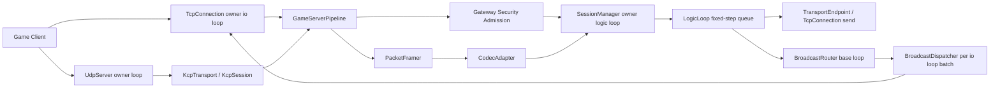

# 游戏服务器网络底座阶段闭环审计

本文记录将 mini-trantor 推向“游戏服务器网络底座”过程中，M1-M32 阶段的交付边界、验证证据与剩余风险。

审计口径不是“功能是否能跑一次”，而是按项目规则检查：
- intent 是否匹配目标定位
- public contract 是否有测试约束
- 线程亲和是否仍回到 owner loop
- 生命周期是否有明确 owner / observer / release
- 回调重入和跨线程入口是否有统一 marshal
- 生产化风险是否被明示，而不是被测试通过掩盖

## Intent Reference

- `rules/thread_affinity_rules.md`
- `rules/ownership_rules.md`
- `rules/testing_rules.md`
- `rules/review_rules.md`
- `docs/core_module_change_gate.md`
- `docs/roadmap_game_server_network_base_execution_plan.md`
- `docs/game_server_network_base_scope_boundary.md`
- `docs/game_server_network_base_lifecycle_hardening.md`
- `intents/architecture/game_network_base_scope.intent.md`
- `intents/architecture/threading_model.intent.md`
- `intents/architecture/lifetime_rules.intent.md`
- `intents/modules/game_backpressure_policy.intent.md`
- `intents/modules/game_gateway_security.intent.md`
- `intents/modules/kcp_transport.intent.md`
- `intents/modules/path_mtu_cache.intent.md`
- `intents/modules/path_mtu_signal_authentication.intent.md`
- `intents/modules/platform_path_mtu_signal.intent.md`
- `intents/modules/udp.intent.md`
- `intents/modules/metrics_exporter.intent.md`
- `intents/modules/tcp_server.intent.md`
- `intents/modules/tcp_client.intent.md`

## 1. 总体审计结论

mini-trantor 已经从“callback-based reactor 网络库”推进为一个可承载游戏服务器主路径实验的网络底座：

1. TCP 主线仍保持 Reactor 语义：连接读写、回调、关闭和发送都回到连接 owner loop。
2. 游戏层获得了基础会话模型：`PlayerSession` / `SessionManager` 负责认证、在线、断线、重连窗口和状态推进。
3. I/O 与逻辑线程被拆开：`GameServerPipeline` 负责网络输入 framing 与命令提交，`LogicLoop` 负责 fixed-step 逻辑队列和默认输出回写。
4. 广播链路具备可扩展的路由与批量发送骨架：base loop 维护路由，io loop 分桶发送，payload 共享避免每连接重复拷贝。
5. TCP / UDP / KCP 被统一到 transport 概念下，上层可以逐步减少对具体连接类型的感知。
6. 生命周期高风险点已经补上第一层闸门：延迟任务弱生命周期令牌、stop 后发送丢弃、旧连接 close 不清掉新绑定路由。
7. 指标从单点计数扩展为端到端观测闭环：pipeline input、logic enqueue/tick/output、session async drain、broadcast batch 都有 hook。
8. 游戏网关入口已有第一层安全骨架：auth token validator、防重放 nonce window、per-session rate limit 和异常关闭原因指标。
9. 游戏层背压已从 hard reject 扩展到 output / broadcast soft-zone 优先级降级和自适应 soft threshold。
10. metrics exporter 已具备静态标签适配和无依赖 Prometheus text snapshot 渲染，真实游戏服 smoke 链路已通过 tagged recorder 验证。
11. KCP 预览传输已具备固定安全 MTU 分片与重组，large payload 在损伤网络 contract 中仍按序一次性交付；重传/RTO 策略已可按 transport 构造期 options 显式调优，并有高丢包长时 contract 约束；selective ACK 预览可回收乱序已达包，减少缺口后的无效重传；dynamic MTU probe/backoff 预览可在 owner loop 内按 session 提升或回退 datagram payload size；PMTU 黑洞冷却 preview 可在探测黑洞后抑制立即重复探测并保持安全尺寸数据交付；transport-local MTU path cache 可把 confirmed size 与黑洞 cooldown 复用到 reopen 后的同 peer session；shared `PathMtuCache` 预览可在 transport stop/destruction 后由 replacement transport 复用同 peer confirmed size；path MTU failure signal 预览可显式消费 ICMP/EMSGSIZE 适配层事件，把当前和 reopen 后同 peer session 降级回安全尺寸；platform PMTU signal adapter 预览把 Linux `MSG_ERRQUEUE` 实现和 portable no-op fallback 从 `UdpSocket` 中抽出，并继续把 local `EMSGSIZE` 映射为 owner-loop path MTU failure event；platform PMTU source capability/query 预览进一步把 Linux 真实 async source、generic socket API 和 connected MTU query hook 收口到 adapter capability；IPv4/ICMPv6 raw Packet Too Big listener 预览可在 UDP owner loop 中解析/过滤 quoted UDP header 并保留 bounded quoted UDP payload prefix；KCP userspace PMTU signal authentication 预览可在 raw ICMP signal 带错 session quote 时拒绝降级、带匹配 session quote 时才进入 owner-loop PMTU failure state machine；congestion-window 预览可限制 reliable data 初始 burst，并在 ACK 到达后按序 drain queued frames；redundant-copy 预览可用 bounded 同 seq 副本覆盖首发 data 丢包；XOR parity recovery 预览可在每组一个 data frame 丢失时不等 RTO 补洞并保持按序一次性交付。
12. 当前状态适合作为 v1-coro-preview 前的游戏网络底座 alpha/beta 骨架，但还不是完整商业游戏网关。
13. M1-M32 之后必须按 scope boundary 收口：核心保持网络底座，game 模块保持接入/会话/逻辑桥，KCP/PMTU/FEC 类能力统一视为 transport preview，真实安全平台、AOI、多进程网关、生产 FEC/拥塞控制和可部署观测平台不得继续进入 core 主线。

## 2. M1-M32 任务闭环矩阵

| 阶段 | 目标 | 主要落点 | 验证文件 |
|---|---|---|---|
| M1 / Task-01 | 统一传输抽象 | `mini/net/transport/*`、`ProtocolConnection*`、`TransportManager` | `tests/unit/transport/test_transport_abstraction.cpp`、`tests/contract/transport/test_transport_contract.cpp`、`tests/integration/transport/test_transport_adapter_loopback.cpp` |
| M2 / Task-04 | base loop 广播路由 | `BroadcastRouter`、`TcpServer` session/group API | `tests/contract/net/test_tcp_server_broadcast_router_contract.cpp`、`tests/integration/tcp_server/test_tcp_server_broadcast_session_group.cpp` |
| M3 / Task-05 | io loop 分桶批量发送 | `BroadcastDispatcher`、broadcast batch API | `tests/unit/broadcast/test_dispatcher_batch.cpp`、`tests/contract/net/test_broadcast_batch_contract.cpp`、`tests/integration/tcp_server/test_tcp_server_broadcast_batch.cpp` |
| M4 / Task-06 | payload 共享与池化 | `mini/net/buffer/Payload*` | `tests/unit/buffer/test_payload_pool.cpp`、`tests/contract/broadcast/test_payload_sharing_contract.cpp` |
| M5 / Task-07 | 通用 framing | `PacketFramer`、game pipeline input path | `tests/unit/framing/test_framer.cpp`、`tests/contract/framing/test_framer_contract.cpp`、`tests/integration/transport/test_framing_halfpack.cpp` |
| M6 / Task-09 | PlayerSession + SessionManager | `mini/game/PlayerSession*`、`SessionManager*` | `tests/unit/game/test_player_session_fsm.cpp`、`tests/contract/game/test_session_manager_contract.cpp`、`tests/integration/game/test_connect_auth_replay.cpp` |
| M7 / Task-11 | fixed-step 逻辑线程 | `GameCommandQueue`、`LogicLoop`、network-to-logic bridge | `tests/unit/logic/test_game_command_queue.cpp`、`tests/contract/logic/test_logic_loop_timing_contract.cpp`、`tests/integration/logic/test_network_to_logic_roundtrip.cpp` |
| M8 / Task-12 | 游戏网络指标 | `MetricsHook`、pipeline / logic / session / broadcast metrics | `tests/unit/metrics/test_metrics_hook_ext.cpp`、`tests/contract/net/test_game_metrics_contract.cpp`、`tests/integration/benchmark/test_game_server_metrics_smoke.cpp` |
| M9 / Task-08 | codec 标准化桥接 | `CodecAdapter`、`ProtobufAdapter`、`FlatBuffersAdapter` | `tests/unit/codec/test_protobuf_adapter.cpp`、`tests/unit/codec/test_flatbuffers_adapter.cpp`、`tests/contract/codec/test_codec_adapter_contract.cpp`、`tests/integration/codec/test_game_message_roundtrip.cpp` |
| M10 / Task-10 | 断线重连与 sticky session | `SessionManager` 重连窗口、`GameServerPipeline` guarded unbind | `tests/contract/game/test_session_manager_contract.cpp`、`tests/integration/game/test_reconnect_flow.cpp`、`tests/contract/net/test_tcp_server_broadcast_router_contract.cpp` |
| M11 / Task-02 | UDP 基线 | `UdpSocket`、`UdpServer`、`UdpTransportEndpoint` | `tests/unit/udp/test_udp_socket.cpp`、`tests/contract/udp/test_udp_server_contract.cpp`、`tests/integration/udp/test_udp_loopback.cpp`、`tests/integration/udp/test_udp_sendto_stop_lifecycle.cpp` |
| M12 / Task-03 | KCP 预览传输 | `KcpCodec`、`KcpSession`、`KcpTransport` | `tests/unit/kcp/test_kcp_codec.cpp`、`tests/contract/kcp/test_kcp_transport_stress_contract.cpp`、`tests/integration/kcp/test_kcp_reliable_flow.cpp` |
| M13 / Task-13 | 游戏网关安全骨架 | `GameGatewaySecurityPolicy`、`GameServerPipeline` security admission、`GameSecurityMetricSample` | `tests/unit/game/test_game_gateway_security_policy.cpp`、`tests/contract/game/test_game_gateway_security_contract.cpp`、`tests/integration/game/test_game_gateway_security.cpp`、`tests/unit/metrics/test_metrics_exporter.cpp` |
| M14 / Backpressure P1 | 优先级与自适应 soft threshold | `GameBackpressureOptions::PriorityShedding`、packet priority flags、`LogicLoop` output shedding、broadcast soft admission | `tests/unit/game/test_game_backpressure_policy.cpp`、`tests/contract/logic/test_logic_loop_timing_contract.cpp`、`tests/integration/game/test_game_backpressure_policy.cpp`、`tests/unit/metrics/test_metrics_exporter.cpp` |
| M15 / Metrics P1 | 标签化与文本导出适配 | `TaggedMetricsExporter`、`metricNameWithLabels()`、`renderPrometheusText()`、tagged metrics smoke | `tests/unit/metrics/test_metrics_exporter.cpp`、`tests/contract/net/test_metrics_exporter_contract.cpp`、`tests/integration/benchmark/test_game_server_metrics_smoke.cpp` |
| M16 / KCP P1 | 固定 MTU 分片与 large payload contract | `KcpTransport` fragment split/reassembly、`KcpFrame` payload length boundary、large payload stress | `tests/unit/kcp/test_kcp_codec.cpp`、`tests/contract/kcp/test_kcp_transport_stress_contract.cpp`、`tests/integration/kcp/test_kcp_reliable_flow.cpp` |
| M17 / KCP P1 | 高丢包长时与重传参数 contract | `KcpTransportOptions` retry/RTO policy、periodic high-loss long-run proxy、option normalization | `tests/unit/kcp/test_kcp_codec.cpp`、`tests/contract/kcp/test_kcp_transport_stress_contract.cpp` |
| M18 / KCP P1 | Selective ACK 预览 | `kKcpFrameFlagSelectiveAck`、ACK payload `SAK1`、SACK gap contract | `tests/unit/kcp/test_kcp_codec.cpp`、`tests/contract/kcp/test_kcp_transport_stress_contract.cpp` |
| M19 / KCP P1 | Dynamic MTU probe/backoff 预览 | `kKcpFrameFlagMtuProbe`、per-session datagram size、probe ACK/backoff contract | `tests/unit/kcp/test_kcp_codec.cpp`、`tests/contract/kcp/test_kcp_transport_stress_contract.cpp` |
| M20 / KCP P1 | Congestion window 预览 | `KcpTransportOptions::enableCongestionWindow`、per-session `sendQueue`、ACK drain contract | `tests/unit/kcp/test_kcp_codec.cpp`、`tests/contract/kcp/test_kcp_transport_stress_contract.cpp` |
| M21 / KCP P1 | Redundant copy 预览 | `KcpTransportOptions::enableRedundantCopies`、bounded same-seq wire duplicates、first-loss cover contract | `tests/unit/kcp/test_kcp_codec.cpp`、`tests/contract/kcp/test_kcp_transport_stress_contract.cpp` |
| M22 / KCP P1 | PMTU blackhole cooldown 预览 | `KcpTransportOptions::mtuProbeBlackholeCooldown`、per-session probe cooldown、safe-size delivery contract | `tests/unit/kcp/test_kcp_codec.cpp`、`tests/contract/kcp/test_kcp_transport_stress_contract.cpp` |
| M23 / KCP P1 | MTU path cache 预览 | `KcpTransportOptions::enableMtuPathCache`、transport-local peer cache、reopen reuse contract | `tests/unit/kcp/test_kcp_codec.cpp`、`tests/contract/kcp/test_kcp_transport_stress_contract.cpp` |
| M24 / KCP P1 | XOR parity recovery 预览 | `kKcpFrameFlagXorParity`、`KcpTransportOptions::enableXorParityRecovery`、one-loss group recovery contract | `tests/unit/kcp/test_kcp_codec.cpp`、`tests/contract/kcp/test_kcp_transport_stress_contract.cpp` |
| M25 / KCP P1 | Path MTU failure signal 预览 | `KcpTransport::notifyPathMtuFailure()`、owner-loop safe-size downgrade、path cache cooldown reuse contract | `tests/contract/kcp/test_kcp_transport_stress_contract.cpp` |
| M26 / KCP P1 | Linux UDP error queue PMTU signal 接入 | `udp::PathMtuFailure`、`enablePathMtuErrorQueue()`、`KcpTransportOptions::enablePlatformPathMtuSignals` | `tests/unit/udp/test_udp_socket.cpp`、`tests/unit/kcp/test_kcp_codec.cpp` |
| M27 / KCP P1 | IPv4 raw ICMP PMTU signal listener 预览 | `IcmpPathMtuListener`、`UdpSocket::enableRawIcmpPathMtuListener()`、`KcpTransportOptions::enableRawIcmpPathMtuSignals` | `tests/unit/udp/test_icmp_path_mtu_listener.cpp`、`tests/unit/udp/test_udp_socket.cpp`、`tests/unit/kcp/test_kcp_codec.cpp` |
| M28 / KCP P1 | ICMPv6 raw PMTU signal listener 预览 | `IcmpPathMtuListener::parseIpv6PacketTooBig()`、AF_INET6 raw listener selection、same `PathMtuFailure` event | `tests/unit/udp/test_icmp_path_mtu_listener.cpp`、`tests/unit/udp/test_udp_socket.cpp` |
| M29 / KCP P1 | Cross-platform PMTU signal adapter 预览 | `PathMtuSignalAdapter`、`PathMtuSignal.h`、Linux `MSG_ERRQUEUE` implementation + portable no-op fallback | `tests/unit/udp/test_path_mtu_signal_adapter.cpp`、`tests/unit/udp/test_udp_socket.cpp`、`tests/unit/kcp/test_kcp_codec.cpp` |
| M30 / KCP P1 | Cross-transport shared PathMtuCache 预览 | `transport::PathMtuCache`、`KcpTransportOptions::sharedMtuPathCache`、replacement transport confirmed-size/cooldown seed contract | `tests/unit/transport/test_path_mtu_cache.cpp`、`tests/unit/kcp/test_kcp_codec.cpp`、`tests/contract/kcp/test_kcp_transport_stress_contract.cpp` |
| M31 / KCP P1 | Userspace raw ICMP PMTU signal authentication 预览 | `PathMtuFailure` source/quoted prefix evidence、`KcpTransportOptions::enablePathMtuSignalAuthentication`、quoted KCP magic/version/session gate | `tests/unit/udp/test_icmp_path_mtu_listener.cpp`、`tests/unit/udp/test_udp_socket.cpp`、`tests/unit/kcp/test_kcp_codec.cpp`、`tests/contract/kcp/test_kcp_transport_stress_contract.cpp` |
| M32 / UDP PMTU P1 | Platform PMTU source capability/query 预览 | `PathMtuSignalAdapter::platformCapabilities()`、generic platform signal configure/drain aliases、connected UDP payload MTU query hook、`UdpSocket::enablePlatformPathMtuSignals()` | `tests/unit/udp/test_path_mtu_signal_adapter.cpp`、`tests/unit/udp/test_udp_socket.cpp`、`tests/unit/kcp/test_kcp_codec.cpp`、`tests/contract/kcp/test_kcp_transport_stress_contract.cpp` |

## 3. 当前主路径架构



这条链路的核心边界是：

- 网络 I/O loop 只负责读写、framing 输入入口、发送排队和 connection 生命周期。
- `SessionManager` 负责玩家身份和在线状态，不把业务状态推进散落在连接回调里。
- `GameServerPipeline` 的 security admission 在进入 session/logic/broadcast 前执行 auth validator、防重放和限频。
- `LogicLoop` 负责 fixed-step 逻辑命令，不让游戏逻辑阻塞 I/O loop。
- `BroadcastRouter` 只维护 session/group 到连接的路由；`BroadcastDispatcher` 只做同 io loop 批量发送。
- codec/framing 是协议桥，不拥有会话状态，也不绕过 EventLoop 调度语义。

## 4. 核心模块改动闸门审计

### TcpServer / Broadcast

1. Loop / Thread：连接接入、session/group 路由归 base loop；真实发送归连接 owner io loop。
2. Ownership / Release：`TcpServer` 持有 router/dispatcher 与连接映射；延迟任务通过生命周期令牌观察 server；广播路由按 connection-scoped expected owner 注销。
3. Re-entrant Callbacks：close、session register/remove、broadcast flush 可在同 tick 内重入，路径保持幂等。
4. Cross-thread Operations：外部广播/session API 先 marshal 到 base loop，再按连接 owner loop 分桶发送。
5. Test File Mapping：`tests/contract/net/test_tcp_server_broadcast_router_contract.cpp`、`tests/contract/net/test_tcp_server_broadcast_admission_contract.cpp`、`tests/unit/broadcast/test_dispatcher_batch.cpp`、`tests/integration/tcp_server/test_tcp_server_broadcast_threaded.cpp`。

### SessionManager / PlayerSession

1. Loop / Thread：状态推进归 owner logic loop；无 owner loop 时退化为同步调用线程。
2. Ownership / Release：manager 持有 session shared ownership；外部返回指针只应作为查询或观察，不应绕开 manager 推进状态。
3. Re-entrant Callbacks：state/metric callbacks 在 owner loop 触发，允许再次调用 manager API，但 mutating API 会被收口。
4. Cross-thread Operations：需要结果的 mutating API 同步 marshal；热路径断连/心跳用 `post...` 异步批量 drain。
5. Test File Mapping：`tests/contract/game/test_session_manager_contract.cpp`、`tests/integration/game/test_reconnect_flow.cpp`、`tests/contract/net/test_game_metrics_contract.cpp`。

### GameServerPipeline / LogicLoop

1. Loop / Thread：pipeline 输入/security/rate-limit continuation 回连接 owner loop；逻辑命令和 tick 在 `LogicLoop` 内部 loop；输出 soft/adaptive priority shedding 先在 logic loop 检查 payload，再回目标 endpoint owner loop 检查 latency；broadcast soft/adaptive admission 在 base loop route 后、dispatch 前执行。
2. Ownership / Release：pipeline 和 logic 延迟任务使用生命周期令牌；输出 endpoint/connection 以 weak observation 方式使用；game backpressure/security policy 是值语义配置，不拥有 loop/connection/session；pipeline 持有 replay/rate cache。
3. Re-entrant Callbacks：message callback、metric/security/backpressure callback、logic tick 和 output callback 都可能排队下一轮工作；metric callback 只能观察策略决策，不应隐藏修改状态。
4. Cross-thread Operations：输入 hard limit、auth admission 和 per-session rate limit 在连接 owner loop 执行并收敛到 `forceClose()`；replay/rate 共享状态用 pipeline mutex 保护；输入批处理超过预算后重新 queue continuation；logic admission 在 `GameCommandQueue::tryEnqueue()` 的锁保护边界原子检查并入队/拒绝，决策指标回到 logic loop 上报；broadcast priority flags 随 public broadcast API 进入 base loop admission，再分桶到目标 io loop。
5. Test File Mapping：`tests/unit/game/test_game_backpressure_policy.cpp`、`tests/unit/game/test_game_gateway_security_policy.cpp`、`tests/contract/game/test_game_backpressure_policy_contract.cpp`、`tests/contract/game/test_game_gateway_security_contract.cpp`、`tests/unit/logic/test_game_command_queue.cpp`、`tests/contract/logic/test_logic_loop_timing_contract.cpp`、`tests/integration/game/test_game_backpressure_policy.cpp`、`tests/integration/game/test_game_gateway_security.cpp`、`tests/integration/logic/test_network_to_logic_roundtrip.cpp`、`tests/integration/game/test_game_server_vertical_slice.cpp`。

### UDP / KCP

1. Loop / Thread：socket、session map、flush timer 属于 transport owner loop。
2. Ownership / Release：server/transport 持有 session map；session 对 owner 使用可失效观察，stop 后 detach。
3. Re-entrant Callbacks：packet/message callbacks 可触发 send/close，必须回到 owner loop。
4. Cross-thread Operations：send/close/stop 经 owner loop marshal；UDP read budget、platform PMTU adapter capability/configure/drain/connected-query 与 raw ICMP/ICMPv6 listener read/filter 在 socket owner path 内执行，adapter 不拥有 owner loop 状态，raw ICMP enable/disable 不作为跨线程 setter 使用；KCP `openSession()` 跨线程同步 marshal；KCP fragment split/reassembly、selective ACK 生成/应用、MTU probe/backoff/blackhole cooldown/path cache、shared `PathMtuCache` advisory reads/writes、path MTU failure signal、platform/raw ICMP path MTU signal consumption、raw ICMP PMTU quote authentication、congestion-window enqueue/drain、redundant-copy emission、XOR parity encode/recovery、retry/RTO policy 读取和 in-flight/ACK 状态同属 owner loop flow state；stop 后 sessionId/address/raw peer 发送都被 owner-loop 闸门丢弃。
5. Test File Mapping：`tests/unit/udp/test_udp_socket.cpp`、`tests/unit/udp/test_path_mtu_signal_adapter.cpp`、`tests/unit/udp/test_icmp_path_mtu_listener.cpp`、`tests/unit/transport/test_path_mtu_cache.cpp`、`tests/contract/udp/test_udp_server_contract.cpp`、`tests/integration/udp/test_udp_sendto_stop_lifecycle.cpp`、`tests/unit/kcp/test_kcp_codec.cpp`、`tests/contract/kcp/test_kcp_transport_stress_contract.cpp`、`tests/integration/kcp/test_kcp_reliable_flow.cpp`。

### Codec / Framing

1. Loop / Thread：framing/codec 本身不拥有线程；由调用方所在 owner loop 驱动。
2. Ownership / Release：payload 与序列化结果按值或 shared payload 传递；codec 不保存会话或连接 owner。
3. Re-entrant Callbacks：serializer/parser 回调异常会被转换为 error，不越过 reactor 回调边界向外逃逸。
4. Cross-thread Operations：codec 不提供跨线程入口；跨线程发送必须经 transport/pipeline/logic 层。
5. Test File Mapping：`tests/contract/codec/test_codec_adapter_contract.cpp`、`tests/integration/codec/test_game_message_roundtrip.cpp`。

### MetricsExporter

1. Loop / Thread：exporter 不拥有 EventLoop；hook 仍在事件原 owner loop 上同步触发，in-memory 聚合器内部 mutex 保护跨 loop 记录；Prometheus text 渲染只基于 snapshot，不在 hot hook 内执行。
2. Ownership / Release：调用方通过 `std::shared_ptr<MetricsExporter>` 拥有 exporter；`MetricsHookRecorder` 只持有 exporter，不持有 connection/session/loop；`TaggedMetricsExporter` 只持有 sink exporter shared ownership 和静态 label 值。
3. Re-entrant Callbacks：recorder callback 只记录 counter/histogram，不回调 reactor，也不改变业务状态；tagged wrapper 只做 metric name 编码后转发。
4. Cross-thread Operations：不同 owner loop 可并发记录到同一 `InMemoryMetricsExporter` 或 wrapped tagged exporter；状态更新只通过 sink exporter 内部同步。
5. Test File Mapping：`tests/unit/metrics/test_metrics_exporter.cpp`、`tests/contract/net/test_metrics_exporter_contract.cpp`、`tests/integration/benchmark/test_game_server_metrics_smoke.cpp`。

## 5. 已修复的高风险点

1. 延迟任务悬空：`TcpServer`、`BroadcastRouter`、`BroadcastDispatcher`、`TransportManager`、`KcpTransport`、`UdpServer`、`GameServerPipeline`、`LogicLoop`、`TcpClient` 均引入弱生命周期令牌或 weak target 观察。
2. 旧连接 close 清掉新连接路由：`TcpServer::unbindBroadcastSession(connection, sessionId)` 与 router expected connection 检查已经收口。
3. stop 后继续发送：UDP sessionId/address send 和 KCP session/raw peer send 都在 owner loop started 闸门后丢弃。
4. stop off-loop 竞态：UDP/KCP stop 在非 owner 线程同步 marshal，确保资源和 session map 清理完成后返回。
5. KCP session 外部残留：transport stop 会把仍被外部持有的 session 标记 closed 并 detach owner。
6. codec callback exception：Protobuf/FlatBuffers 适配器把 serializer/parser/callback 异常转换为错误结果。
7. 热路径断连/心跳同步等待：`SessionManager` 增加异步 batched event drain，避免 I/O loop 被逻辑 loop 长时间阻塞。
8. 指标不可串联：新增 metrics smoke benchmark，把 pipeline、logic、session、broadcast 的观测点连成轻量端到端路径。
9. UDP 突发包独占 loop：`UdpSocket` 增加 `maxDatagramsPerRead`，每次 read handler 到达预算后返回 owner loop，并通过 UDP read-batch metric 暴露 datagram 数、字节数、耗时和 budget 状态。
10. 游戏层背压边界不清：新增 `intents/modules/game_backpressure_policy.intent.md`，把 input framing、logic admission、output send、broadcast fanout 四层资源、owner loop、策略动作和测试契约拆开。
11. 游戏层背压 Stage A：新增 `GameBackpressureOptions` 值语义配置、`GameBackpressureMetricSample` 决策指标 schema，并把配置接入 `GameServerPipeline::Options::validate()`。
12. 游戏层背压 Stage B：`GameServerPipeline` 对 per-connection input buffer 执行 hard limit close/reject，`LogicLoop` 对 command backlog/oldest-lag 执行 admission reject，并通过 `GameBackpressureMetricSample` 上报 accept/reject/defer 决策。
13. 游戏层背压 Stage C：`LogicLoop` 默认 output 回写路径执行 payload hard-limit 与 queue-latency hard-limit，拒绝/接受都通过 `OutputDropped` / `OutputQueued` 上报；`TcpServer` 增加 broadcast admission hook，`GameServerPipeline` 在 base loop route 后、dispatch 前执行 broadcast fanout/payload hard-limit，并通过 `BroadcastAccepted` / `BroadcastRejected` 上报。
14. Metrics exporter P0：新增 `MetricsExporter` 抽象接口、`InMemoryMetricsExporter` 计数器/直方图聚合器和 `MetricsHookRecorder` typed hook adapter；game metrics smoke 已通过真实 exporter 记录 pipeline / logic / session / broadcast 端到端指标。
15. KCP 压力 contract P1：新增 `tests/contract/kcp/test_kcp_transport_stress_contract.cpp`，用受控 UDP proxy 验证丢包、乱序、重复包、延迟抖动下的按序一次性交付，并验证 `send()` / `forceClose()` / `stop()` 并发不破坏 session detach。
16. 游戏网关安全骨架 P1：新增 `GameSecurityOptions`、auth token validator、connect-auth replay window、per-session rate limit 和 `GameSecurityMetricSample`；默认关闭时保持旧 auth payload 语义，开启 replay 后同 token fresh nonce 仍可 sticky reconnect。
17. 游戏层背压 P1：output / broadcast 支持 soft-zone priority shedding；packet flags `0` 保持 normal priority 兼容语义，低优先级消息在 soft/adaptive 区间被显式 `DropLowPriority`，高优先级消息可继续进入 owner-loop send/dispatch 路径。
18. Metrics exporter P1：新增 `TaggedMetricsExporter` 静态标签适配、label 校验/转义和 Prometheus text snapshot renderer；端到端 metrics smoke 已通过 tagged recorder 写入并验证渲染结果。
19. KCP 分片 P1：`KcpTransport` 以固定 1200-byte 安全 UDP payload 为目标拆分 large application payload，每个 fragment 继续走可靠 seq/ACK/retransmission；接收端只在 owner loop 完整重组后交付一次。
20. KCP 高丢包长时 P1：新增 `KcpTransportOptions`，在构造期归一化 initial RTO、max RTO、retry budget、safe datagram payload 和 application payload 上限；高丢包长时 contract 通过周期性多次丢 data、ACK 丢失、重复和延迟验证 tuned retry/RTO policy 下长消息流仍按序一次性交付。
21. KCP selective ACK P1：ACK frame 支持 `kKcpFrameFlagSelectiveAck` 和私有 `SAK1` payload；接收端从 owner-loop pending packet state 生成 SACK，发送端仅据此回收已到达的乱序 in-flight packet，不改变按序交付。
22. KCP dynamic MTU P1：新增 `kKcpFrameFlagMtuProbe` 控制帧、per-session current datagram payload size 和 probe retry/backoff；probe 不占用 data seq、不进入 message callback，成功后提升单 frame 上限，失败后保持安全分片尺寸。
23. KCP congestion-window P1：新增可选 `enableCongestionWindow`，开启后 reliable data frame 受 per-session window 限制，超出窗口的 frame 留在 owner-loop `sendQueue`；ACK 回收 in-flight 后按 seq 顺序 drain，timeout 将窗口回退到 configured minimum。
24. KCP redundant-copy P1：新增可选 `enableRedundantCopies` 和 bounded `redundantCopyCount`；newly sent reliable data frame 可发送少量同 seq wire duplicate，接收端仍按原 duplicate/ACK 语义保证应用只交付一次，首份 data 丢失可由副本覆盖而不等待 RTO。
25. KCP PMTU 黑洞冷却 P1：新增 `mtuProbeBlackholeCooldown` 和 per-session cooldown state；probe retry exhaustion 后保持当前 confirmed safe size，在冷却期内抑制立即重复探测，同时 data path 仍按安全尺寸分片交付，冷却后允许重新探测路径变化。
26. KCP MTU path cache P1：新增可选 `enableMtuPathCache` 和 transport-local peer cache；probe 成功后缓存 confirmed datagram payload size，黑洞后缓存 cooldown，新建同 peer session 时 seed flow state，避免 reopen 后重复探测或重复黑洞打包。
27. KCP XOR parity P1：新增 `kKcpFrameFlagXorParity`、可选 `enableXorParityRecovery` 和 `xorParityGroupSize`；发送端对首发 reliable data group 生成 XOR parity frame，接收端在每组恰好缺一个 packet 时恢复缺包并重新进入现有 data delivery path，parity frame 自身不进入 in-flight。
28. KCP path MTU failure signal P1：新增 `KcpTransport::notifyPathMtuFailure()`；显式 PMTU/ICMP/`EMSGSIZE` 适配层事件可跨线程进入 transport，实际 safe-size downgrade、in-flight probe cancel、cooldown 和 path cache 更新都在 owner loop 完成。
29. KCP Linux UDP error queue PMTU signal P1：`UdpSocket` 可选开启 Linux `IP_RECVERR` / `IPV6_RECVERR`，从 owner-loop `EPOLLERR` handler drain `MSG_ERRQUEUE` 中的 `EMSGSIZE`，并把 local `sendTo()` `EMSGSIZE` 同步转换为 `PathMtuFailure` event；KCP 可选接入该 event 到既有 path MTU failure state machine。
30. KCP IPv4 raw ICMP PMTU signal P1：新增 `IcmpPathMtuListener`，在 UDP owner loop 中 best-effort 打开 Linux IPv4 raw ICMP socket，解析 Packet Too Big 的 quoted IPv4/UDP header，按本地 UDP source port 过滤后发出 `PathMtuFailure` event；KCP 可选在 `start()` 中启用该 UDP-owned listener 并接入既有 PMTU failure state machine。
31. KCP ICMPv6 raw PMTU signal P1：`IcmpPathMtuListener` 支持 AF_INET6 raw ICMPv6 socket 和 ICMPv6 Packet Too Big parser；parser 接受 ICMPv6 payload 起始形态，也兼容带 outer IPv6 header 的适配层输入，并按 quoted UDP source port 过滤后发出同一 `PathMtuFailure` event。
32. KCP/UDP cross-platform PMTU signal adapter P1：新增 `PathMtuSignalAdapter` 和独立 `PathMtuSignal.h`；Linux error queue configure/drain 从 `UdpSocket` 抽出，非 Linux 保持 no-op fallback，adapter 不拥有 fd/channel/loop/session。
33. KCP shared PathMtuCache P1：新增 `transport::PathMtuCache` 和 `KcpTransportOptions::sharedMtuPathCache`；多个 transport 可显式共享同一进程内 mutex-protected PMTU hint store，replacement transport 可复用同 peer confirmed size 和 blackhole cooldown，同时 stop 仍只清理自身 session/flow/local cache。
34. KCP userspace raw ICMP PMTU signal authentication P1：`PathMtuFailure` 保留 signal source 与 bounded quoted UDP payload prefix；开启 `enablePathMtuSignalAuthentication` 后，KCP 只接受带有效 KCP magic/version 且 session id 匹配当前 peer 的 raw ICMP PMTU signal，wrong-session quote 不会触发降级、probe cancel、cooldown 或 cache 写入。
35. UDP platform PMTU source capability/query P1：`PathMtuSignalAdapter` 新增 platform capability facts、generic platform configure/drain alias 和 connected UDP payload MTU query hook；`UdpSocket` 新增 `enablePlatformPathMtuSignals()`，旧 error queue API 保持兼容，Linux `MSG_ERRQUEUE` 路径继续作为运行态验证 source。

## 6. 剩余生产化风险

这些风险没有被“当前测试通过”消除，后续推进时应优先纳入 roadmap：

1. UDP 公平性仍是静态预算：`UdpSocket` 已有每轮 datagram budget 和 read-batch metric，但预算尚不是自适应策略，也没有跨 socket / 跨 endpoint 的全局公平调度。
2. backpressure enforcement 仍是基础策略：当前已有 input / logic hard-limit enforcement，也已有 output / broadcast soft-zone 优先级降级和自适应 soft threshold；但还没有按玩家状态、房间负载、消息业务类别做更细粒度差异化，也没有全局公平队列或运行时自动调参。
3. KCP 仍是预览级：已有 ack/retry、固定 MTU 分片、可配置 retry/RTO policy、selective ACK 预览、dynamic MTU probe/backoff 预览、PMTU 黑洞冷却 preview、transport-local MTU path cache 预览、shared PathMtuCache 预览、path MTU failure signal 预览、platform PMTU signal adapter 预览、platform PMTU source capability/query 预览、IPv4/ICMPv6 raw PMTU signal listener 预览、userspace raw ICMP PMTU signal authentication 预览、congestion-window 预览、redundant-copy 预览、XOR parity recovery 预览、损伤网络压力 contract、高丢包长时 contract 与生命周期 contract，但还不是完整生产 KCP 栈；BSD/Windows PMTU runtime source verification、磁盘/跨进程 PMTU 服务、cryptographic PMTU signal authentication、Reed-Solomon/multi-loss FEC codec、adaptive redundancy controller 和生产级 congestion/window tuning 仍需要独立阶段。
4. 安全仍是网关入口骨架：auth validator、防重放和 per-session rate limit 已覆盖最小 admission，但协议加密、账号体系、风控、封禁、设备指纹、灰度路由和审计日志仍不属于当前闭环。
5. 广播路由还不是 AOI 系统：当前支持 session/group 路由和 io loop batch，不包含空间索引、兴趣管理、视野裁剪和跨进程 fanout。
6. 指标已有轻量聚合和文本导出适配但还不是完整观测平台：当前具备 hook、可替换 exporter 接口、in-memory counter/histogram 聚合、静态标签和 Prometheus text snapshot；远端 push/pull 服务、采样策略、percentile sketch、持久化和告警规则仍未完成。
7. TimerQueue / async timers 仍按项目 v1 focus 延后：重连窗口已有使用，但通用 async timer/coroutine timer 能力不是本阶段目标。
8. 多进程/多节点网关能力未开始：当前是单进程内 reactor + thread pool 语义，尚未定义 gateway shard、session migration、跨服转发和 service discovery。

## 7. 建议的后续推进顺序

1. P0：执行 M33 scope boundary hardening，冻结 M1-M32 为 `game-network foundation + transport preview`。
2. P0：给 KCP/PMTU preview 测试和文档补齐 `transport-experimental`、`kcp-preview`、`pmtu-preview` 标记，确保它们被回归但不被误读为生产级 core。
3. P1：只修正 foundation bug、补 contract、强化线程/所有权/生命周期，不继续新增 KCP/FEC/PMTU 生产化 API。
4. P1：将 auth provider、封禁/灰度、安全审计、AOI、可部署 metrics endpoint、多进程 gateway 作为 adapter/example/experimental intent 重新设计。
5. P2：若确需推进生产级 KCP、cryptographic PMTU、Reed-Solomon/multi-loss FEC、adaptive redundancy 或生产 congestion/window tuning，先从 `mini/net/kcp` 主类中拆出 experimental boundary 或独立 target。
6. P2：更新框架理解文档和模块地图，让新读者先看到 core / game-foundation / transport-preview / out-of-core 的分层。

## 8. 阶段验收命令

本阶段收口应至少通过：

```bash
cmake --build build -j2
ctest --test-dir build --output-on-failure -L "transport|game|logic|udp|kcp|codec|benchmark|metrics"
ctest --test-dir build --output-on-failure --quiet
git diff --check
```

其中 `-L "transport|game|logic|udp|kcp|codec|benchmark|metrics"` 是游戏网络底座相关标签的快速回归，全量 `ctest --quiet` 用于确认已有 reactor、coroutine、HTTP/RPC/WebSocket/TLS 等旁路能力未被改坏。

## 9. 最终判断

M1-M32 可以视为“游戏服务器网络底座骨架闭环”：

- 能接入连接
- 能解析 game frame
- 能认证并建立玩家 session
- 能把输入转交逻辑 loop
- 能从逻辑 loop 回写
- 能按 session/group 广播
- 能在网关入口执行最小 auth validator、防重放和限频
- 能在 output / broadcast soft overload 区间按消息优先级显式降级
- 能观测主要延迟和队列事件，并把 snapshot 以静态标签 Prometheus text 形式导出
- 能通过 TCP/UDP/KCP 三类入口演进传输层，且 KCP large payload 可按固定 MTU 分片可靠传输；KCP tuned retry/RTO policy 已有高丢包长时契约验证，selective ACK 预览已能抑制缺口后的乱序包重复重传，dynamic MTU probe/backoff 预览已能在成功路径提升 single frame payload、失败路径保持安全分片，PMTU 黑洞冷却 preview 已能抑制立即重复探测并保持安全尺寸数据交付，transport-local MTU path cache 已能让 reopen 后的同 peer session 复用成功尺寸和黑洞 cooldown，shared PathMtuCache 预览已能让 replacement transport 复用同 peer confirmed size，path MTU failure signal 预览已能显式把当前和 reopened session 降回安全尺寸，platform PMTU signal adapter 预览已能把 Linux `MSG_ERRQUEUE` 和 no-op fallback 从 UDP owner 中拆出并接入同一状态机，platform PMTU source capability/query 预览已让 PMTU source 能力显式可测，IPv4/ICMPv6 raw PMTU signal listener 预览已能把 Packet Too Big quoted UDP header 转成同一 owner-loop failure event 并保留 quoted UDP payload evidence，userspace raw ICMP PMTU signal authentication 预览已能拒绝 wrong-session quote 并接受 matching-session quote，congestion-window 预览已能限制初始 burst 并在 ACK 后继续按序 drain，redundant-copy 预览已能用同 seq 副本覆盖首发 data 丢包，XOR parity recovery 预览已能每组恢复一个丢失 data frame 且不等待 RTO

但它仍应被定位为 v1 game-network foundation，而不是完整 game gateway。下一阶段的关键不是继续加 API，也不是继续把 KCP/PMTU/FEC 生产化能力塞进 core，而是先完成 M33 scope boundary hardening：把 foundation、game-foundation、transport-preview 和 out-of-core adapter 分清，再决定哪些能力只能作为外部适配或实验层推进。
