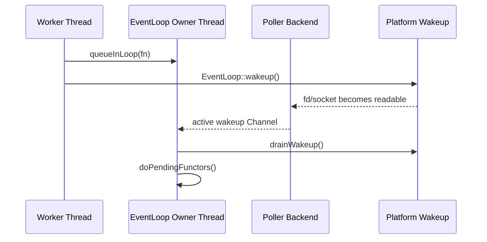

# Platform Runtime Split

## Intent

This split keeps Linux and Windows system-code in explicit directories while
preserving the same reactor semantics above the platform boundary.

- Public compatibility headers stay at `mini/net/SocketTypes.h`,
  `mini/net/EPollPoller.h`, and `mini/net/SelectPoller.h`.
- Platform socket and wakeup implementations live in `mini/net/platform/`.
- Concrete poller backends and factory selection live in `mini/net/poller/`.
- `EventLoop`, `Channel`, `TcpConnection`, and protocol layers remain
  backend-neutral.

## Source Layout

| Area | Linux | Windows | Stable Entry |
| --- | --- | --- | --- |
| Socket types | `mini/net/platform/SocketTypes.h` | `mini/net/platform/SocketTypes.h` | `mini/net/SocketTypes.h` |
| Socket ops | `mini/net/platform/SocketsOps_linux.cc` | `mini/net/platform/SocketsOps_win.cc` | `mini/net/SocketsOps.h` |
| Wakeup | `mini/net/platform/Wakeup_linux.cc` | `mini/net/platform/Wakeup_win.cc` | `mini/net/platform/Wakeup.h` |
| Poller backend | `mini/net/poller/EPollPoller.cc` | `mini/net/poller/SelectPoller.cc` | `mini/net/Poller.h` |
| Backend factory | `mini/net/poller/PollerFactory.cc` | `mini/net/poller/PollerFactory.cc` | `Poller::newDefaultPoller()` |

## Wakeup State

```mermaid
stateDiagram-v2
    [*] --> Created: EventLoop ctor
    Created --> Registered: wakeup Channel enableReading
    Registered --> Polling: EventLoop::loop()
    Polling --> Woken: queueInLoop()/quit() writes wakeup
    Woken --> Drained: wakeup Channel read callback
    Drained --> Polling: doPendingFunctors()
    Registered --> Removed: EventLoop dtor disables/removes Channel
    Removed --> Closed: closeWakeupFds()
    Closed --> [*]
```

## Cross-Thread Sequence



## CMake Selection

CMake includes one implementation set per target platform:

- Windows: `SocketsOps_win.cc`, `Wakeup_win.cc`, `SelectPoller.cc`.
- Linux/non-Windows build path: `SocketsOps_linux.cc`, `Wakeup_linux.cc`,
  `EPollPoller.cc`.

`PollerFactory.cc` is always compiled and selects the default backend with the
same platform condition, so backend choice is centralized.

## Core Module Change Gate

1. **Loop / Thread**: `EventLoop` owns wakeup lifecycle on its owner thread;
   `Poller` backend mutation stays owner-thread only.
2. **Ownership / Release**: `EventLoop` owns wakeup descriptors; concrete pollers
   own only backend kernel handles; `SocketsOps` observes caller-owned sockets
   except explicit create/close functions.
3. **Re-entrant Callbacks**: wakeup handling can lead to pending functors that
   re-enter public APIs; callback execution still happens on the owner loop.
4. **Cross-thread Operations**: only `queueInLoop()`, `runInLoop()` when
   off-thread, `quit()`, and connection send/shutdown paths may wake the loop;
   they still marshal through EventLoop.
5. **Test Mapping**: `tests/contract/event_loop/test_event_loop.cpp`,
   TCP contract tests, and the Windows VS2026 workflow verify this split.

## Verified Snapshot

Windows VS2026 workflow:

```powershell
& "D:\VS2026\2026\Common7\IDE\CommonExtensions\Microsoft\CMake\CMake\bin\cmake.exe" --workflow --preset windows-vs2026-x64
```

Result: configure, build, and `ctest --preset windows-vs2026-x64` passed with
27/27 tests.
