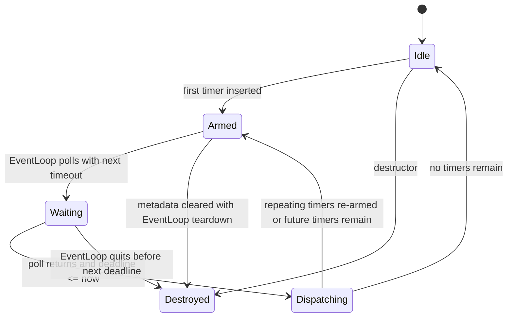

# mini TimerQueue 生命周期说明

本说明记录 `TimerQueue` 与 `EventLoop` 集成后的关键生命周期和线程约束。

## 状态图



## 定时器触发时序

```mermaid
sequenceDiagram
    participant Other as Other Thread
    participant Loop as EventLoop
    participant TQ as TimerQueue
    participant Poller as Poller

    Other->>Loop: runAfter / runEvery
    Loop->>TQ: addTimerInLoop()
    Loop->>TQ: pollTimeoutMs(defaultTimeoutMs)
    Loop->>Poller: poll(timeoutMs)
    Poller-->>Loop: active channels or timeout
    Loop->>TQ: handleExpired(now)
    TQ->>TQ: collect expired timers
    TQ->>TQ: run callbacks on owner loop
    TQ->>TQ: reinsert repeating timers if not canceled
```

## 取消时序

```mermaid
sequenceDiagram
    participant Other as Caller Thread
    participant Loop as EventLoop
    participant TQ as TimerQueue

    Other->>Loop: cancel(timerId)
    Loop->>TQ: cancelInLoop(timerId)
    alt timer still pending
        TQ->>TQ: erase timer metadata
        TQ->>TQ: reset next expiration if needed
    else timer already firing / gone
        TQ->>TQ: mark or ignore safely
    end
```

## 当前约束

- `TimerQueue` 归属单个 `EventLoop`，所有内部状态只允许 owner loop 修改。
- `TimerQueue` 不拥有平台 fd，也不注册 `Channel`；跨线程唤醒仍由 `EventLoop` wakeup 机制负责。
- `EventLoop` 必须在每轮 `Poller::poll()` 前调用 `pollTimeoutMs()`，并在 I/O dispatch 后调用 `handleExpired()`。
- repeating timer 只有在未被取消时才允许重新插回队列。
- 定时器回调只是“在 owner loop 执行的 functor”，不提供额外线程或隐藏所有权。
