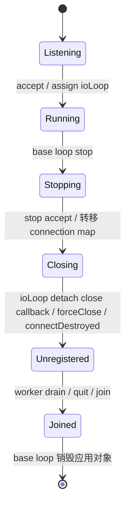

# 本次核心变更说明与 change gate

## 变更结果

TcpServer 恢复为监听、连接集合与 worker 生命周期的协调者；游戏广播和 logic callback
从 API/成员/实现中移除。EventLoop 修复首次 poll 前任务唤醒、批次内 Channel 失效、
同线程重复创建的 wakeup 泄漏，并拒绝递归 loop。关闭通知回归连接 owner-loop，
Disconnected 保留单一通知点。Options 明确 0 worker 模式并拒绝负值。

Intent：`intents/architecture/reactor_scope_reset.intent.md`、`modules/event_loop.intent.md`、
`modules/channel.intent.md`、`modules/tcp_server.intent.md`；阶段：S0。

## 五项 gate

| 问题 | 本次回答 |
| --- | --- |
| 哪个 loop/thread 拥有模块？ | EventLoop/Channel 归 owner thread；Server map 归 base loop；每条 Connection 和关闭/TLS hook 归其 ioLoop |
| 谁拥有、谁释放？ | EventLoop 独占 Poller/TimerQueue/wakeup；Poller 与活动批次借用 Channel；Server map 共享持有 Connection；移除广播组件没有引入新持有者 |
| 哪些 callback 可重入？ | runInLoop 同线程立即执行；事件/连接/指标 callback 可发起 close；关闭先转移 map 再通知，避免其遍历被重入修改；回调中直接析构 owner 的一般安全性仍属 S1 |
| 哪些跨线程操作允许，怎样回流？ | queueInLoop/runInLoop、Connection send/shutdown/forceClose 保持原回流语义；Server start/stop 在 base loop；stop 内的 callback detach、状态读取、ForceClosed、connectDestroyed 一并投到 ioLoop |
| 哪个文件验证？ | `tests/contract/event_loop/test_event_loop.cpp`、`test_active_channel_removal.cpp`；`tests/contract/tcp_server/test_connection_event_contract.cpp`、`test_shutdown_ordering.cpp`；`tests/contract/net/test_options_contract.cpp`；`tests/contract/build/test_assertions_enabled.cpp` 和 `tests/package/main.cpp` |

## 活动事件批次的借用期限

```mermaid
sequenceDiagram
    participant Poller
    participant Loop as EventLoop
    participant A as Channel A
    participant B as Channel B
    Poller-->>Loop: active = [A, B]
    Loop->>A: handleEvent
    A->>B: disableAll + remove
    B->>Loop: removeChannel(B)
    Loop->>Poller: unregister B
    Loop->>Loop: active 中的 B 置空
    A->>B: destroy
    Loop->>Loop: 跳过空位，不再解引用 B
```

不承诺可在 Channel 自己的 handleEvent 中直接销毁当前 Channel；其 owner tie/析构规则
保持有效。新增处理只结束对“另一个已注销 Channel”的批次借用。

## TCP 关闭顺序



ConnectionEvent::Disconnected 经 connection callback 发一次；close callback 负责 server
账本移除，不再重复发观测事件。ForceClosed 与 TLS HandshakeStarted 也遵循 ioLoop 归属。
stop(Duration) 的协议级 drain、owner 在回调内析构等未闭合场景明确留在审计，不推断已经解决。
图示为调用顺序；TSan 已报告 worker 关闭 wakeup fd 与 pool.stop 写 fd 竞争，
因此不能把箭头当作已证明完整的跨线程寿命屏障。S1 必须闭合停止状态机。

## 验证与迁移风险

构建/测试实测见[审计记录](audit_2026-09-12.md)。Release 的测试编译独立撤销 NDEBUG，
没有改变库 Release 优化模式。原 idle-timeout 集成测试改用 promise 定位指定 read 场景，
没有删去失败断言。撤除文件清单和破坏性 API 迁移在审计第 6 节。

库代码/安装 API 已移除业务和协议实验，旧应用会在编译期明确失败，需要固定旧提交
或迁移至应用侧。协程/DNS/TLS 的遗留安全问题没有在本次范围裁剪中解决。
