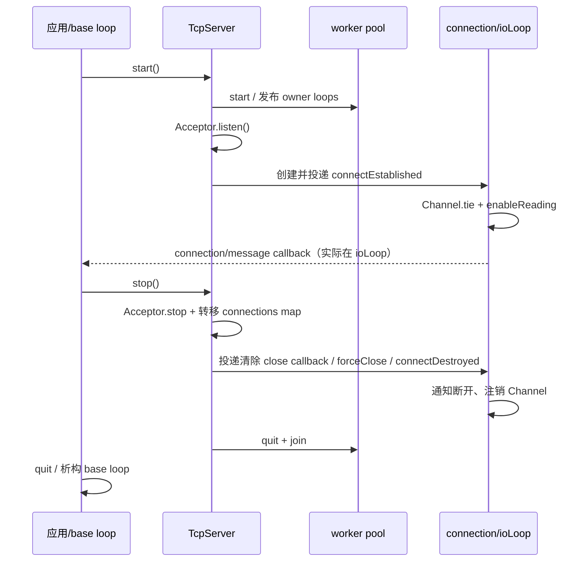
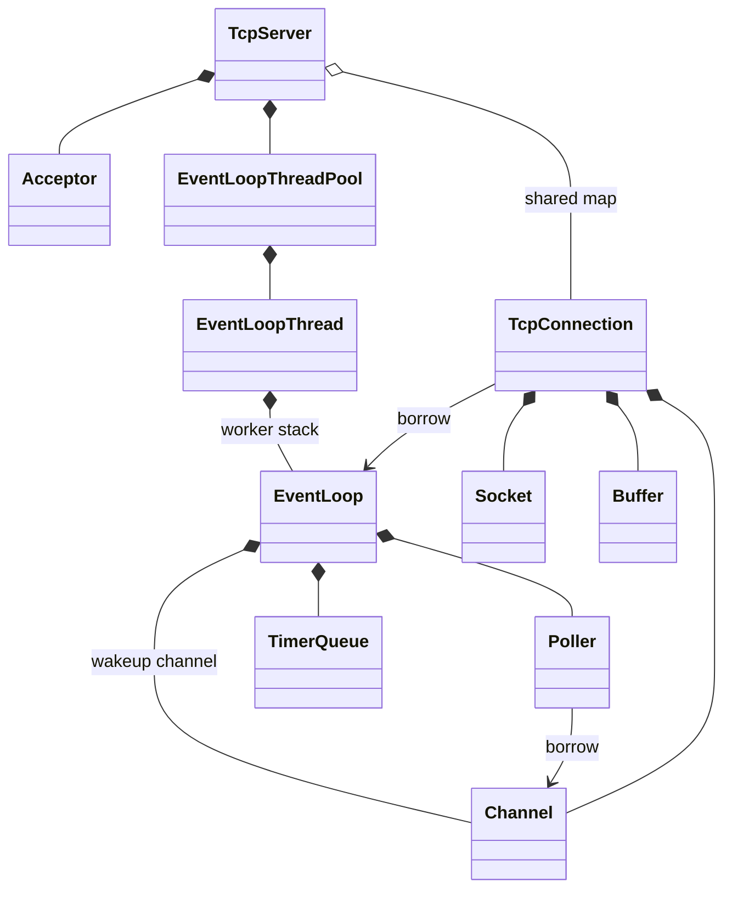

# mini-trantor 框架理解文档

本文对应 2026-09 范围收敛后的工作树。历史游戏/协议/传输实验实现见 Git `3eba368`；
旧解读已归档，不能混作当前 API 说明。具体缺陷及验证证据见[审计记录](audit_2026-09-12.md)。

## 0. 文档摘要

1. 这是 TCP 网络基础库，核心输入是 socket readiness，核心输出是用户字节回调。
2. EventLoop 是绑定线程的调度对象；它不拥有所有连接，不是全局线程池。
3. Channel 把 fd 与读写兴趣、回调绑定起来；Socket 才负责关闭 fd。
4. Poller 借用 Channel 指针，必须先注销再销毁；活动批次中的借用同样需要失效处理。
5. TcpServer 在 base loop 管理连接集合，连接 I/O 可以归属 worker loop。
6. TcpConnection 的状态机与 Socket/Channel/Buffer 生命周期是 TCP 主链路的中心。
7. TimerQueue 通过 poll timeout 驱动，无独立 timer 线程，也不再依赖 timerfd。
8. Task 管 coroutine frame，awaitable 负责把网络等待接回 EventLoop；两者不能相互替代。
9. DNS 有阻塞解析 worker；它与 Reactor 的回流边界需要特别审计。
10. 基础能力已有测试，但 coroutine frame 注销、DNS 重入和 TLS 身份校验仍有真实风险。
11. `mini/net/detail/ConnectionTransport` 是 TCP/TLS 内部 I/O 策略；已移除的通用
    `mini/net/transport/` 则是另一套上层抽象，两者不能混淆。

## 1. 整体定位与边界

库负责监听、连接、非阻塞读写、线程投递、定时、基础背压和关闭协作。
应用负责定义消息含义、身份、会话、业务调度和存储。使用者创建 EventLoop 和
TcpServer/TcpClient，安装回调后进入 `loop()`。回调中读写 Buffer 和发起 send/close。

保留 PacketFramer 是为了演示有界字节分帧，它没有 session map 或调度线程。
已有协程 API 保持预览状态，研发上先关闭生命周期缺口再扩充抽象。
TLS 为可选构建能力；DNS、取消与组合器是支撑功能，不是下一阶段的功能扩张入口。

## 2. 目录结构与职责

```text
mini/
  base/          日志、单调时间、不可复制基类、基础观测回调
  net/           Reactor、TCP、线程、定时器、DNS/TLS、配置和错误类型
    detail/      一个连接内部的 I/O、回调、awaiter 和背压协作者
    platform/    Linux/Windows socket 操作、wakeup 与句柄类型
    poller/      epoll/select 实现及后端工厂
    framing/     与 socket/业务无关的字节分帧
  coroutine/     Task、取消、timer/DNS awaitable、组合和 timeout
examples/        callback echo 与 coroutine echo
tests/           unit / contract / integration / fuzz / package
intents/         当前架构、模块职责与合同
rules/           所有权、线程、测试、审查规则
docs/            当前审计、路线、理解文档与 change gate
  archive/       历史设计资料，不参与当前路线
cmake/           sanitizer 和安装包配置
.github/         持续验证配置
```

`out/`、`Testing/` 和 build 目录是机器产物，不能解释为项目源码或已验证证据。
`tests/package` 是真实外部消费工程：只使用安装包，不回退到源码目录找头文件。

## 3. 核心模块地图

| 模块 | 为什么存在 | 依赖与调用方 | 对外能力与隐藏复杂性 |
| --- | --- | --- | --- |
| Reactor | 把阻塞等待统一在单线程事件循环中 | 调用 Poller/Channel/TimerQueue；被 TCP 和 awaitable 使用 | run/queue/timer；隐藏 wakeup 与后端差异 |
| TCP 生命周期 | 将连接状态、缓冲、事件订阅绑定为一个可关闭对象 | Server/Client 建立 Connection；依赖 Socket/Channel | send/shutdown/close、消息回调；隐藏部分写和异步清理 |
| 线程封装 | 每个 worker 自己创建自己的 EventLoop | Server 使用 Pool，Pool 使用 Thread | 发布 loop 借用指针、stop/join、轮询分配 |
| 定时 | 为超时与重试提供 owner-loop 调度 | EventLoop 独占 TimerQueue | TimerId 和取消；隐藏排序与 repeating 重插入 |
| 协程桥接 | 让顺序代码表达等待，不再造 scheduler | Task frame + 网络/定时/解析 awaitable | result/cancel/timeout；隐藏句柄恢复但尚有注销缺口 |
| 平台层 | 隔离 SocketFd、socket ops、wakeup 与 poller | 被 Reactor/TCP 底层使用 | Linux epoll/eventfd、Windows select/socket wakeup |
| 辅助工具 | 提供日志、基础事件、分帧而不管理业务 | 被基础模块或应用按需使用 | 时间、错误、hook、payload 视图 |

## 4. 启动、稳定运行与关闭

以 `examples/echo_server/main.cpp` 为入口：构造 EventLoop、监听地址和 TcpServer，
设置消息回调，调用 start，然后进入 loop。EventLoop 构造 Poller、TimerQueue、wakeup
资源，wakeup Channel 最后注册。当前同线程重复构造会在分配这些资源前被拒绝。

TcpServer 构造 Acceptor 并 bind，但 start 才启动 worker 并 listen。
`numThreads` 数的是 worker，不包括 base loop；0 使用 base loop，默认 1 个 worker。
EventLoopThread 在自己的线程栈上创建 loop，再通过 mutex/condition_variable 发布借用指针。

每轮运行顺序为 poll → 遍历活动 Channel → 到期 timer → pending functors。
queued 工作在 loop 启动前提交也会唤醒第一次 poll；同线程 runInLoop 则立即执行。
quit 停止后续正常轮询，并继续 drain 已排队的嵌套 functor。它不是应用所有生产者的
生命周期屏障：调用者仍必须停止外部生产后才能销毁 loop。



析构比普通 close 更敏感。Connection 可由多个 shared_ptr 持有，但 shared_ptr 不拥有
EventLoop；外部连接引用不能被用来延长其已停止 worker 的生命周期。
stop 和对象析构也不等价：stop 后应用仍应遵守 owner-loop 的对象释放顺序。

## 5. 主调用链

### 5.1 新连接进入

1. Poller 将监听 fd 的 readiness 转成 Channel 事件，不接管 fd 所有权。
2. Acceptor::handleRead 循环 accept 到 would-block，获得新 fd 与 peer address。
3. TcpServer::newConnection 在 base loop 选择 ioLoop，创建 shared TcpConnection，放入 map。
4. 回调、超时、背压和可选 TLS 被配置；connectEstablished 投给目标 loop。
5. Connection 注册读事件并 tie 自己；plain TCP 通知连接建立，TLS 则先走握手状态。

### 5.2 收包与回包

1. Channel 调 TcpConnection::handleRead；ConnectionTransport 将数据读入 inputBuffer。
2. 有 coroutine read waiter 时，registry 判断长度并排队恢复；否则 message callback 使用 Buffer。
3. 应用解析/消费字节；Buffer 指针只在该连接 owner loop 的合法生命周期内使用。
4. send 若来自其他线程，复制待发送内容并捕获连接 shared_ptr，通过 runInLoop 回流。
5. sendInLoop 先尝试直接写；剩余字节进 outputBuffer 并注册可写事件。
6. handleWrite 排空输出后取消写兴趣、排队 write-complete、恢复 write waiter；
   若此前请求 shutdown，再关闭写半边。

### 5.3 关闭与移除

peer EOF、I/O 错误或 forceClose 最终进入 runCloseSequence：设置 disconnected、关闭背压状态、
禁用 Channel、安排 waiter 恢复、通知断开。close callback 通知 Server 回 base loop 清 map，
connectDestroyed 回 ioLoop 解除注册。重复 close 有状态保护，但重复生命周期操作和重入仍需
继续加强，不能把“有 shared_ptr”理解为所有关闭顺序自动正确。

### 5.4 timer、取消与协程

runAfter 创建 TimerId；异线程插入经 runInLoop 回 owner。pollTimeoutMs 计算最近 deadline；
handleExpired 取出到期批次，回调后决定是否重插 repeating timer。
SleepAwaitable 在 timer 回调恢复，网络 awaiter 通过 queueInLoop 恢复。
取消通常再投一个 owner-loop 工作；取消请求发出不等于已经完成或已经注销 frame。

## 6. 关键数据流与所有权

| 数据/资源 | 持有者 | 借用者/跨线程路径 | 必须注意 |
| --- | --- | --- | --- |
| socket fd | Socket；Acceptor 向新 Connection 交付 accept fd | Channel 只记录 fd | 接管后的 fd 不能再由原层关闭 |
| Channel | Connection/Acceptor/wakeup owner | Poller map 与 activeChannels 借用 | 两处借用都要在销毁前失效 |
| input/output Buffer | Connection | message callback / await_resume | view 在 retrieve/扩容后可能失效 |
| pending functor | EventLoop mutex 保护的队列 | 调用方投递，owner 执行 | 捕获 shared_ptr 会延长对象，裸 this 不会 |
| Timer | TimerQueue map 与到期批次 shared_ptr | callback 捕获应用对象 | TimerId 取消不自动管理被捕获对象 |
| connections map | TcpServer base loop | close 回调投递删除请求 | map 的线程与 Connection 的线程可能不同 |
| coroutine frame | Task / Awaiter / detached frame | registry/timer 保存 handle | 裸 handle 非所有权，提前销毁需注销协议 |
| DNS request | resolver queue/operation state | worker 解析后投 callbackLoop | raw loop 指针缺少强制生命周期屏障 |
| TLS context | shared TlsContext，内部 SSL_CTX | ConnectionTransport 创建每连接 SSL | 配置应在共享前冻结；CA 加载不等于启用验证 |

错误面有两种：运行时 socket/握手错误由 Connection 收敛关闭，协程通过
`Expected<T>`/`NetError` 返回 PeerClosed、ConnectionReset、Cancelled 等；程序合同错误
采用异常或 fatal/assert。全局 callback exception 策略尚不统一，属于待明确的合同。

## 7. 文件级职责拆解

### `mini/net/EventLoop.h` / `EventLoop.cc`

1. **核心职责**：绑定一个线程，统一驱动 readiness、timer 与 pending functor。
2. **存在理由**：没有统一驱动者，各模块会各自恢复任务，线程归属失去中心。
3. **位置**：核心调度层，不是连接容器或业务 runtime。
4. **依赖**：Poller 等待事件；Channel 分发；TimerQueue 计算 deadline；platform Wakeup 打断等待。
5. **调用方**：Server/Client、Thread、timer/网络 awaitable 与应用。
6. **关键方法**：loop 是驱动周期；runInLoop 可能同步重入；queueInLoop 总是延后；
   removeChannel 还要使当前活动批次的借用指针失效。
7. **阅读抓手**：先看成员所有权，再看 loop 的顺序、退出 drain、queueInLoop 的锁和唤醒条件。
8. **易误解处**：quit 不是 join，EventLoop 自己不拥有线程；排队也不保证目标 loop 永远存活。
9. **修改约束**：不得在 worker 直接改 poller；新增调度阶段要同步更新 timer/close/awaiter 合同。

### `mini/net/Channel.h` / `Channel.cc`

1. **核心职责**：记录 fd、兴趣 events、实际 revents 与四类事件回调。
2. **存在理由**：把后端事件翻译与上层 Socket/Connection 的职责分开。
3. **位置**：事件绑定层，借用 EventLoop 和 fd。
4. **依赖**：EventLoop 完成注册/注销；Timestamp 提供收包时间。
5. **调用方**：Connection、Acceptor、Connector、wakeup、SignalWatcher。
6. **关键方法**：enable/disable 更新 interest；remove 要求先 disableAll；tie 锁住上层 owner
   贯穿单次 handleEventWithGuard。
7. **阅读抓手**：events/revents 的区别、index 与 addedToLoop 的变化、析构检查。
8. **易误解处**：tie 不能挽救在进入 handleEvent 前已经悬空的 Channel 指针；活动批次由 loop 保护。
9. **修改约束**：非 owner 调用不应先改 bits 再抛异常；多事件连续分发和回调中析构仍需审计。

### `mini/net/Poller.h/.cc`、`poller/EPollPoller.h/.cc`、`poller/SelectPoller.h/.cc`

1. **核心职责**：保持 fd→Channel 借用关系，把 OS readiness 转为 Channel 事件。
2. **存在理由**：让 EventLoop 的时序独立于 epoll/select。
3. **位置**：后端适配层。
4. **依赖**：Channel 的 interest/index，OS socket API。
5. **调用方**：仅 owner EventLoop；具体类型由 `poller/PollerFactory.cc` 选择。
6. **关键方法**：poll/updateChannel/removeChannel；EPollPoller 动态扩大事件数组，SelectPoller 每轮组装 fd_set。
7. **阅读抓手**：kNew/kAdded/kDeleted 与 map/OS 注册的同步关系。
8. **易误解处**：map 不拥有 Channel；select 的 FD_SETSIZE 是实际容量约束，不能宣称与 epoll 等价扩展。
9. **修改约束**：先定义注销、重复操作及 fatal error 行为，再替换 backend；不得新增第二调度线程。

### `mini/net/TcpConnection.h` / `TcpConnection.cc`

1. **核心职责**：一个 socket 的公开状态机、Buffer 与 I/O/close 协作中心。
2. **存在理由**：让状态、回调、资源释放在同一个 owner domain 收敛。
3. **位置**：TCP 生命周期层，通过 Impl 隐藏细节。
4. **依赖**：Socket/Channel/Buffer，以及 detail 下四个专职协作者。
5. **调用方**：Server/Client 持有与创建，应用持有 shared_ptr 并安装回调或等待。
6. **关键方法**：connectEstablished 注册、handleRead/Write 驱动、runCloseSequence 收敛、
   connectDestroyed 注销；asyncReadSome/asyncWrite/waitClosed 提供三类 awaitable。
7. **阅读抓手**：先看 StateE 和 Impl，再看 close 顺序，最后看部分写和 arming/cancel。
8. **易误解处**：connected()/context/Buffer 不是跨线程快照；shared_ptr 不保护 loop 或 coroutine frame。
9. **修改约束**：跨线程操作先排队；close 不可 double-resume；恢复前 frame 是否存活必须有协议。

### `mini/net/TcpServer.h` / `TcpServer.cc`

1. **核心职责**：管理监听、选择 worker、持有连接集合、协调停止。
2. **存在理由**：连接生命周期需要一个 base-loop 账本，与单连接 I/O 分开。
3. **位置**：TCP 组装与生命周期边界。
4. **依赖**：Acceptor、ThreadPool、Connection、timer、可选 TlsContext。
5. **调用方**：应用入口和回调 echo；当前没有业务 pipeline 依赖。
6. **关键方法**：start、newConnection、removeConnectionInLoop、stop、stop(Duration)、forceCloseAllConnections。
7. **阅读抓手**：从 connection map 看 base/io loop 间交接，再看 lifetimeToken 与回调捕获。
8. **易误解处**：stop(Duration) 主要是等待已有连接自行结束，到时强关；不是自动完成业务 drain 握手。
9. **修改约束**：不得重新塞入 session/AOI/broadcast；关闭 hook 的观察和调用在连接 owner loop。

### `mini/net/TimerQueue.h/.cc` / `TimerId.h`

1. **核心职责**：按 deadline/sequence 排序并支持取消、重复定时。
2. **存在理由**：TCP idle、重试和 asyncSleep 需要同一 owner-loop 时间模型。
3. **位置**：调度支撑层，不拥有 OS timer fd。
4. **依赖**：EventLoop 回流和 steady Timestamp。
5. **调用方**：EventLoop 的 runAt/runAfter/runEvery/cancel，以及其上层用户。
6. **关键结构**：TimerMap 排序，timersById 查取消，到期批次 shared_ptr 保持回调执行期间条目存活。
7. **阅读抓手**：cancelInLoop、getExpired 与 reset 的交错，尤其回调内取消另一到期 timer。
8. **易误解处**：未知 id cancel 是 no-op；跨线程 cancel 到达 owner 前可能已有到期回调执行。
9. **修改约束**：修改 repeating 语义要说明相对上次计划还是实际执行时间；回调异常不能悄悄破坏容器状态。

### `mini/net/EventLoopThread.h/.cc` / `EventLoopThreadPool.h/.cc`

1. **核心职责**：Thread 拥有 worker；Pool 拥有一组 Thread 并提供分配策略。
2. **存在理由**：保证 EventLoop 在实际 owner 线程构造、执行和销毁。
3. **位置**：线程/运行时适配层。
4. **依赖**：EventLoop 与 jthread、mutex、condition_variable。
5. **调用方**：TcpServer 和需要单独 I/O loop 的应用。
6. **关键方法**：startLoop 发布栈上 loop；stop 请求 quit 并 join；getNextLoop 轮询，0 worker 回 base。
7. **阅读抓手**：线程栈指针如何发布/清空，stop 与自然退出是否有共同状态机。
8. **易误解处**：裸 loop 指针不是 lifetime token；池内缓存不能延长已退出 worker 的栈对象。
9. **修改约束**：init-quit/throw、重复启动、外部提前 quit 必须有失败合同；不得靠额外 sleep 修等待竞争。

### `mini/coroutine/Task.h`

1. **核心职责**：lazy coroutine 的结果与 frame 所有权容器。
2. **存在理由**：统一开始、组合、返回值和异常传递，而不把调度塞进网络层。
3. **位置**：协程对象层，无 EventLoop 成员。
4. **依赖**：标准 coroutine、CancellationToken、ResumeHandle。
5. **调用方**：业务协程、echo 示例、WhenAll/WhenAny 包装协程。
6. **关键方法**：start/detach/result、转移 frame 的 operator co_await、FinalAwaiter 的 continuation/self-destroy。
7. **阅读抓手**：每个路径谁拥有 handle，何处 destroy，continuation 何时被恢复。
8. **易误解处**：恢复锁只保护 frame 边界。Sleep/TCP awaitable 析构执行 owner-loop 注销；DNS 请求注销和 loop 关闭仍需单独处理。
9. **修改约束**：先定义挂起注销和线程规则，不能简单给 handle 再包一个 shared_ptr 就宣称安全。

### 其余核心与支撑文件

下表将成对的公开头/实现放在一起，路径均位于 `mini/`。这些模块保留相同的审查要求：
职责、依赖、谁调用、阅读入口、误解点与修改限制必须一起看。

| 文件 | 职责、存在理由与位置 | 依赖/调用方和关键入口 | 阅读重点、误解及修改限制 |
| --- | --- | --- | --- |
| `base/noncopyable.h` | 阻止有资源/线程语义的对象被误复制 | 被 runtime 基类使用 | 禁复制不代表线程安全 |
| `base/Timestamp.h` | 统一 steady clock 时间点 | timer/loop/metrics 使用 now | 不是墙钟时间，不能当业务日期 |
| `base/Logger.h/.cc` | 日志级别与 fatal 出口 | 核心错误路径调用 | 不能把 fatal 当可恢复错误返回；析构/回调日志线程要明确 |
| `base/MetricsHook.h` | 连接/背压/连接器/TLS/loop 事件值类型 | Server/Connection/Connector/Loop 调用应用 hook | base 与 io loop 分开；没设置 hook 仍有队列计时成本 |
| `net/Buffer.h/.cc` | 读写索引和连续字节空间；支撑部分读写 | ConnectionTransport 读入，应用消费；append/retrieve/readFd | view 失效、扩容与 compaction；不是线程安全队列 |
| `net/InetAddress.h/.cc` | IPv4/IPv6 地址值，屏蔽 sockaddr 细节 | Acceptor/Connector/Socket/DNS 使用 | family/长度、mapped IPv4；地址字符串与名称解析分开 |
| `net/Socket.h/.cc` | fd RAII、bind/listen/accept/options | Acceptor/Connection 拥有 | releaseFd 显式交付所有权；setsockopt 返回值策略仍待加强 |
| `net/SocketsOps.h` | 两个平台共享的低层 socket 函数声明 | Socket/ConnectionTransport/Connector 调用 | ssize_t/错误码翻译；接口不应泄露业务状态 |
| `net/platform/SocketsOps_linux.cc` | POSIX 创建/读写/地址和错误分类 | Linux 实现上述声明 | would-block/EINTR/peer close 要保持 distinct |
| `net/platform/SocketsOps_win.cc` | WinSock 初始化与相同操作入口 | Windows 实现上述声明 | SOCKET 宽度、WSA 错误，不可按 int 假设所有句柄 |
| `net/platform/SocketTypes.h` | SocketFd 和平台头文件边界 | 全部 socket 模块 | Windows FD_SETSIZE=1024 定义在此，include 顺序可能影响容量 |
| `net/platform/Wakeup.h` 与 `_linux.cc`/`_win.cc` | wakeup 创建、write、drain、close | EventLoop 拥有；Linux eventfd，Windows loopback pair | 是调度信号，不是任务数据通道；创建失败的资源回滚要检查 |
| `net/poller/PollerFactory.cc` | 按平台选 backend | Poller::newDefaultPoller 被 EventLoop 调用 | 它只构造后端，不启动线程 |
| `net/SocketTypes.h`、`net/EPollPoller.h`、`net/SelectPoller.h` | 原路径的转发头 | 老核心包含路径使用 | 不是第二份实现；不能双处修改 |
| `net/Acceptor.h/.cc` | 持有监听 socket/Channel，并移交 accept fd | Server 安装 newConnectionCallback | stop 关闭监听并注销；accept 循环无独立业务预算 |
| `net/Connector.h/.cc`、`ConnectorOptions.h` | 非阻塞 connect、timeout、retry | TcpClient 使用，成功时移交 fd | kDisconnected/Connecting/Connected；配置是否完整校验、stop thread 合同要一致 |
| `net/TcpClient.h/.cc`、`TcpClientOptions.h` | 主动连接、重连、持有 Connection 与 Connector | 应用使用 connect/disconnect/stop | hostname 路径额外依赖 DNS；析构先断回调再停 connector |
| `net/TcpServerOptions.h` | server 配置值与校验 | Server 构造/应用设置 | worker 数不含 base；Options 合法不等于配置可在运行时任意变更 |
| `net/Callbacks.h` | 核心 callback 签名共享 | Server/Client/Connection/Thread | Buffer 借用、callback 在 owner；不再定义 Logic/Transport 回调 |
| `net/NetError.h` | Expected 与显式网络错误 | awaitable 返回 | Cancelled/TimedOut/PeerClosed 区分；错误类型不拥有资源 |
| `net/detail/ConnectionCallbackDispatcher.h/.cc` | 集中 callback slot 与通知 | Connection 独占调用 | 立即通知与 queued writeComplete 有不同重入窗口 |
| `net/detail/ConnectionAwaiterRegistry.h/.cc` | 每连接 read/write/close waiter | Connection arm、readiness、close 驱动 | S1 用共享操作状态守护借用的 handle；排队仍占槽位，消费或 owner-loop 析构时注销 |
| `net/detail/ConnectionBackpressureController.h/.cc` | 高低水位驱动暂停/恢复读 | Connection 依据 outputBuffer 更新 | 限读不等于输出内存硬上限，也不管理业务优先级 |
| `net/detail/ConnectionTransport.h/.cc` | plain/TLS handshake、read/write/shutdown | Connection 在 owner loop 调用 | WANT_READ/WRITE 与 channel interest；不含业务 transport manager |
| `net/TlsContext.h/.cc` | SSL_CTX RAII 与 CA/verify 配置 | TLS ConnectionTransport 创建 SSL | 默认客户端验证目前未启用，SNI 不等于 hostname 校验；待修复 |
| `net/DnsResolver.h/.cc`、`DnsResolverOptions.h` | worker getaddrinfo、缓存和结果回流 | TcpClient/ResolveAwaitable 使用 resolve | cache hit 可同步回调；锁内回调已复现死锁；裸 callbackLoop 需存活 |
| `net/SignalWatcher.h/.cc` | Linux signalfd 接入 Channel | 应用主动配置 | 线程信号屏蔽顺序重要；Windows 不提供等价实现 |
| `net/framing/FrameType.h`、`PacketFramer.h/.cc` | 有界 header/payload 解码，区分未完整/非法/超限 | 应用工具与 fuzz 使用 | Packet.payload 是借用 view；无游戏身份、顺序调度或可靠传输保证 |
| `coroutine/CancellationToken.h` | source/token/registration 与取消 callback | awaitable/Task/combinator 使用 | 取消通知不等于 target 已停止；回调锁与注销重入需要验证 |
| `coroutine/ResumeHandle.h` | 借用 frame 的恢复权限与执行锁 | Task 在释放前失效；内建 awaitable 保留 metadata | 同一 Task/组合器树串行恢复，I/O 仍属于各自 EventLoop；不拥有 frame，也不许可异线程注销网络等待 |
| `coroutine/SleepAwaitable.h` | timer 到期/取消恢复 | Task 调 asyncSleep | S1 析构注销并标为 Abandoned；state 不拥有 frame，挂起析构要求 owner-loop |
| `coroutine/ResolveAwaitable.h` | 解析结果转换为 await | 依赖 DNS + EventLoop | 同步 cache hit 和跨线程完成都影响 suspend 发布顺序 |
| `coroutine/WhenAll.h` | 等待子 task 集合完成 | 用包装 Task/共享状态收集结果 | 所有结果完成后恢复父，父/子 frame 生命周期与异常传播需审计 |
| `coroutine/WhenAny.h` | 选择先完成子 task 并请求取消其余 | Timeout 复用；原子 winner 标记 | 取消败者不等于已 join；parent.resume 不自动创建固定 owner 语义 |
| `coroutine/Timeout.h` | 操作与定时竞争并映射 TimedOut | 依赖 WhenAny/Sleep/NetError | 继承两者的生命周期限制，不能作为全局安全屏障 |
| `examples/echo_server/main.cpp` | 最小 callback 入口 | 组装 loop/server/message callback | 先读它建立主链路，再下钻资源释放 |
| `examples/coroutine_echo_server/main.cpp` | 展示 asyncRead/Write 顺序代码 | detach 一个连接处理 Task | detach 不是托管服务范围，示例不证明提前销毁安全 |

## 8. 关键类对象关系



EventLoop 的 `pendingFunctors_` 由 mutex 保护，`activeChannels_` 则只属 owner；两者
不是同一种共享状态。TcpConnection 的 Impl 保留 kConnecting/kConnected/kDisconnecting/
kDisconnected，状态转换只在 ioLoop。Server 的 `lifetimeToken_` 是失效通知，
不能独自替代析构与跨线程任务之间的同步。Thread 返回的 `loop_` 指向线程栈对象，
与 heap shared_ptr 的持有语义完全不同。

## 9. 依赖方向与分层

应用 → TCP/协程接口 → EventLoop/连接协作者 → Channel/Poller/platform。
TimerQueue 与 EventLoop 通过实现层相互调用，但没有相互所有权环。
Task 不依赖 EventLoop；网络 awaitable 依赖 Task promise 的可选 cancellationToken 接口。
MetricsHook 可前向声明 net 对象，但禁止再声明 game 业务类型。

撤掉的关键反向依赖是 TcpServer→广播/session/AOI，以及 base metrics→game types。
仍需关注头文件耦合：TcpConnection.h 引入协程取消与 EventLoop，安装 detail/platform
头是当前包含关系的需要，不代表承诺这些细节是稳定 ABI。

## 10. 扩展点地图

- 新应用协议：使用 MessageCallback 和 Buffer 或 PacketFramer，在应用目录实现解析状态。
- 新连接策略：先用现有 connection/high-water/write-complete hook；有实际合同才改 TcpConnection。
- 日志/观测：从 MetricsHook 的具体事件接出，导出服务放应用侧；先量化无 hook 成本。
- 新后端：只改 poller/platform 层并用相同 Channel 合同验证；当前路线不启动后端扩张。
- 协程生命周期修复：从 Task、SleepAwaitable、ConnectionAwaiterRegistry 的 handle 所有权切入，
  先建立注销/恢复竞争合同，再触碰 WhenAll/WhenAny。
- 游戏热更新、插件、房间调度：由上层应用保存对象，通过 queueInLoop 回流；本库不提供这些框架。

## 11. 调试与排错入口

| 症状 | 首先检查 | 再检查 |
| --- | --- | --- |
| 无法启动/监听 | 地址 family、bind、Acceptor.listen、socket 错误 | worker 构造与平台初始化 |
| 任务不执行 | queue/run 区别、loop 是否运行/已 quit | wakeup write/drain、pending queue、外部持有的 loop 是否失效 |
| 收不到消息 | Channel interest、Poller 注册、handleRead 的 status | inputBuffer 是否被 coroutine waiter 消费/抑制回调 |
| 发一部分后停住 | outputBuffer、isWriting、handleWrite | TLS WANT_READ/WRITE、背压是否只暂停读 |
| 停服卡住 | base loop 是否在 join worker，worker 是否等待 base | callback 重入、DNS 阻塞解析、init-quit 发布竞争 |
| close 后崩溃 | remove-before-destroy、活动批次借用、延迟捕获 | waiter queued handle、外部 Connection 超过 loop 生命周期 |
| DNS cache 命中后卡死 | 是否在 cacheMutex 内同步回调 | 回调重入 clearCache/resolve（已复现） |
| 协程 UAF/double resume | Task 析构与 timer/registry handle | await_suspend 发布后继续访问 this、取消注册的 owner 线程 |
| TLS 连错目标也成功 | 是否显式启用 verifyPeer、是否有 hostname 校验 | 测试不能只看 self-signed echo |
| Release 测试异常快/卡住 | 是否有 NDEBUG、assert 是否包含 setup | CMake test target 的 /UNDEBUG 或 -UNDEBUG |

## 12. 推荐阅读顺序

第一轮：README → 当前 scope intent → echo 示例 → TcpServer → EventLoop 主循环。
第二轮：Channel/Poller → Socket/Buffer → Connection close/read/write → timer。
第三轮：Thread/Pool → threaded server tests → shutdown ordering → callback hook 合同。
第四轮：Task → SleepAwaitable → ConnectionAwaiterRegistry → read/write awaitable → cancellation/WhenAny。
最后：DNS、TLS 和平台差异。先读审计中的已知缺口，避免把现状误学为正确合同。

## 13. 优点与风险

值得保留的是一线程一 loop、Socket 与 Channel 所有权分离、连接 close 收敛、
测试按合同分层，以及 intent 先于实现的流程。ConnectionTransport/Backpressure/
AwaiterRegistry 的拆分比继续扩大 TcpConnection 更容易形成局部测试。

风险集中在借用指针/handle 的生命周期、配置和回调的线程要求未完全由接口表达、
DNS worker 与 loop 关闭交错，以及测试只覆盖“正确使用”的 happy path。
过去的范围扩张放大了这些欠账；减代码减少维护面，却不能自动修好遗留欠账。

## 14. 下一步如何学习与修改

抓住五件事：谁拥有资源、谁拥有线程、谁可以回调重入、何时结束借用、哪份测试证明它。
快速上手先在 echo 应用侧增加一个有界 framing handler；深入核心先用活动 Channel 移除
与关闭通知测试理解时序。研发主线则从 S1 的协程注销和 DNS 生命周期开始，
不要从增加新协议或更复杂调度抽象开始。
