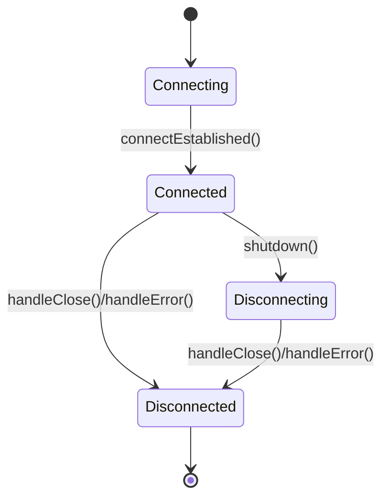
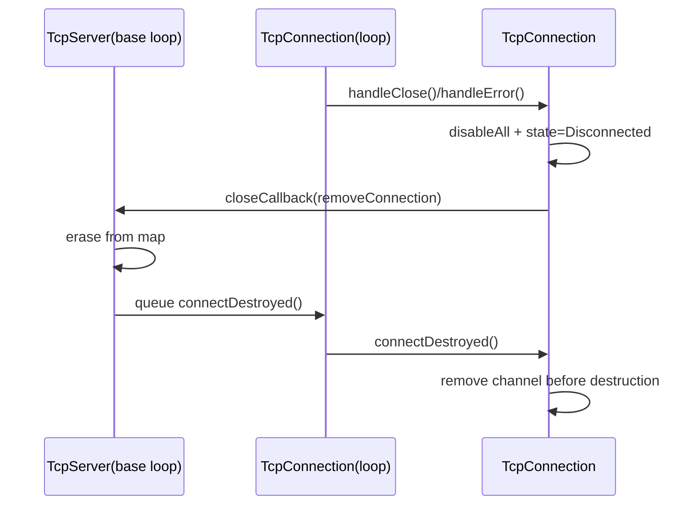
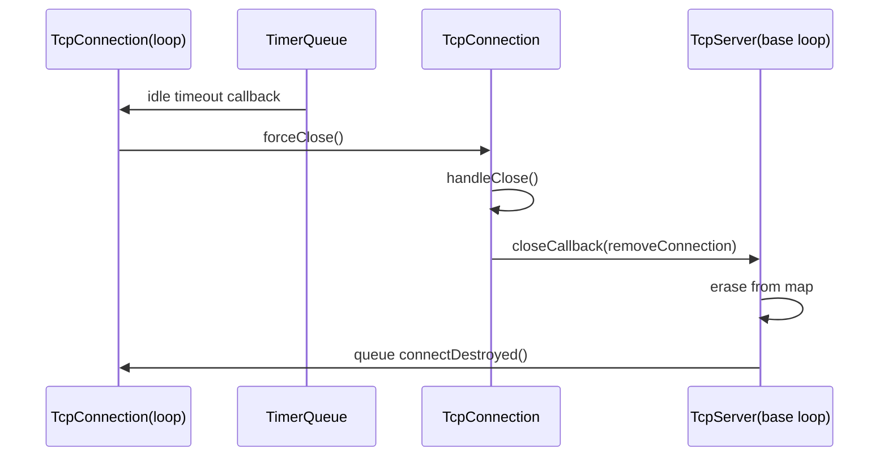
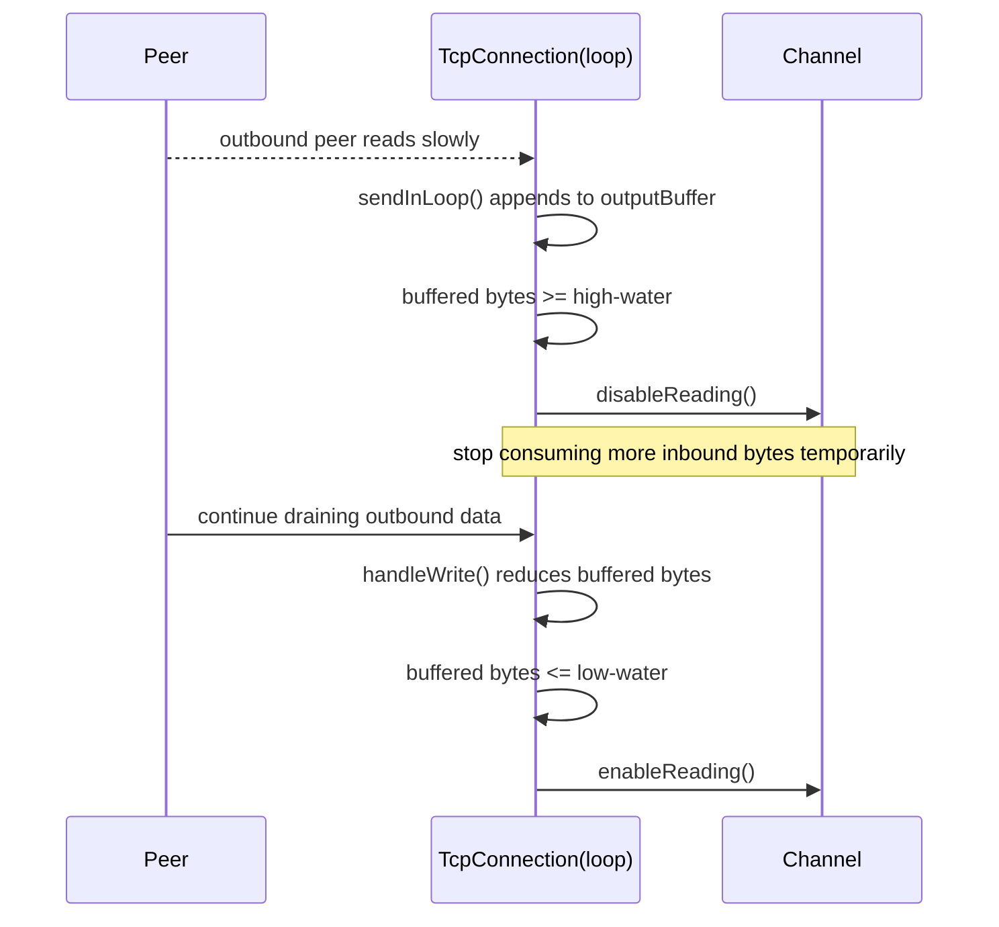

# mini Tcp 生命周期说明

本说明记录本轮修复后，`TcpServer` 与 `TcpConnection` 的关键生命周期约束。

## 状态图

## 关闭路径时序

## Idle Timeout 路径时序

## 当前约束
- `TcpServer` 的延迟移除回调必须先验证 server 生命周期令牌，不能默认假设 `this` 还活着。
- `TcpConnection` 的 awaiter 只允许在 owner loop 线程直接观察内部状态；跨线程调用必须先 marshal 回 loop。
- fatal read/write error 必须走统一关闭路径，避免“仅打印错误但仍保持注册”的半坏状态。
- idle timeout 只是 close 的触发来源之一，不能绕开 `handleClose() -> removeConnection() -> connectDestroyed()` 这条主路径。

## Backpressure 路径时序

新增约束：
- backpressure policy 只允许通过 owner loop 上的 `Channel` 读兴趣切换实现，不能跨线程直接改注册状态。
- 策略必须使用 high-water / low-water 滞回，避免在单一阈值附近频繁抖动。
