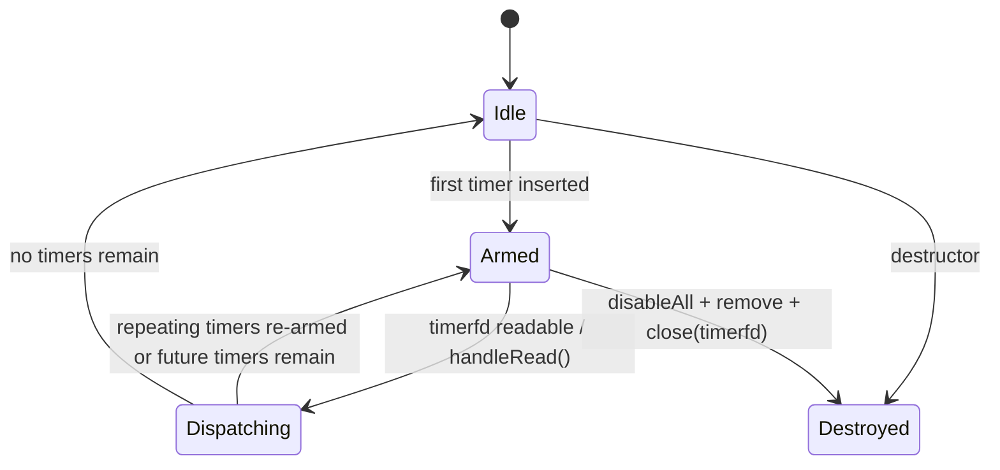

# mini TimerQueue 生命周期说明

本说明记录 `TimerQueue` 与 `EventLoop` 集成后的关键生命周期和线程约束。

## 状态图



## 定时器触发时序

```mermaid
sequenceDiagram
    participant Other as Other Thread
    participant Loop as EventLoop
    participant TQ as TimerQueue
    participant TFD as timerfd

    Other->>Loop: runAfter / runEvery
    Loop->>TQ: addTimerInLoop()
    TQ->>TFD: timerfd_settime(next expiration)
    TFD-->>Loop: readable
    Loop->>TQ: handleRead()
    TQ->>TFD: read expirations
    TQ->>TQ: collect expired timers
    TQ->>TQ: run callbacks on owner loop
    TQ->>TQ: reinsert repeating timers if not canceled
    TQ->>TFD: reset next expiration
```

## 取消时序

```mermaid
sequenceDiagram
    participant Other as Caller Thread
    participant Loop as EventLoop
    participant TQ as TimerQueue

    Other->>Loop: cancel(timerId)
    Loop->>TQ: cancelInLoop(timerId)
    alt timer still pending
        TQ->>TQ: erase timer metadata
        TQ->>TQ: reset next expiration if needed
    else timer already firing / gone
        TQ->>TQ: mark or ignore safely
    end
```

## 当前约束

- `TimerQueue` 归属单个 `EventLoop`，所有内部状态只允许 owner loop 修改。
- `TimerQueue` 必须先移除 timerfd 对应的 `Channel` 注册，再关闭 timerfd。
- repeating timer 只有在未被取消时才允许重新插回队列。
- 定时器回调只是“在 owner loop 执行的 functor”，不提供额外线程或隐藏所有权。
