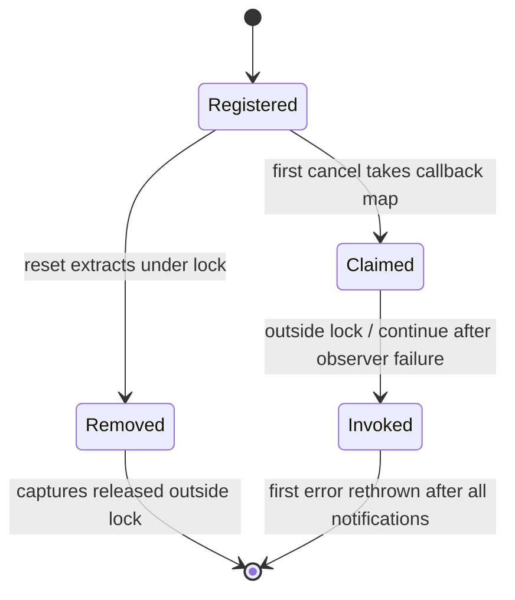
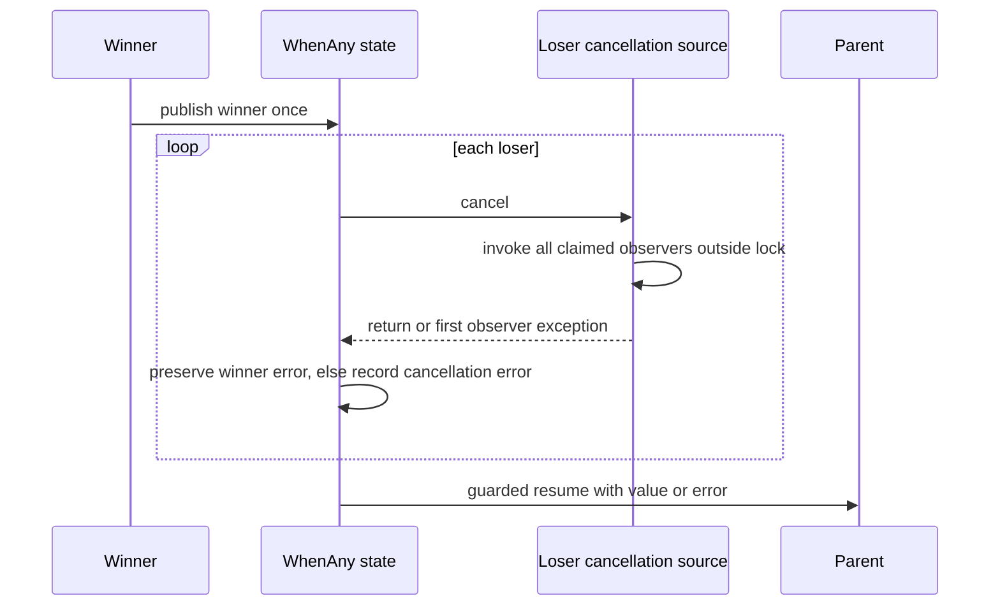

# S1-04a：取消通知的重入和异常

本项先固定同步取消观察者的语义。Reactor 的 I/O 回调异常和 TcpServer 的关闭重入
仍是后续独立工作，不由取消模块的修复代替。

旧 CancellationRegistration::reset 在 mutex 内 erase std::function。捕获对象析构
再次 registerCallback 时死锁：`test_cancellation_reentry release` 的旧代码进程
在 5 秒后以 timeout 124 结束。旧 cancel 在首个观察者异常处中断，fanout 用例断言
失败；WhenAny 已抢占 winner 标志后 cancelLosers 抛出，外层 catch 无法再次 tryWin，
留下挂起的 parent，any 用例在 `parent.done()` 断言失败。

现在 reset 在锁内提取节点，锁外销毁捕获。注册时先准备 bucket 容量，之后移动
callback，避免 rehash 分配失败时在锁内释放已移动的捕获。cancel 一次取走待通知集合，
锁外尝试每个观察者，保存第一个异常，全部尝试后回传。通知顺序不作保证。
注册到已取消 token 的观察者仍在当前调用中立即执行，异常直接回传给注册方。

WhenAny 请求所有 loser 取消，再恢复 parent。若 winner 本已有异常，保留原异常；
否则将第一个取消观察者异常作为 parent 的失败结果。loser Task 自身的结果异常
仍被丢弃。这项规则保证父任务可结束，不承诺强制销毁不配合取消的子任务。

五项 gate：取消状态没有固定线程，mutex 保护 callback 集合；Task/网络 awaitable
继续遵守原来的 frame 和 owner-loop 规则。source/token/registration 持有共享元数据，
不拥有 loop/frame。观察者和捕获析构均可重入 token/source，注册对象本身的 reset/move
仍要求独占访问。跨线程 cancel 执行同步观察者，网络回调仍只投递 owner completion。
`test_cancellation_reentry.cpp` 验证析构重入、异常通知完整性、迟到注册、moved-from
source，以及 value/void 和成功/异常 winner 的四种组合。

reset 不是等待屏障：cancel 已取走的 callback 可以在 reset 返回后执行，捕获对象
必须通过 weak/state 等明确生命周期协议保护。callback 捕获的析构仍须遵守 C++ 的
析构不抛异常约束。

验证：ASan/UBSan + TLS 71/71、Linux Release 68/68、Windows Release 31/31。
插桩 libc++ 18.1.3 下完整 TSan 首轮 68/68，新取消合同全部通过。随后重复四个历史
控制块入口时，普通 TcpServer 第 10 次报告了**真正的实例字段竞争**：析构在
TcpServer.cc:103 reset lifetimeToken_，worker 的 removeConnection 在 :419 读取同一
shared_ptr 对象。它不同于系统未插桩 weak release 的控制块 delete 报告，S1 仍开放。
证据在 `build_audit_s1_control_block_repeat.log`；下一项移除 worker 对 server 成员的访问。

后续 S1-04b 已将通知改为仅携带连接名并经 base LoopHandle 投递，修复和新增析构
重入合同见[server 关闭记录](s1_server_close.md)。本节的 68/68 保留为发现问题时的
历史快照，不代表当前 S1 的完整退出证据。
