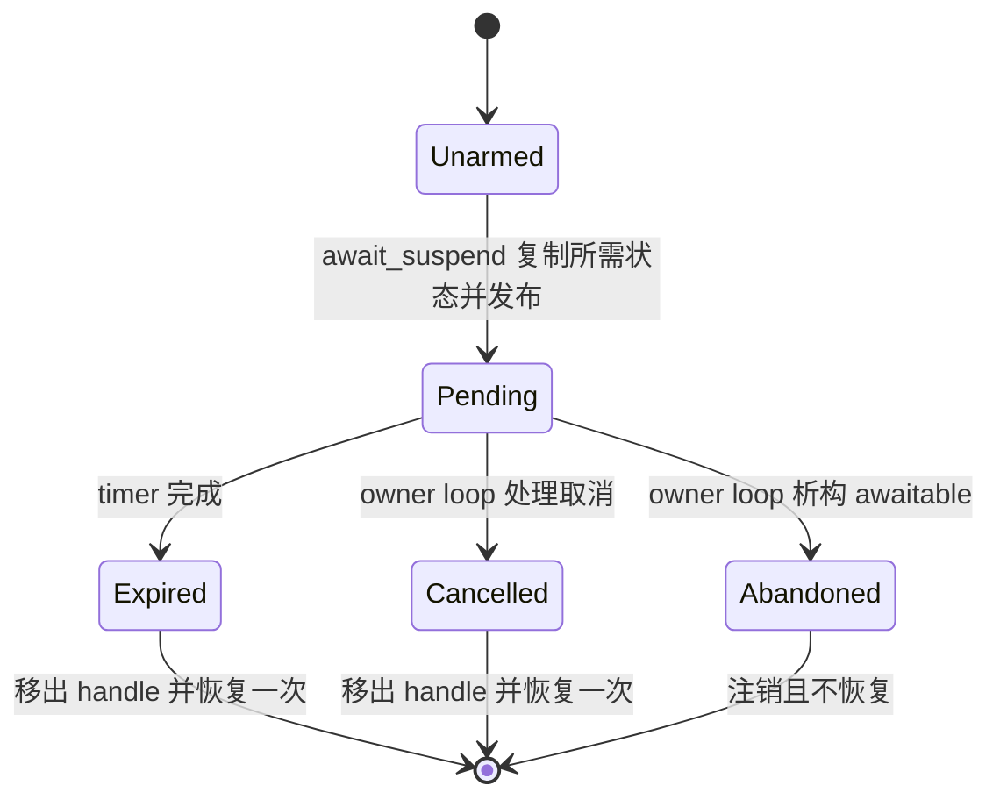
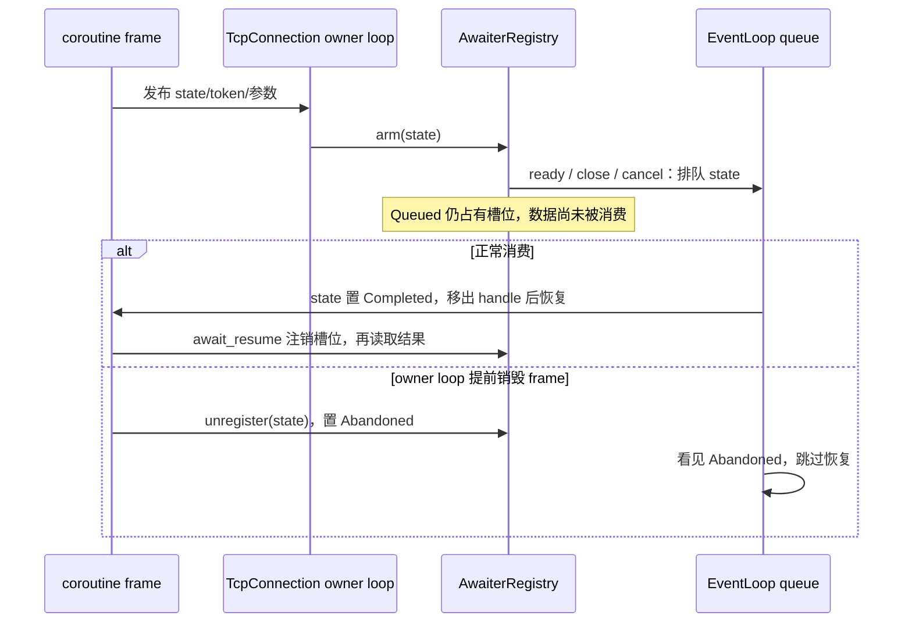
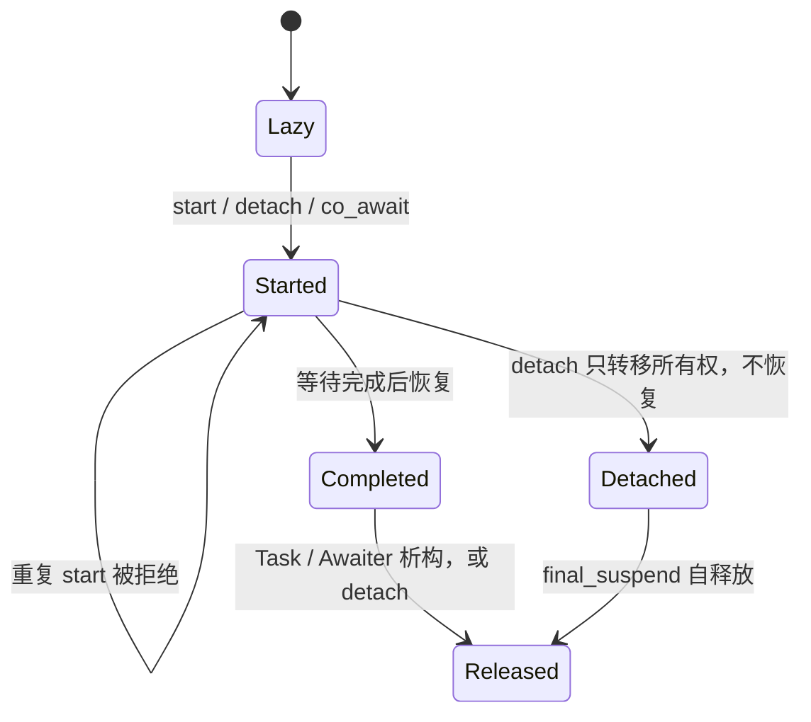

# S1 协程生命周期实施记录

本记录服务于 [唯一研发路线](roadmap.md) 的 S1-01，不替代阶段计划。
首次回归：`contract.coroutine.test_task_lifetime` 在审计提交 `d3647eb`
的 sleep 实现上产生 ASan `heap-use-after-free`，恢复点为过期 timer 的 `handle.resume()`。

## 所有权和线程合同

Task 或它转移出的 Task::Awaiter 独占 coroutine frame；detach 是显式的自持有转移。
网络 awaitable 借用 frame 的恢复入口，不获得 frame 所有权。完成、取消、析构是三个不同动作：

- 完成或取消：移出 handle、注销 timer/取消回调，再在 owner loop 恢复一次。
- 析构：注销并使恢复入口失效，不执行用户协程剩余代码。
- 网络 Task 在挂起时于当前等待所属的 owner loop 析构；与恢复并发的外部直接析构不属于合同。
  跨线程调用方请求取消，并向 owner loop 投递清理。完成后的跨线程移交仍需要同步屏障。

EventLoop 必须活过所有 awaitable 和在途取消请求。线程池停止与 DNS 在途回调的整体屏障
继续在后续 S1 项中处理，不能由本次 sleep 改动推断已经解决。

## Sleep 等待状态

已排队的取消或 arming 回调持有独立的操作状态。即使 awaitable 不再存在，它们也只能检查
终态并返回。取消注册使用 weak_ptr 回调，避免 token、registration、操作状态形成持有环。
`await_suspend` 在投递前复制 token、deadline、state；投递后不再读取 promise 或 awaitable。

SleepAwaitable 改为 move-only，`state()` 仅提供只读诊断视图；读取仍需要 owner-loop 或完成屏障。
测试通过 CancellationSource 或 cancel() 驱动真实取消路径，不再直接修改状态并调用裸 handle。

## 核心变更五项 gate

| 问题 | 回答 |
| --- | --- |
| 哪个线程拥有状态？ | Sleep 的 timer、registration、phase 和恢复入口归目标 EventLoop；发布前初始化由启动调用方完成 |
| 谁拥有、谁释放？ | Task/Task::Awaiter 拥有 frame；awaitable 与 timer/队列闭包共享操作状态；析构注销解除借用，闭包不拥有 frame |
| 哪些回调可重入？ | handle.resume 会执行用户代码并可销毁 awaitable、启动下一次等待；恢复前先完成状态转换并移出 handle |
| 哪些跨线程操作允许？ | await_suspend 一次性发布注册；CancellationSource 请求经 queueInLoop 回到 owner；禁止异线程直接销毁挂起网络 Task |
| 哪个测试验证？ | test_task_lifetime.cpp、test_suspend_publication.cpp、test_sleep_awaitable.cpp、test_cancellation_contract.cpp |

## 验证与剩余工作

当前实现覆盖 sleep 与 TCP read/write/close 的注册和已排队恢复。ResolveAwaitable、
组合器父 frame 提前销毁仍需逐项建立相同强度的合同；Task 启动语义见下文 S1-01c。
P0-01/P1-04 在上述范围完成前保持开放；完整测试与 sanitizer 结果在执行后登记。

S1-01a 验证：Linux GCC ASan/UBSan + TLS 全量 62/62；Windows Release 22/22；
Clang/libc++ TSan 定向 4/4（task_lifetime、suspend_publication、sleep_awaitable、
cancellation_contract）。审计中的后两个 sleep 相关 TSan 失败入口本轮通过；其余报告
不能因此关闭。没有删除测试或加入 sanitizer suppressions。

首轮 sleep 生命周期修复通过 13 个协程相关 ASan/UBSan 用例。随后新增的“预先取消优先于
零时长 timer”合同先产生明确断言失败，再补充 arming 前取消判断；跨线程发布合同包含
200 次启动/取消交错，并使用独立 loop 寿命屏障隔离线程池停止问题。

## TCP 等待与槽位保护（S1-01b）

`test_tcp_awaitable_lifetime.cpp` 在修改前同样触发 ASan UAF。修复后注册表保存共享的
ConnectionAwaiterState；回调借用的 handle 只有在 Queued 状态才允许恢复。awaitable
析构在 owner loop 解除槽位、注销 token 并清空 handle，已经排队的闭包只剩失效状态。

取消 token 只捕获 weak connection/state；注册 action 自身持有 connection，确保“尚未开始
注册就销毁 frame”不会让 action 解引用已销毁连接。两者不持有 frame。
owner 线程重复注册继续同步抛 logic_error；异线程 arming 的异常存入操作状态，排队回到
该协程的 await_resume 抛出。它不应逃逸到无关的 EventLoop callback。

TCP awaitable 改为 move-only。连接非空时统一经过 await_suspend，以便在 I/O 提交前观察
显式或继承的取消 token；ready I/O 也排队完成。空连接仍同步返回 NotConnected。
已排队的 write 仍保留槽位，避免同时存在两个尚未消费完成结果的 write waiter。

Gate 补充：连接和注册表由原 owner loop 管理；frame 的所有者保持 Task/Task::Awaiter。
read/write/close 完成恢复可能重入用户代码，因此先取出 handle；跨线程仅投递完整操作。
新增合同覆盖等待、排队完成、排队取消、注册尚未执行、重复注册和预先取消不发送数据；
`test_connection_awaiter_registry.cpp` 恢复了原来跳过的取消及取消后析构测试。

第一轮 GCC ASan/UBSan 全量 63/63；补充跨线程与槽位合同后的结果另行登记。
补充合同通过 ASan 定向 1/1；Windows Release 全量 23/23。
完整 Clang/libc++ TSan 为 54/60，新增 TCP 合同通过；剩余 6 项均为审计已记录的
thread_pool_stop、connector、timer_queue、dns_contract 及两个 TcpServer 集成用例。
原 sleep_awaitable/cancellation_contract 失败本轮保持通过，不新增排除或 suppressions。

## Task 初始启动和所有权转移（S1-01c）

新回归先证明：重复 start 会越过尚未完成的 sleep，提前执行后续协程代码。
Task promise 现在记录 Lazy/Started，start 只离开 initial_suspend；挂起时再次 start 抛
logic_error。对已完成 Task 的 start 保持无操作。

detach 已启动的 Task 时只转移所有权；detach 已完成的 Task 直接释放，不能 resume
final_suspend。co_await 已启动子 Task 只连接 continuation，等待其现有操作完成。
Task::Awaiter 显式 move-only；空 Task 的 await_resume 抛出 logic_error。

Gate：Task 仍无 EventLoop 所有权或调度器；frame 始终由 Task、Awaiter 或显式 detached
状态中的一个拥有。已有 continuation/final_suspend 可重入父协程；本次没有新增跨线程
入口，Task 对象的访问与所有权转移仍要求外部同步及网络等待的 owner-loop 约束。
`test_task_start_contract.cpp` 验证重复启动、两种 detach、已启动子 Task、空 await 和
Awaiter 移动后 frame 参数恰好释放一次。

验证：GCC ASan/UBSan + TLS 全量 64/64；Linux Release 61/61；Windows Release 24/24。
本轮不宣称组合器和 DNS 的 frame 生命周期已经解决。
