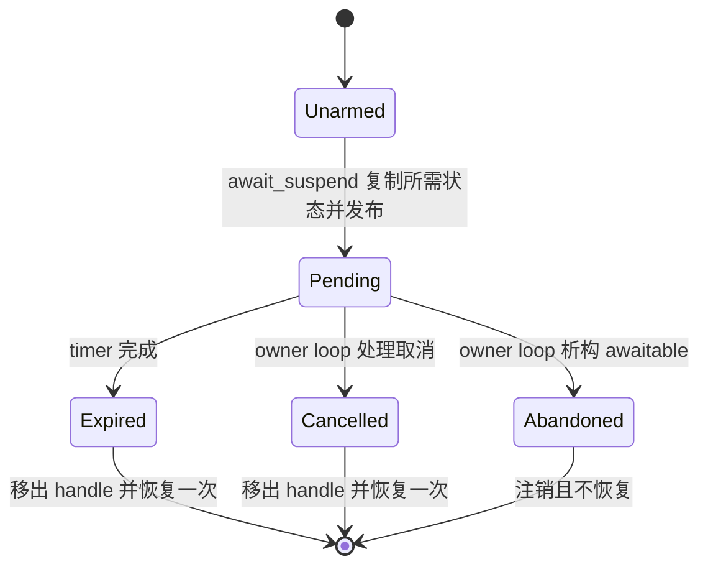

# S1 协程生命周期实施记录

本记录服务于 [唯一研发路线](roadmap.md) 的 S1-01，不替代阶段计划。
首次回归：`contract.coroutine.test_task_lifetime` 在审计提交 `d3647eb`
的 sleep 实现上产生 ASan `heap-use-after-free`，恢复点为过期 timer 的 `handle.resume()`。

## 所有权和线程合同

Task 或它转移出的 Task::Awaiter 独占 coroutine frame；detach 是显式的自持有转移。
网络 awaitable 借用 frame 的恢复入口，不获得 frame 所有权。完成、取消、析构是三个不同动作：

- 完成或取消：移出 handle、注销 timer/取消回调，再在 owner loop 恢复一次。
- 析构：注销并使恢复入口失效，不执行用户协程剩余代码。
- 网络 Task 在挂起时于当前等待所属的 owner loop 析构；与恢复并发的外部直接析构不属于合同。
  跨线程调用方请求取消，并向 owner loop 投递清理。完成后的跨线程移交仍需要同步屏障。

EventLoop 必须活过所有 awaitable 和在途取消请求。线程池停止与 DNS 在途回调的整体屏障
继续在后续 S1 项中处理，不能由本次 sleep 改动推断已经解决。

## Sleep 等待状态

已排队的取消或 arming 回调持有独立的操作状态。即使 awaitable 不再存在，它们也只能检查
终态并返回。取消注册使用 weak_ptr 回调，避免 token、registration、操作状态形成持有环。
`await_suspend` 在投递前复制 token、deadline、state；投递后不再读取 promise 或 awaitable。

SleepAwaitable 改为 move-only，`state()` 仅提供只读诊断视图；读取仍需要 owner-loop 或完成屏障。
测试通过 CancellationSource 或 cancel() 驱动真实取消路径，不再直接修改状态并调用裸 handle。

## 核心变更五项 gate

| 问题 | 回答 |
| --- | --- |
| 哪个线程拥有状态？ | Sleep 的 timer、registration、phase 和恢复入口归目标 EventLoop；发布前初始化由启动调用方完成 |
| 谁拥有、谁释放？ | Task/Task::Awaiter 拥有 frame；awaitable 与 timer/队列闭包共享操作状态；析构注销解除借用，闭包不拥有 frame |
| 哪些回调可重入？ | handle.resume 会执行用户代码并可销毁 awaitable、启动下一次等待；恢复前先完成状态转换并移出 handle |
| 哪些跨线程操作允许？ | await_suspend 一次性发布注册；CancellationSource 请求经 queueInLoop 回到 owner；禁止异线程直接销毁挂起网络 Task |
| 哪个测试验证？ | test_task_lifetime.cpp、test_suspend_publication.cpp、test_sleep_awaitable.cpp、test_cancellation_contract.cpp |

## 验证与剩余工作

当前实现先覆盖 sleep。TCP read/write/close 的注册和已排队恢复、ResolveAwaitable、
组合器父 frame 提前销毁，以及 Task 重复启动仍需逐项建立相同强度的合同。
P0-01/P1-04 在上述范围完成前保持开放；完整测试与 sanitizer 结果在执行后登记。

S1-01a 验证：Linux GCC ASan/UBSan + TLS 全量 62/62；Windows Release 22/22；
Clang/libc++ TSan 定向 4/4（task_lifetime、suspend_publication、sleep_awaitable、
cancellation_contract）。审计中的后两个 sleep 相关 TSan 失败入口本轮通过；其余报告
不能因此关闭。没有删除测试或加入 sanitizer suppressions。

首轮 sleep 生命周期修复通过 13 个协程相关 ASan/UBSan 用例。随后新增的“预先取消优先于
零时长 timer”合同先产生明确断言失败，再补充 arming 前取消判断；跨线程发布合同包含
200 次启动/取消交错，并使用独立 loop 寿命屏障隔离线程池停止问题。
