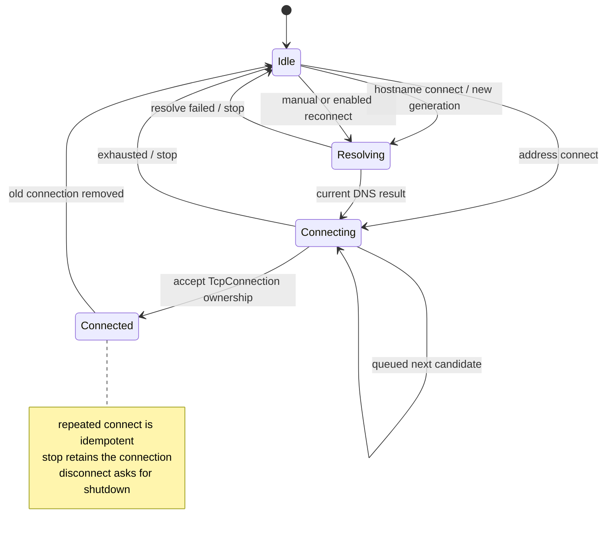
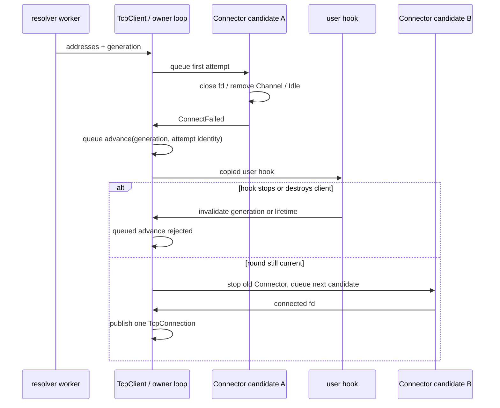

# S1-04c：DNS 候选与主动连接生命周期

## 触发证据

`79438ff` 的[远端 CI](https://github.com/YanqingXu/mini_trantor/actions/runs/34683534301)
确认插桩运行库构建和正负对照成功；Linux Debug、Release、Clang、ASan 与 TSan
仍在两项 DNS 测试失败。unit 要求 localhost 首地址为 127.0.0.1；hostname echo
则在 5 秒内无法完成。Windows 当时的子集不含这两项，不能代替 Linux 结果。

DNS 本身通过 AF_UNSPEC 返回系统顺序，TcpClient 却只使用首地址。原 Connector
的 start 又覆盖了 enableRetry=false，使第一个失败地址无限重试。改变系统的
IPv6 优先级或把测试换成数字 IPv4 都不能修复这个组合行为。

测试用链接包装提供固定 getaddrinfo 结果，真实 Connector 仍发起非阻塞 TCP。
在旧头文件与 `79438ff` 静态库组成的隔离构建中，回退、失败终止、hook 取消、
重复 connect、旧 DNS 结果五个模式均退出 134，记录在
`build_audit_dns_candidate_red/`。回退模式在截止前仍停留首候选；失败模式观察到
禁止的 RetryScheduled；旧结果模式在明确的双队列标记处观察到过期 attempt。
重复连接模式只保留 SIGABRT 事实，不从缺少细节的日志推断具体内部竞争。

另有五项 Connector 红证据在 `build_audit_connector_reentry/red_*.log`：终端 hook
看到 Connecting 状态、关闭 retry 后仍安排定时器、ConnectAttempt 中 stop 后仍
继续连接、自替换 hook 提前销毁正在执行的捕获、RetryScheduled 中 stop 后仍被
新安装的 timer 保活。它们需要先明确回调边界，才能安全推进下一个 DNS 候选。

## 合同与实现

TcpClient 的连接轮次区分 Idle、Resolving、Connecting 和 Connected。Connected
表示已经接管一条 TcpConnection；TLS 身份认证仍有独立的握手状态。重复 connect
不会启动第二份解析或覆盖现有连接。每轮有 generation；stop、disconnect、析构和
新轮次使先前 DNS/排队推进无效。候选推进还检查当前 Connector 身份，避免旧 attempt
影响替换后的对象。

DNS 候选严格依系统顺序逐个尝试，每个候选关闭自动 retry。只有失败、超时或自连接
终端事件才排队推进下一项；全部失败后回到 Idle，显式 connect 可开启新轮次。
没有增加 DNS 后端或并发地址竞速；未设置连接超时的候选仍等待 OS 的 connect 终点。
用户通过 ConnectorEvent 观察每个候选的尝试和失败，不伪造一个已连接对象来通知失败。
最终候选失败在用户 hook 前发布 Idle，因此该 hook 内显式 connect 可以开启新轮次；
新 generation 使旧推进无效。中间候选失败时的重复 connect 则继续保持幂等。

单地址 TcpClient 仍使用 ConnectorOptions.enableRetry 控制失败后的退避重试。
TcpClient.enableRetry 单独控制已建立连接关闭后的重连。原来“默认 false 却自动重试”
属于实现违约；需要失败重试的调用方应显式启用 ConnectorOptions，而不是依赖旧缺陷。
stop 取消建立过程与未来重连，保留已建立连接；disconnect 还请求该连接 shutdown。

Connector 在失败 hook 前完成 timer 取消、fd 关闭、Channel remove 和 Idle 状态发布。
start/restart 始终排队，新 generation 拒绝旧 readiness/timer。退役队列拥有具体旧
Channel，不再通过 self->resetChannel 误删替换后的 Channel。hook 使用函数快照；
ConnectAttempt 后重新检查 generation，RetryScheduled 在 timer 安装后才通知。
retry 配置与连接意愿分离，退避按配置恢复并避免 duration 翻倍溢出。

socket 创建是一个候选失败点：新增 recoverable `sockets::createNonblocking`
返回无效句柄和平台错误，Connector 发出 ConnectFailed 后允许回退。旧 OrDie
入口保留其 fail-fast 含义。Windows 非阻塞设置失败会先关闭已建 socket，再恢复
原错误；WinSock 全局初始化规则不变。IPv6 不可用不应导致整个 hostname 客户端退出。

## 测试与五项 gate

1. **线程归属**：TcpClient/Connector 状态、回调、Channel 和 timer 都由 owner loop
   修改；DNS worker 仅返回地址值。配置在发布前完成，已有跨线程请求经 owner 调度。
2. **拥有与释放**：应用拥有 client，client 拥有当前 Connector 与连接；旧 Channel
   由 owner 的退役队列释放。DNS/推进通知保存 weak lifetime、generation 和 weak attempt，
   不延长 client 生命周期。Socket 的 raw fd 只在明确成功交付点转移。
3. **重入**：Connector hook 可停止、重启、自替换或销毁 client；旧代次不得继续。
   Connected 内重复 connect 幂等，Disconnected 内手动重连延迟到旧连接移除之后。
   Disconnected hook 只从连接状态通知一次，bookkeeping close 不再重复发送。
4. **跨线程**：public client 控制请求回到 owner；DNS 仍通过 LoopHandle 回流；
   候选推进总排队。已经进入 getaddrinfo 的工作不能被取消，但过期结果无效。
5. **合同映射**：`test_dns_candidates.cpp` 覆盖可控地址顺序、终止、旧结果、回调
   重入和 socket family 失败；`test_connector_reentry.cpp` 覆盖主动连接状态边界；
   `test_socket_creation.cpp` 直接验证新平台 API。旧 Connector/DNS/TCP 测试保留。

受控 DNS 合同将相同生产 DnsResolver 和 Linux SocketsOps 实现编译到测试可执行文件，
在系统调用边界使用 `--wrap`；因此静态及共享库配置都能检查该边界，不添加生产测试
注入 API。wrapper 查询次数、参数和实际 TCP 结果必须符合预期；共享库配置另外实测。
真实 hostname 集成仍使用系统解析，协程示例则明确选取与 IPv4 listener 匹配的地址。
unit 对每个候选验证 family/loopback/port，并验证 cache 的完整顺序及 IPv6 scope。

## 验证与剩余工作

追加复审发现最终失败 hook 的显式 connect 原先会被 Connecting 状态吞掉。
隔离副本链接本轮修复前的 Release 产物，`final_failure` 模式退出 134；加入
“失败 hook 请求新一轮，第二轮连接成功”和“中间失败 hook 不重复解析”两侧合同。

Windows 的初次新增 Connector 合同有两个 watchdog 失败。逐 mode 定位及独立
WinSock 探针表明，本机拒绝连接约需 2.03–2.05 秒，三次串行拒绝超出原总计 5 秒。
测试改为每个 ConnectAttempt 的 5 秒进展期限，仍要求恰好三次尝试、三次失败，
超过次数立即断言；未减少场景或改变 CTest 全局超时。

补入最终失败 hook 合同后的 ASan 全量曾为 74/75；新增合同全部通过，保留背压
策略集成在 EOF 断言失败。受控交错证明其从 worker 的 Disconnected 提前退出 base，
使后续关闭消息被拒绝。测试改为真实 EOF/reset 后投递退出，并在 join worker 后
检查通知次数，原 EOF 时限不变。独立红回归 3/3、修复后 ASan 定向 20/20，详见
[关闭记录追加](s1_server_close.md#保留背压测试的退出屏障)。

最终源码的本地矩阵全部通过：ASan/UBSan + TLS 75/75、Linux Release 72/72、
插桩 libc++ TSan 72/72、Windows Release 34/34。日志为
`build_audit_s1_dns_candidates_{asan,release,tsan_instrumented,windows}_final.log`。
BUILD_SHARED_LIBS=ON 下新增 DNS/Connector/socket 合同及安装消费 4/4；受控 wrapper
调用次数与真实连接结果均符合断言，记录在 `build_audit_s1_dns_candidates_shared_final.log`。

TSan 下 DNS candidates、Connector reentry、真实 hostname echo 和保留背压策略
四个入口各重复 20 次，合计 80 次均通过，记录在
`build_audit_s1_dns_candidates_repeat_final.log`。没有排除保留测试或使用 suppression。
上述为本地证据。交接时已独立核对 `0ea897c` 的
[远端 CI](https://github.com/YanqingXu/mini_trantor/actions/runs/34685547831)：
8 个 job 全部成功，包括 Linux Debug/Release、Clang、ASan/TLS、TSan、
Windows Debug/Release 与 framing fuzz。

用户随后要求清理根目录临时产物，上述 `build_audit_*` 日志和构建目录已从工作区移除。
这些路径仅记录历史证据位置；重新验证统一使用 `.tmp/`，详见[交接与环境恢复](HANDOFF.md)。

本项不关闭一般 Reactor 回调异常传播、全部 callback owner 自销毁或 TLS 身份验证。
特别是 TLS 创建失败不得降为明文，与名称/证书链验证一起进入下一项实施；S1 之后
仍须依次完成 S2 TCP 资源边界、平台合同和 S3 负载/发布证据。
