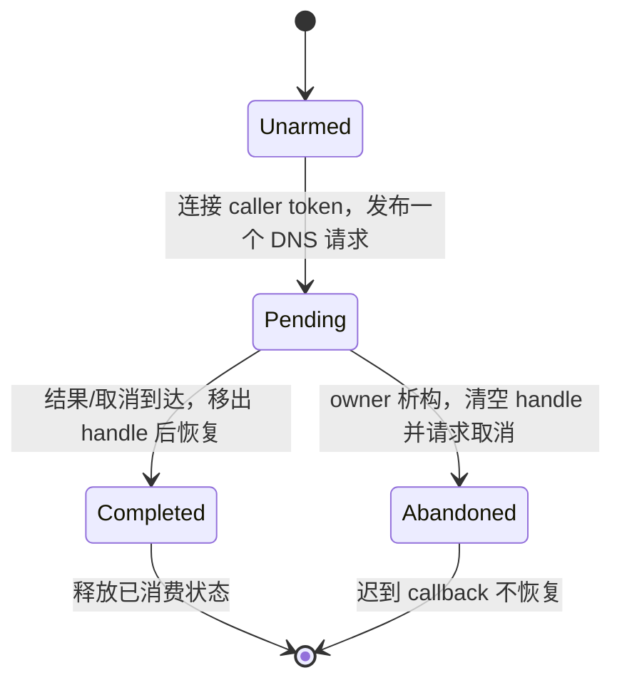

# S1：DNS 生命周期执行记录

## 缓存重入与取消发布（S1-02a）

`test_dns_lifetime.cpp` 的 cache 模式在修改前被 5 秒 watchdog 终止（exit 124）：
首次解析填充缓存，第二次命中的回调调用 clearCache 时再次获取 cacheMutex，形成死锁。
cancel 模式另有明确断言失败：预先取消的 token 在 cache hit 时仍返回成功结果。

缓存结果现在在锁内复制、锁外投递；enableCache 的 TTL 写入与 worker 的 TTL 读取
共用 cacheMutex。缓存命中在 owner 线程仍可以同步回调，因此调用者必须允许重入。

取消回调保留弱操作状态。installRegistration 与 deliver 使用 request mutex，完成标记
与 registration 的移出是一个受保护的步骤；实际注销和用户回调都在解锁后执行。
已经完成的 request 不再安装迟到的 registration，不会留下 token/operation 持有环。
预先取消在查缓存之前排队返回 Cancelled。

```mermaid
sequenceDiagram
    participant Caller as resolve 调用方
    participant Request as 操作状态与 registrationMutex
    participant Loop as callback EventLoop
    Caller->>Caller: 复制 hostname 等请求数据
    Caller->>Request: 注册 weak cancellation callback
    par 注册返回后安装
        Caller->>Request: 加锁，未完成才保存 registration
    and 取消或结果到达
        Loop->>Request: 加锁，置 completed，移出 registration
        Loop->>Loop: 解锁后注销并调用用户 callback
    end
```

ResolveAwaitable 在发布前持有局部 resolver 引用，防止同步完成销毁 awaitable 时，
正在执行 resolve 的 resolver 提前释放。请求入口也先复制 hostname，不能在发布后
继续借用可能随协程 frame 一起消失的输入字符串。

## 核心变更 gate

| 问题 | 回答 |
| --- | --- |
| 哪个线程拥有？ | blocking getaddrinfo 在 worker；用户完成在 callbackLoop；缓存及 registration 各有明确的 mutex |
| 谁拥有与释放？ | resolver 拥有并 join worker；request/排队闭包共享操作状态；取消回调 weak 借用；frame 仍归 Task/Awaiter |
| 哪些回调可重入？ | cache hit 的用户 callback 可以 clearCache、enableCache、再次 resolve 或完成协程；执行时不持库内缓存/registration 锁 |
| 跨线程如何处理？ | resolve/cancel 可并发；取消经 queueInLoop 完成；install/reset 通过同一 request mutex 串行 |
| 测试在哪里？ | test_dns_lifetime 覆盖缓存重入、预取消缓存、200 个取消/注册交错和 TTL 并发更新、Task 提前销毁；原 DNS unit/contract/integration 继续运行 |

## 尚未关闭

S1-02a 时 callbackLoop 仍是裸借用指针；下文 S1-02b 处理迟到投递，S1-02c 处理
ResolveAwaitable 析构取消及网络 awaitable 的迟到通知。线程启停、统一关闭和异常策略
仍在 S1 后续工作中。
本次不把 resolver 的 worker join 误当作 loop 中用户 callback 已经完成的屏障。

## 验证

Linux GCC ASan/UBSan 与 Clang/libc++ TSan 的 DNS unit/contract/integration 均为
4/4；Windows Release 全量 26/26。随后以每请求三方 barrier 加强取消/注册/TTL
更新交错，新增合同在 ASan、TSan、Windows 各通过 1/1。原 dns_contract 的 TSan
registration 报告在本轮通过，其他 S1 失败入口没有因此关闭。

## 非 owning 投递与目标关闭（S1-02b）

新回归在修改前触发 ASan stack-use-after-scope：loop 已退出作用域，CancellationSource
里的 DNS 通知仍调用其 queueInLoop。回归覆盖 40 轮目标销毁、640 个 callback 请求和
40 个先在 owner 线程释放的解析 Task；resolver 最后 join，检查 callback 捕获资源全部释放。

EventLoop::handle() 现在提供 LoopHandle 快照。queue 只负责排队，返回值表示是否入队；
共享 metadata 的 mutex 覆盖检查、入队和 wakeup。EventLoop 析构先在同一 mutex 下
清空借用指针，再释放描述符。loop() 的最后一次空队列检查也在 posting mutex 和 queue
mutex 下关闭句柄，因此生产者不会在“最后检查已结束”之后仍得到接受结果。

```mermaid
sequenceDiagram
    participant Producer as DNS worker / cancel
    participant Handle as LoopHandle posting mutex
    participant Loop as owner EventLoop
    Producer->>Handle: queue(result)
    alt loop 仍开放
        Handle->>Loop: queuePrepared + wakeup
        Handle-->>Producer: accepted
        Loop->>Loop: owner 执行 callback
    else loop 已关闭
        Handle-->>Producer: rejected
        Producer->>Producer: takeCallback：终态、注销、释放捕获，不执行回调
    end
    Loop->>Handle: 最终排空或析构：使借用指针失效
```

queuePrepared 接收已经构造好的待入队项。vector 分配失败时，该项仍由调用方局部
变量持有，释放 callback 捕获发生在 posting/queue mutex 解锁之后。合同也覆盖关闭
目标拒绝回调时，捕获对象析构再次调用 queue 的重入。

DNS worker 与取消通知只保留 LoopHandle，不再保存裸 callbackLoop；cache hit 也统一
排队，不再同步执行用户 callback。空 loop 或空 callback 参数在发布前抛 invalid_argument。
目标已关闭时，操作完成标记与 registration 在 request mutex 下统一取出，随后在锁外
释放。回调执行仍只在 owner-loop；放弃回调时，捕获资源的析构可能位于 worker/cancel
线程，调用方必须遵守这些资源的所有权规则。

Gate：LoopHandle 不拥有 loop/frame；EventLoop 仍由 owner 线程销毁。共享 mutex 只保护
借用期的投递，不运行用户代码。获取 handle 时原 loop 必须仍然存活；已有 raw-pointer
API 仍要求生产者停止和生命周期同步。test_loop_handle 验证 default/expired、启动前
入队、owner 执行、quit 后嵌套排空、返回后拒绝、并发析构及捕获析构重入；DNS 回归验证
迟到结果和取消。未运行的 loop 可以丢弃队列；handle 不负责释放用户未清理的协程帧。

这一变更没有完成 S2 的容量限制和 quitting 准入策略；持续生产者仍需先停止，再等待排空。

S1-02b 验证：ASan/UBSan + TLS 全量 67/67、Linux Release 64/64、Windows Release
27/27；完整 Clang/libc++ TSan 为 59/64，DNS 与 LoopHandle 合同均通过。
本轮失败入口为 thread_pool_stop、connector、timer_queue、tcp_server_threaded 和
coroutine_idle_timeout。最后一个是新记录的测试入口：堆栈经过 TcpServer.cc:103 的
lifetimeToken reset 与 TcpServer.cc:388 close callback 的 weak 控制块释放，加入已有
TcpServer 生命周期/标准库插桩分诊；归因尚未完成。普通 tcp_server 本轮未复现，仍不关闭。

## 请求所有权与迟到取消（S1-02c）

新增 test_resolve_awaitable_lifetime 在修改前断言失败：第二个 Task 等待同一
ResolveAwaitable 会覆盖第一个 continuation。现在 awaitable 为 move-only，第二次等待
在发布前抛 logic_error；空 resolver/loop 也在构造时拒绝。



每个 ResolveState 拥有独立 CancellationSource，caller token 的注册回调只向它转发
取消。awaitable 析构先置 Abandoned、清空 handle、注销转发，再取消自己的请求。
因此不会反向取消调用方的 source，也不隐式接管 frame。已进入 getaddrinfo 的操作
不能被强制中断；resolver 的 worker join 仍可能等待 OS 返回。

Sleep 的 token 通知和显式 cancel 改用 LoopHandle。新的 200 次“取消与 owner 清理
同时开始”回归在旧实现触发 LeakSanitizer：迟到通知向已经清理的队列写入，泄漏 functor
和 SleepState。修复后，关闭目标拒绝通知；诊断状态并不拥有 loop。

TCP 的取消通知只捕获 weak connection/state 和 LoopHandle，在排队到 owner 后才
取得强引用。取消线程不再可能成为 TcpConnection 的最后一个强所有者。新增 200 次
socket/Task/loop 清理交错合同；该旧版 TCP 压力用例本轮未复现 sanitizer 失败，因此
此项依据是所有权路径审查与新合同，不能冒称另一个已经复现的 UAF。

Gate：所有 Pending awaitable 的析构与注销仍在 owner-loop；callback 恢复可以重入
用户代码，必须先完成状态转换并移出 handle。Task/Awaiter 持有 frame，操作状态与
安全投递句柄不持有 frame/loop。跨线程取消仅投递元数据，TCP 强引用在 owner 获取。
验证入口为 test_resolve_awaitable_lifetime、test_cancel_during_teardown，以及已有
sleep/TCP/DNS/whenAny/timeout 合同。自定义裸 handle awaitable 和未清理的 detached
任务仍需要调用方的生命周期协议。

S1-02c 验证：ASan/UBSan + TLS 全量 69/69；Linux Release 66/66；Windows Release
29/29。完整 Clang/libc++ TSan 61/66，剩余失败入口与上一轮相同；新的 resolve/取消清理
合同均通过。没有删除测试或设置 suppressions。S1 的线程启停、异常与 TLS 阻塞项继续开放。
