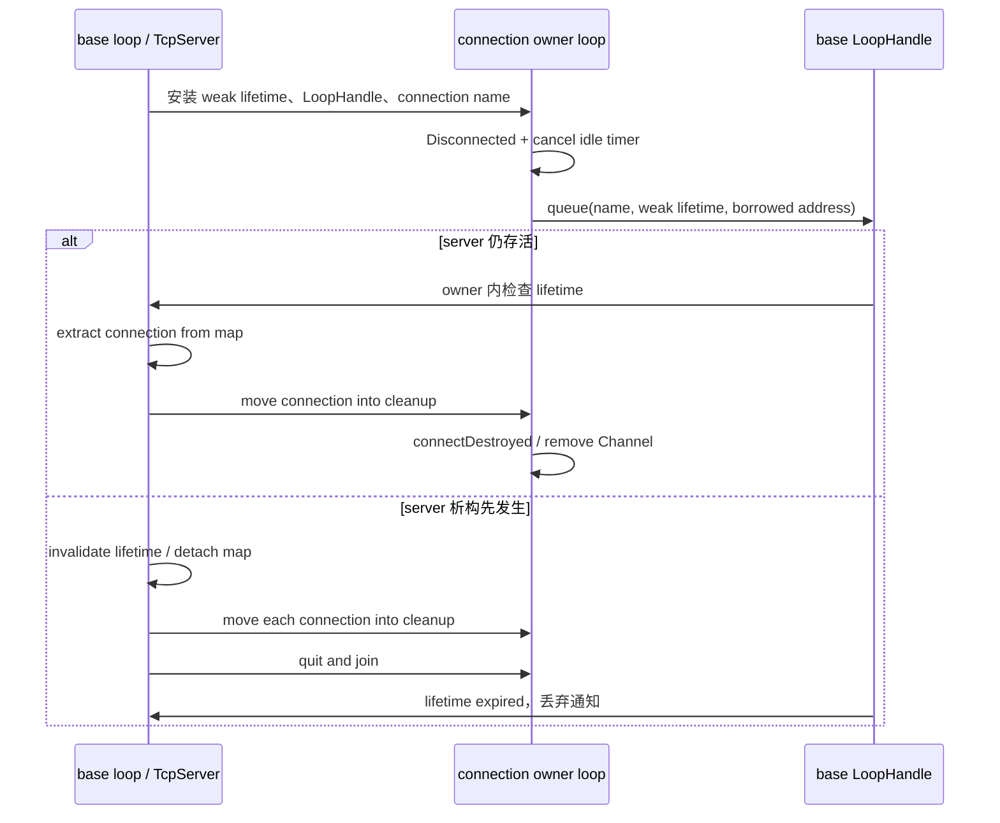
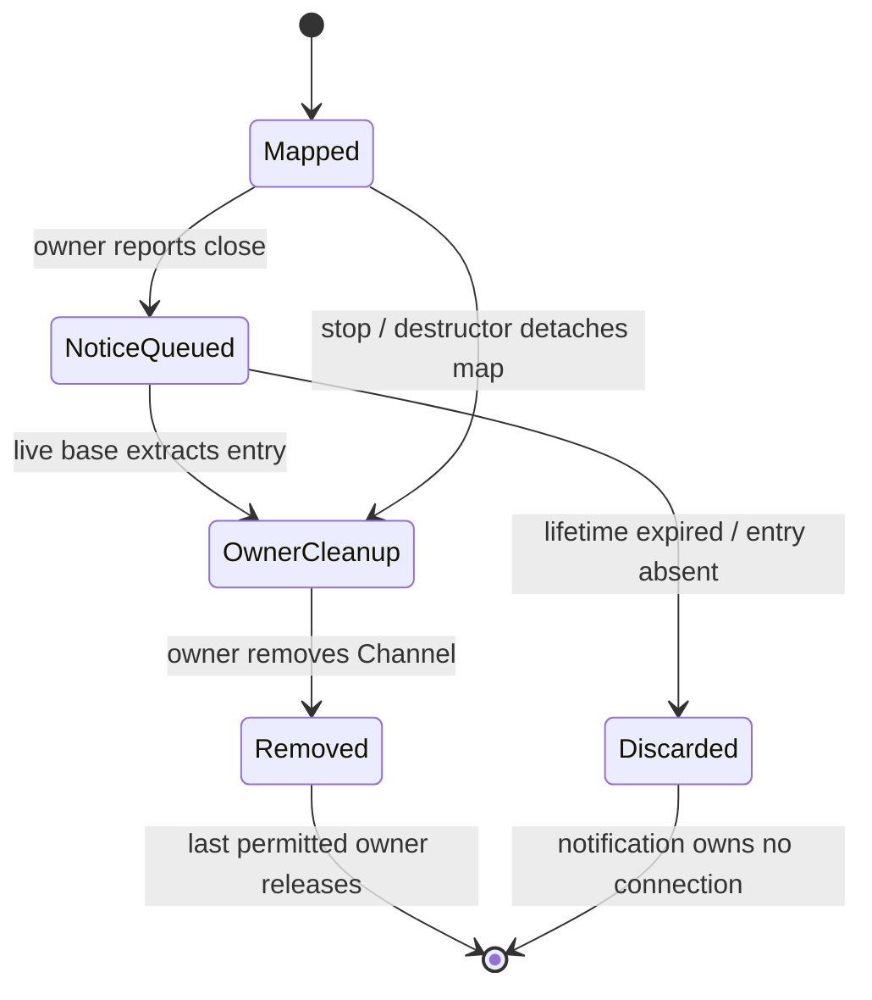

# S1-04b：TcpServer 关闭通知与析构

## 失败场景与边界

插桩 libc++ 的历史入口重复验证，在普通 TCP server 集成测试第十轮报告真实竞争：
base 线程析构重置 `lifetimeToken_`，worker 从 `removeConnection` 读取同一个
shared_ptr 实例。旧 close callback 虽然先检查 weak lifetime，但检查并不拥有
TcpServer，也不串行化随后对 server 成员的读取。独立控制块对照通过后，这个
实例字段报告仍成立，不能按标准库误报关闭。

新增公开 API 契约还稳定复现一个所有权问题：base 暂缓处理移除通知，等 worker
完成 close 后析构 server；通知捕获的强连接引用仍留在 base 队列，`weak.expired()`
断言失败，ASan 构建退出 134。通知本来只需要找到 base map 中的记录，却延长了
连接及用户 context 的寿命。

日志入口为 `build_audit_s1_control_block_repeat.log`（原真实竞争）、
`build_audit_s1_server_close_red.log` 与对应 `_status.log`（新增稳定失败）。
另行执行 100 次旧版退出交错测试未报告竞争；它验证一个边界，不能被描述成
稳定复现上述细小窗口。真实竞争的红证据来自原集成测试日志。

## 不变量和实现

在 base 安装 close callback 时复制 LoopHandle、独立 weak lifetime 和连接名。
worker 只取消自己的 idle timer，并投递这些路由数据；捕获的 `this` 仅作为地址
值交接，worker 不访问它的成员。base 回调检查 lifetime 后才查 map；map 已移除
或 server 已析构时通知无事可做。LoopHandle 关闭后拒绝投递，也无需释放强连接引用。

正常移除用 map 的 extract 取出连接，再把强引用移动到 owner-loop 清理回调。
强制关闭和析构同样把账本引用移交给 owner。析构先标记停止、停止 accept、取消
drain timer 并分离 map，然后通知连接并 join worker；同步 disconnect 回调再次
查询 connectionCount 得到 0，再次 stop 返回，不会修改正在遍历的局部集合。
应用自行保留的 TcpConnection 引用仍须遵守连接的 owner/lifetime 合同。

没有新增公共 API，也没有通过给 shared_ptr 加 atomic 来维持跨线程访问 server。
即使是零 worker，正常关闭通知也总是排队，因此不会在连接 close callback 内
同步修改 server map。Disconnected 通知与 base connectionCount 归零之间允许
存在一轮排队延迟；stop 本身仍同步清空 map。

## 契约与 core change gate

`tests/contract/tcp_server/test_close_during_destruction.cpp` 在 Linux/Windows 都运行：
延迟通知不保活、100 次 base 先退出与 worker 关闭交错、两个零 worker 连接在析构
disconnect 回调内重入 stop/count。同步用队列和 promise，不依赖 sleep 对齐竞态；
定时器只负责失败超时。已有连接事件次数、停服次序、drain 和集成测试继续保留。

1. **线程归属**：TcpServer 的成员、map、lifetime token 实例只由 base 访问；
   连接状态、idle timer、Channel 清理由 connection owner 访问。
2. **拥有与释放**：应用拥有 server；server map 拥有连接，清理时将引用移交
   owner 回调。通知只持连接名、weak token 和非 owning LoopHandle。
3. **重入**：disconnect/hook 可在其 owner 内触发关闭；base 上的析构通知允许
   重入 stop/count，必须先分离 map、公布停止。同步销毁当前正在分发的 Acceptor
   或 Channel、任意回调异常策略仍属于后续审计，不能由本项推导安全。
4. **跨线程**：worker 仅经 LoopHandle queue 通知 base；base 经连接 loop
   调度 connectDestroyed。对 server 的 stop 请求必须回到 base。
5. **测试映射**：新增上述 contract；历史 `test_tcp_server.cpp`、
   `test_tcp_server_threaded.cpp`、`test_connection_event_contract.cpp` 和
   `test_shutdown_ordering.cpp` 联合验证真实连接及停服路径。

## 验证记录

新增定向契约在修复后通过 ASan/UBSan 与插桩运行库 TSan，各 1/1。
最终源码完整矩阵：ASan/UBSan + TLS 72/72、Linux Release 69/69、插桩 libc++
TSan 69/69、Windows Release 32/32。`build_audit_s1_server_close_full_*.log`
与 `build_audit_s1_server_close_windows.log` 保存完整输出。

DNS lifetime、新增 server 析构合同、普通/线程 server 集成、coroutine idle timeout
五个入口各重复 20 次全部通过（`build_audit_s1_server_close_tsan_repeat.log`）。
其中新增合同每次包含 100 次 base 先退出的交错。CI 使用同一插桩运行库脚本，
合法/故意竞争对照与实际链接检查均通过；详见[工具链记录](tsan_toolchain.md)。
远端旧系统库曾报告的 `test_cancel_during_teardown` 另以插桩运行库重复 20 次通过，
输出保存在 `build_audit_s1_server_close_remote_entry_repeat.log`；CI 同样保留该重复入口。

远端上一提交的 Linux job 另有 DNS 首地址假设及 hostname echo 失败，见
[DNS 后续记录](s1_dns_lifecycle.md)。上述是本地最终源码的验证结果，不能据此
声明远端环境或 S1 整体全绿。

S1 整体仍进行中：一般回调自替换/异常传播、服务器完整启停状态机和 TLS 对端
身份验证尚未完成；S2 TCP 上限和 S3 负载/发布证据仍按路线顺序推进。
