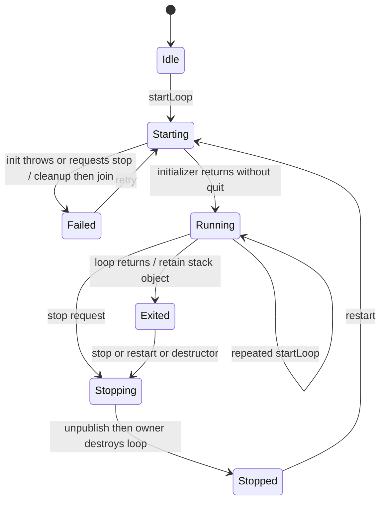
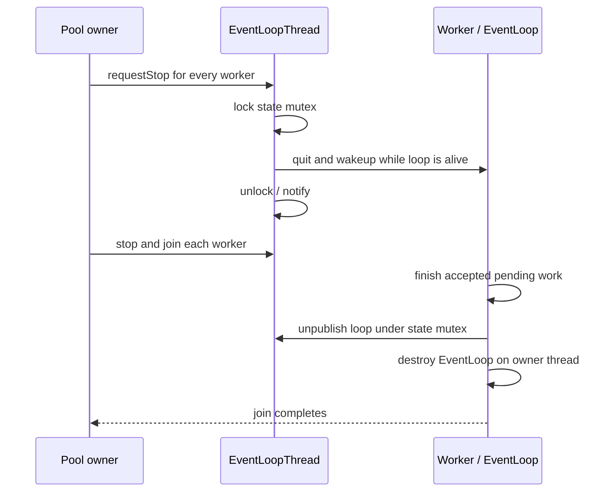

# S1-03：线程启动结果与停止边界

本项解决初始化失败回传与线程池 stop 的裸指针竞争。运行时回调异常、
TcpServer 连接关闭重入及 TLS 身份验证仍由 S1 后续任务处理。

## 失败场景与合同

旧 startLoop 仅等待 `loop_ != nullptr`。初始化回调提前 quit 时，worker
可以在启动方重新拿到锁之前清空指针；初始化回调抛异常则逃出线程入口。
旧 pool.stop 直接调用缓存指针的 quit，无法与 worker 栈上 EventLoop 的销毁互斥。

启动结果必须由状态表达，失败须在 worker 清理并 join 后回传。成功返回的 loop
是借用：存活到 wrapper 的 stop、重启或析构，但其调度可能已经停止。
提前退出的 worker 因此保留栈上的 loop，等待拥有者释放；这段时间保留一个线程
及 loop 资源，调用方应及时 stop。安全投递用 LoopHandle，关闭后的投递明确拒绝。

线程池只在全部初始化成功后发布 worker 集合，部分失败回收所有已启动 worker。
先向所有拥有者发出停止请求，再逐一 join，避免靠缓存裸指针驱动销毁。
零 worker 的 init 回调在 base loop 执行；停止线程池不停止借用的 base loop。

## 变更门禁

1. **线程**：EventLoop 在 worker 构造、运行和销毁；pool 控制与选择属于 base loop。
   EventLoopThread 的外部 start/stop 由 control mutex 串行化，状态另由 state mutex 保护。
2. **所有权**：pool 独占 worker wrapper；worker 栈独占 EventLoop。借用指针不会转移所有权。
   已同步移交 wrapper 所有权后可在其他外部线程析构；在自身 worker 析构属于致命违约。
3. **重入**：初始化回调不持内部锁，可请求自身 stop；启动中再次 startLoop 拒绝。
   pool 的零 worker 回调不能重入 start/stop/选择/配置，失败后恢复 Stopped。
4. **跨线程**：任务仍经 loop 调度；stop 在状态锁保护的存活区间发出 quit/wakeup，
   worker 清空指针后才销毁 loop。调用方须将裸指针使用与 stop/restart 同步。
   停止状态下的 worker 数配置允许在移交给 base loop 前进行，调用方须独占访问；
   它不会访问 Channel/Poller，也不允许与启动、停止或选择并发。
5. **测试**：`tests/contract/event_loop_thread/test_start_stop_failure.cpp` 验证 init-quit、
   原异常回传及重试、自停、提前退出、并发控制、部分 pool 回滚、配置和 owner 约束，
   以及 TcpServer 初始化失败后的再次启动。原 thread/pool 合同与 stop 测试保留。

## 验证记录

- 红测试：旧 init-quit 路径返回成功，触发“必须拒绝启动”的断言；旧 init-throw
  路径因 InitError 逃出线程入口终止进程。前者的指针发布竞争具有永久等待可能，
  但本轮实际观察是错误成功返回，未冒称已经复现超时。
- 首轮定向 ASan/UBSan 4/4、Clang/libc++ TSan 4/4、Windows Release 3/3。
  原 `unit.event_loop_thread_pool.test_thread_pool_stop` 的 wakeup/close 竞争不再报告。
- 另加确定性合同：worker 0 的待完成任务等待 worker 1 的 timer 捕获在析构时释放，
  检查 stop 必须向全部 worker 发请求后才 join；零 worker 合同以 timer 验证 base
  loop 仍可调度，而不只检查 quit 后仍会排空的 pending functor。
- 保留已有“在其他线程配置 TcpServer，再移交 base loop 启动”的合同，并增加专门
  回归。配置期间需要独占访问；不能把尚未发布的配置误判成运行时跨线程修改。
- 最终全量：Linux ASan/UBSan + TLS **70/70**；Linux Release **67/67**；
  Windows Release **30/30**；Clang 18/libc++ 18 TSan **65/67**。
  TSan 本轮失败入口为 Connector 和 TimerQueue 的既有测试同步问题。
  前轮及历史 TcpServer 控制块报告继续开放；前轮新出现的 DNS 控制块报告也进入
  同一分诊队列，不能以本轮未复现关闭。线程池 wakeup/close 的已知竞争已由拥有者锁
  消除，新的启停合同及原线程池测试在最终矩阵均通过。

日志前缀为 `build_audit_s1_thread_final_{asan,release,windows,tsan}.log`。
下一项处理关闭重入/异常策略，并继续追踪控制块报告；S1 整体尚未退出。
