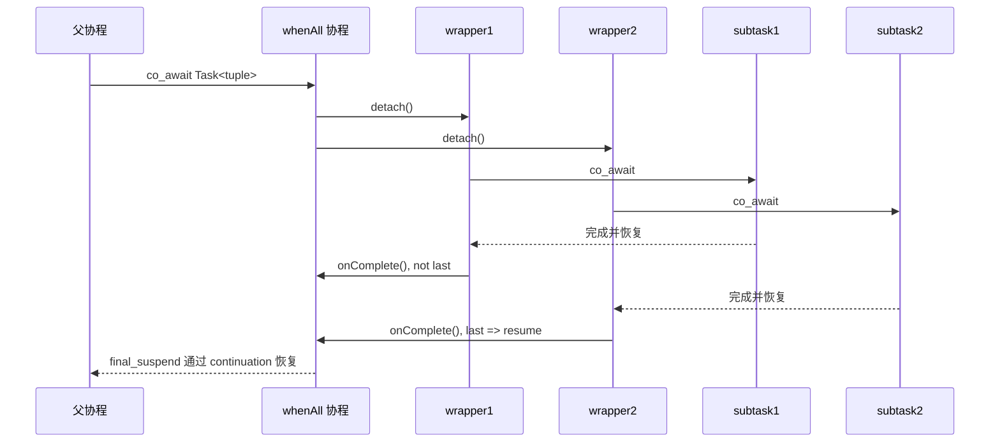
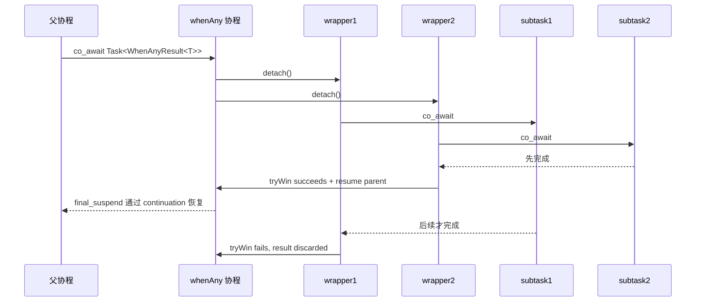

# WhenAll / WhenAny 代码理解文档

## 0. 文档摘要

- `mini::coroutine::WhenAll` 和 `mini::coroutine::WhenAny` 都是“组合器”，不是调度器。
- 它们只负责把多个 `Task<T>` 组织成一个新的 `Task<...>`，并不直接拥有 `EventLoop`。
- 真正的恢复线程由子任务内部 awaitable 决定，而不是由 `WhenAll` / `WhenAny` 决定。
- `WhenAll` 的语义是“全部完成再继续”，结果按输入顺序收集到 `std::tuple`。
- `WhenAny` 的语义是“第一个完成就继续”，返回获胜任务的索引和结果。
- 这两个文件都强依赖 [`Task.h`](../mini/coroutine/Task.h) 提供的三件事：lazy start、continuation、detached self-destroy。
- `WhenAll` 把 wrapper task 放在 awaitable 对象里，因为它要等所有 wrapper 都结束后才恢复父协程。
- `WhenAny` 把 wrapper task 放在 shared state 里，因为父协程可能在第一个 wrapper 完成后立刻恢复，而其他 wrapper 还没结束。
- `WhenAll` 当前实现与 intent 基本一致，但 `firstException` 的并发写入没有同步保护，跨线程多异常场景存在数据竞争风险。
- `WhenAny` 当前实现已经会向剩余子任务注入 `CancellationToken` 并在 winner 确定后请求取消；败者是否立刻退出取决于它们是否在挂起点消费当前 token。
- 对于初次阅读者，最先要抓住的不是模板细节，而是“父协程是谁、wrapper 是谁、subtask 是谁、谁在恢复谁”。

## 1. 模块整体定位

### 1.1 它们是什么

`WhenAll.h` 和 `WhenAny.h` 是协程层的组合原语。  
它们的输入是多个 `Task<T>`，输出是一个新的 `Task<...>`：

- `whenAll(...)` 把多个 task 聚合成一个“全部完成后返回”的 task
- `whenAny(...)` 把多个 task 聚合成一个“第一个完成就返回”的 task

### 1.2 它们解决什么问题

如果只有 `Task<T>`，我们只能：

- 单独 `start()`
- 单独 `detach()`
- 在一个协程里 `co_await` 一个 task

但现实里经常需要“组合等待”：

- 并发等多个操作都完成
- 并发发起多个候选操作，谁先回来用谁
- 做“操作 vs 超时”的竞争

这正是 `WhenAll` / `WhenAny` 存在的意义。

### 1.3 它们不负责什么

这两个模块都不负责：

- 建立 `EventLoop`
- 决定哪个线程恢复协程
- 直接操作 socket / timer / poller
- 实现复杂的取消树
- 负责业务语义

这很重要，因为本项目明确要求“协程是桥，不是替代 Reactor 的另一套调度器”。

## 2. 相关文件地图

本次代码阅读最好同时看下面几个文件：

- `mini/coroutine/Task.h`
- `mini/coroutine/WhenAll.h`
- `mini/coroutine/WhenAny.h`
- `mini/coroutine/SleepAwaitable.h`
- `tests/unit/coroutine/test_when_all.cpp`
- `tests/unit/coroutine/test_when_any.cpp`
- `tests/contract/coroutine/test_combinator_contract.cpp`
- `intents/modules/coroutine_task.intent.md`
- `intents/modules/when_all.intent.md`
- `intents/modules/when_any.intent.md`

它们之间的关系可以概括成：

```text
Task.h
  ├─ 提供 lazy coroutine、continuation、detach、自销毁
  ├─ 被 WhenAll.h 用来包装和启动 wrapper
  └─ 被 WhenAny.h 用来包装和启动 wrapper

SleepAwaitable.h
  └─ 提供一个真实的 EventLoop 绑定 awaitable

WhenAll.h / WhenAny.h
  └─ 只组合 Task，不直接碰 EventLoop

tests/*
  ├─ unit：验证纯协程语义
  └─ contract：验证与 EventLoop 结合后的行为
```

## 3. 先看 Task：不理解 Task，就读不懂组合器

`WhenAll` 和 `WhenAny` 的代码都很短，但它们短的前提是大量语义已经沉到 [`Task.h`](../mini/coroutine/Task.h) 里了。

### 3.1 Task 的三个基本事实

#### 事实 1：Task 是 lazy 的

`TaskPromiseBase::initial_suspend()` 返回 `std::suspend_always`，所以协程函数创建后不会立刻执行，必须通过：

- `start()`
- `detach()`
- `co_await`

之一来启动。

#### 事实 2：Task 可以把“后续恢复点”挂在 continuation 上

`Task::Awaiter::await_suspend()` 会把父协程句柄写入 `promise.continuation_`，然后返回子协程句柄。  
这意味着父协程挂起后，控制权直接切到子协程。

#### 事实 3：detach 后，协程帧会在 final_suspend 自毁

`Task::detach()` 会：

1. 把 `Task` 对象里的 handle 取出来
2. 标记 `detached_ = true`
3. 立刻 `resume()`

后面当子协程走到 `final_suspend()` 时，`FinalAwaiter::await_suspend()` 发现它是 detached 的，就直接 `handle.destroy()`。

这一点是两个组合器的生命线，因为它们都把 wrapper 当作 fire-and-forget 任务启动。

### 3.2 为什么 wrapper 能安全 `co_await` subtask

在 wrapper 里会看到这样的代码：

```cpp
auto val = co_await std::move(subtask);
```

这里并不是“把 subtask 跑完后对象还留着”。  
真实过程是：

1. `subtask` 被 `Task::operator co_await() &&` 转成一个 `Awaiter`
2. `Awaiter` 接管 subtask 的 coroutine handle
3. wrapper 的 continuation 被写进 subtask promise
4. subtask 完成后恢复 wrapper
5. `Awaiter` 析构时销毁 subtask coroutine frame

所以 `WhenAll` / `WhenAny` 本身不需要手工管理 subtask frame 的 destroy。

## 4. WhenAll 的核心结构

### 4.1 它的对外接口

`WhenAll.h` 暴露了 3 个重载：

1. `whenAll(Task<Ts>... tasks)`，其中 `Ts...` 全是非 `void`
2. `whenAll(Task<void>... tasks)`，全部是 `void`
3. `whenAll()`，零参数，立即完成

这意味着当前版本的 `WhenAll`：

- 支持异构非 void 返回值
- 支持全 void
- 不支持“部分 void、部分非 void”的混合 pack

### 4.2 Shared state：最后一个完成者负责恢复父协程

值类型版本的共享状态是：

```cpp
template <typename... Ts>
struct WhenAllState {
    std::atomic<std::size_t> remaining;
    std::coroutine_handle<> parent{};
    std::exception_ptr firstException{};
    std::tuple<std::optional<Ts>...> results;
};
```

每个字段都对应一个明确职责：

- `remaining`：还有多少 wrapper 没完成
- `parent`：要恢复的父协程句柄
- `firstException`：记录第一个异常
- `results`：按位置保存每个子任务的结果

最关键的不是 `results`，而是 `remaining`。  
`onComplete()` 通过 `fetch_sub(1)` 判断“我是不是最后一个完成的 wrapper”。只有最后一个会 `parent.resume()`。

### 4.3 为什么 `results` 用 `tuple<optional<...>>`

因为子任务不是同时完成的，结果也不是一次性拿到的。  
所以 `WhenAll` 需要一个“可延后填充”的容器：

- `tuple` 保留编译期类型和输入顺序
- `optional` 允许先空着，等对应任务完成后再 `emplace`

等所有任务结束后，`await_resume()` 再从这些 `optional` 里提取值，组装成最终 `tuple<Ts...>`。

### 4.4 Wrapper 的职责非常单纯

`whenAllWrapper<I, T, State>` 只做三件事：

1. `co_await` 一个 subtask
2. 如果有结果，就写入 `state->results[I]`
3. 如果抛异常，就记录异常
4. 无论成功失败都调用 `state->onComplete()`

它没有调度逻辑，没有线程切换逻辑，也不关心 EventLoop。

### 4.5 为什么 wrapper 数组放在 awaitable 自身里

`WhenAllAwaitable` 有一个成员：

```cpp
Task<void> wrappers_[sizeof...(Ts)];
```

这在 `WhenAll` 里是成立的，因为：

- 父协程只有在“最后一个 wrapper 完成”后才会恢复
- 既然父协程都还没恢复，那么 `WhenAllAwaitable` 这个 `co_await` 临时对象也还没销毁
- 所以 wrapper 放在 awaitable 里面不会悬空

这是 `WhenAll` 和 `WhenAny` 一个非常重要的实现差异。

## 5. WhenAll 的完整调用链

下面以：

```cpp
auto [a, b] = co_await whenAll(task1(), task2());
```

为例说明。

### 5.1 外层第一层：先进入 `whenAll(...)` 这个返回 `Task` 的协程

`whenAll(...)` 本身也是一个 coroutine function。  
它返回的是 `Task<std::tuple<...>>`，而不是直接返回 tuple。

所以第一步其实是：

1. 创建 `whenAll(...)` 的 coroutine frame
2. 返回一个 lazy `Task<std::tuple<...>>`
3. 外层父协程 `co_await` 这个 task

### 5.2 外层第二层：Task continuation 把父协程挂到 `whenAll` 协程后面

父协程 `co_await` 这个 `Task` 时：

1. `Task::Awaiter::await_suspend()` 把父协程句柄写到 `whenAll` promise 的 `continuation_`
2. 返回 `whenAll` 协程 handle
3. 运行时开始执行 `whenAll` 协程本体

### 5.3 第三层：`whenAll` 协程内部 `co_await WhenAllAwaitable`

`WhenAllAwaitable::await_suspend(parent)` 里会：

1. 把 `parent` 记到 shared state
2. 遍历 `wrappers_`
3. 对每个 wrapper 调用 `detach()`

此时 wrapper 成为自管理任务。

### 5.4 第四层：每个 wrapper 再去等待自己的 subtask

每个 wrapper 都会：

1. `co_await std::move(subtask)`
2. subtask 运行
3. subtask 完成后通过 `Task` 的 continuation 恢复 wrapper
4. wrapper 写结果或记异常
5. `remaining--`

### 5.5 第五层：最后一个 wrapper 恢复 `whenAll` 协程

最后一个 wrapper 执行：

```cpp
if (remaining.fetch_sub(1) == 1) {
    parent.resume();
}
```

这里的 `parent` 不是最外层用户协程，而是“`whenAll(...)` 这个组合协程”。

### 5.6 第六层：`whenAll` 协程结束，再恢复最外层父协程

`whenAll` 协程恢复后：

1. `await_resume()` 取出 tuple 或抛出异常
2. `co_return` 最终结果
3. 走到 `Task` 的 `final_suspend`
4. `FinalAwaiter` 发现有 continuation
5. 恢复最外层真正写了 `co_await whenAll(...)` 的父协程

### 5.7 时序图



## 6. WhenAny 的核心结构

### 6.1 它的对外接口比 WhenAll 更窄

`WhenAny.h` 暴露两个重载：

1. `whenAny(Task<T> first, Task<Rest>... rest)`，要求所有返回类型都和 `T` 相同
2. `whenAny(Task<void>... tasks)`

也就是说，当前版本的 `WhenAny`：

- 支持“同类型非 void”
- 支持“全 void”
- 不支持异构返回值
- 没有零参数重载

原因很直接：它的结果类型是 `WhenAnyResult<T>`，只能存一个 `T value`。

### 6.2 `WhenAnyResult<T>` 只保留 winner 的信息

值类型结果：

```cpp
template <typename T>
struct WhenAnyResult {
    std::size_t index;
    T value;
};
```

void 版本则只有：

- `index`

所以 `WhenAny` 的返回语义是“谁赢了”和“赢家带回来的结果”，不会保留 loser 的任何结果。

### 6.3 Shared state：第一个完成者负责恢复父协程

`WhenAnyState<T, N>` 的关键字段是：

- `done`：有没有 winner 产生
- `parent`：父协程句柄
- `winnerIndex`
- `winnerValue`
- `winnerException`
- `wrappers[N]`

这里最关键的是 `done.compare_exchange_strong(...)`。  
只要有一个 wrapper 抢赢，其他 wrapper 即使后面也完成，也只能看到 `done == true`，因此不能再次恢复父协程。

### 6.4 为什么 wrapper 数组必须放进 shared state

这是 `WhenAny` 最值得读的一点。

代码注释已经把原因说得很准确了：  
父协程在“第一个 wrapper 完成”时就可能被立刻恢复。这样一来：

- `WhenAnyAwaitable` 这个临时对象可能马上析构
- 但其他 loser wrapper 可能还没结束

如果 wrapper 数组放在 awaitable 自己身上，awaitable 析构后，loser wrapper 对象就会被销毁，生命周期会出问题。  
所以 `WhenAny` 必须把 wrapper 存进 shared state，让它们跟着 shared_ptr 活到最后一个 wrapper 结束为止。

这一点是 `WhenAll` 和 `WhenAny` 实现结构不同的根本原因。

## 7. WhenAny 的完整调用链

下面以：

```cpp
auto r = co_await whenAny(task1(), task2());
```

为例说明。

### 7.1 启动阶段

过程和 `WhenAll` 的外层类似：

1. `whenAny(...)` 先生成一个 lazy `Task<WhenAnyResult<T>>`
2. 父协程 `co_await` 它
3. `Task::Awaiter` 把父协程 continuation 挂到 `whenAny` 协程上
4. `whenAny` 协程开始执行

### 7.2 awaitable 启动所有 wrapper

`WhenAnyAwaitable::await_suspend(parent)`：

1. 把 `parent` 记到 state
2. 遍历 `state_->wrappers`
3. 全部 `detach()`

### 7.3 任意一个 wrapper 先完成就抢 winner

winner path 是：

1. `co_await subtask`
2. subtask 完成
3. `tryWin(index)` CAS 成功
4. 写入 `winnerIndex` / `winnerValue` 或 `winnerException`
5. `resumeParent()`

loser path 是：

1. `tryWin(index)` 失败
2. 什么都不写
3. 在自己的清理路径中结束

### 7.4 父协程恢复得很早，但 loser 还可能继续跑

这就是 `WhenAny` 和 `WhenAll` 最大的语义差异：

- `WhenAll` 是“最后一个收尾的人恢复父协程”
- `WhenAny` 是“第一个抢到的人恢复父协程”

所以 `WhenAny` 的父协程恢复时，整个组合操作在资源层面其实并没有完全结束，至少 loser wrapper 还可能在后台继续走取消后的清理路径。

### 7.5 时序图



## 8. 逐段解释 WhenAll.h

### 8.1 `WhenAllState` / `WhenAllVoidState`

这两种 state 的区别只有一个：

- 值类型版本多了 `results`
- 全 void 版本只需要记异常和计数

之所以拆两个版本，而不是全都走 `tuple<optional<...>>`，是为了让 void 情况更直接。

### 8.2 `captureException()`

代码意图是“只记录第一个异常”。  
但这里要注意一个实现细节：

```cpp
if (!firstException) {
    firstException = std::move(e);
}
```

这个写法在“多个子任务可能跨线程并发失败”的前提下没有同步保护。  
也就是说，`remaining` 是原子的，但 `firstException` 不是。

从“讲代码现状”的角度，这一段应该理解成：

- 单线程或串行失败时符合预期
- 多线程并发失败时存在数据竞争风险
- 这和 `when_all.intent.md` 里对跨线程安全的要求并不完全一致

### 8.3 `await_suspend()` 返回 `void`

`WhenAllAwaitable::await_suspend()` 和 `WhenAllVoidAwaitable::await_suspend()` 都返回 `void`。  
语义是“父协程一定挂起，由 wrapper 的最终收尾来负责恢复”。

这和 `Task::Awaiter::await_suspend()` 返回一个 coroutine handle 不同。  
`Task` 是把控制权转移给子协程；`WhenAllAwaitable` 是启动一批 detached wrapper 后自己挂起等待结果。

### 8.4 `extractResults()`

这一段保证了两个重要性质：

- 结果顺序和入参顺序一致
- 不依赖实际完成顺序

所以即使第 3 个 subtask 比第 1 个先结束，最终 tuple 还是 `(task1_result, task2_result, task3_result)`。

### 8.5 `whenAll()` 零参数重载

零参数重载直接：

```cpp
co_return;
```

这表示空集合的 all-of 语义是“立即成功”。  
从数学直觉上也成立。

## 9. 逐段解释 WhenAny.h

### 9.1 `WhenAnyResult<T>`

这个结构体非常简单，但它直接决定了整个模板边界：

- 只能有一个 `value`
- 所以所有非 void 子任务必须返回同一种 `T`

这也是 `WhenAny` 目前不支持异构返回类型的根本原因。

### 9.2 `tryWin(index)` 是整个模块的关键原语

```cpp
bool tryWin(std::size_t index) {
    bool expected = false;
    if (done.compare_exchange_strong(expected, true, std::memory_order_acq_rel)) {
        winnerIndex = index;
        return true;
    }
    return false;
}
```

这段逻辑表达的是：

- 只有第一个完成的 wrapper 能把 `done` 从 `false` 改成 `true`
- 只有成功抢到这个状态的人，才有资格写 winner 信息并恢复父协程

所以 `WhenAny` 的“只恢复一次”不是靠 if 判断惯例实现的，而是靠原子 CAS 保证的。

### 9.3 winner 写值，loser 静默退出

值类型 wrapper 的逻辑是：

- 成功完成且抢赢：写 `winnerValue`，恢复父协程
- 抛异常且抢赢：写 `winnerException`，恢复父协程
- 没抢赢：什么都不写，异常也直接丢弃

这和 `when_any.intent.md` 中“非 winner 的异常会被静默丢弃”是一致的。

### 9.4 当前实现会请求取消 loser

这部分现在已经和 intent 基本对齐了。

`when_any.intent.md` 里写的是：

- 第一名完成后，请求取消其余任务
- 支持 timeout pattern
- loser 的清理通过 cancel 路径完成

当前 `WhenAny.h` 的代码里，winner path 已经包含：

- `tryWin`
- 写 winner 信息
- `cancelLosers()`
- `resumeParent`

所以“当前代码现状”是：

- loser 会收到协作式取消请求
- 支持当前 token 的 awaitable（如 `SleepAwaitable`、`TcpConnection` awaitable）会尽快以显式取消结果恢复
- 如果 loser 已经完成或尚未再次进入支持 token 的挂起点，请求是安全 no-op；它们的结果和异常仍然会在逻辑上被忽略

这一点在当前 contract test 里也有直接验证：  
`tests/contract/coroutine/test_cancellation_contract.cpp` 与 `tests/contract/coroutine/test_combinator_contract.cpp` 都覆盖了 loser cancel 路径；`tests/contract/coroutine/test_timeout_contract.cpp` 进一步把 timeout 收敛到 `NetError::TimedOut`。

### 9.5 这意味着什么

这意味着当前 `WhenAny` 更接近：

- “first result wins, others are cooperatively cancelled”

而不是：

- “强制打断其它任务的抢占式取消器”

所以更准确的理解应该是：

- 它已经具备取消能力
- 但这个取消是协作式的，不承诺 loser 在发出请求后立刻停止

## 10. 与测试的对应关系

### 10.1 unit test 主要验证纯协程语义

`tests/unit/coroutine/test_when_all.cpp` 主要覆盖：

- 多个 void task
- 多个值 task
- 混合值类型
- 单个 task
- 零参数
- 异常传播
- move 语义

这些测试说明 `WhenAll` 的“局部组合逻辑”是明确的。

`tests/unit/coroutine/test_when_any.cpp` 主要覆盖：

- 第一个完成者获胜
- void / value 两套结果类型
- 单个 task
- winner 异常传播
- move 语义

因为这些 unit test 里的 subtask 都是同步立刻完成的，所以“第一个参数赢”是自然结果。

### 10.2 contract test 主要验证它们与 EventLoop 结合后的真实行为

`tests/contract/coroutine/test_combinator_contract.cpp` 展示了两个非常关键的事实：

#### 事实 1：组合器本身不绑定线程，但真实恢复线程取决于子任务 awaitable

例如 `sleepAndReturn()` 内部 `co_await asyncSleep(loop, delay)`，恢复点发生在 timer 所属 loop 线程上。  
所以：

- `WhenAll` 的父协程由“最后一个完成的 subtask 所在执行上下文”恢复
- `WhenAny` 的父协程由“第一个完成的 subtask 所在执行上下文”恢复

#### 事实 2：当前 `WhenAny` contract test 明确验证 loser cancel 路径

测试里现在不仅覆盖 winner 产生后的清理，还直接断言 loser 收到 `Cancelled`：

- `tests/contract/coroutine/test_cancellation_contract.cpp` 会断言 loser sleep task 收到 `NetError::Cancelled`
- `tests/contract/coroutine/test_combinator_contract.cpp` 会断言 `WhenAny(asyncReadSome, asyncSleep)` 中 read loser 收到 `NetError::Cancelled`
- `tests/contract/coroutine/test_timeout_contract.cpp` 会断言 timeout、active cancel、peer close 三者仍然可区分

这并不是偶然测试写法，而是当前实现语义的一部分。

## 11. 与 intent 的一致点和偏差点

### 11.1 `WhenAll` 一致点

当前实现与 `intents/modules/when_all.intent.md` 基本一致的地方：

- lazy，只有在被 `co_await` 时才真正启动
- 自己不依赖 EventLoop
- 子任务全部完成后才恢复父协程
- 结果顺序与输入顺序一致
- 支持首异常传播

### 11.2 `WhenAll` 当前风险点

不完全一致的地方：

- intent 说跨线程异常捕获要安全
- 当前 `firstException` 的写入没有原子或锁保护

所以从工程角度讲，`remaining` 的并发安全和 `firstException` 的并发安全并不对称。

### 11.3 `WhenAny` 一致点

当前实现与 `intents/modules/when_any.intent.md` 一致的地方：

- lazy
- 自己不是调度器
- 只恢复一次
- winner 的 index 稳定
- non-winner 异常被丢弃

### 11.4 `WhenAny` 当前偏差点

当前主要偏差已经不再是“没有取消逻辑”，而是更细的文档/能力边界问题：

- timeout 统一语义如今主要由 `mini/coroutine/Timeout.h` 收敛，而不是直接由 `WhenAny` 自身暴露 `TimedOut`
- `WhenAny` 的取消是协作式的，是否快速停下仍取决于子任务 awaitable 是否消费当前 token

## 12. 线程、所有权、生命周期三张总表

### 12.1 谁拥有谁

- 输入的 `Task<T>` 在调用 `whenAll(...)` / `whenAny(...)` 后按值接收，再 move 进组合器内部
- wrapper coroutine 拥有 subtask 的等待过程
- `Task::Awaiter` 在 `await_resume()` / 析构时负责销毁 subtask frame
- `WhenAll` 的 wrapper task 由 awaitable 暂时持有，detach 后变成自管理
- `WhenAny` 的 wrapper task 由 shared state 持有，直到最后一个 wrapper 完成

### 12.2 谁恢复谁

`WhenAll`：

- subtask 恢复 wrapper
- 最后一个 wrapper 恢复 `whenAll` 协程
- `whenAll` 协程在 `final_suspend` 恢复外层父协程

`WhenAny`：

- subtask 恢复 wrapper
- 第一个抢赢的 wrapper 恢复 `whenAny` 协程
- `whenAny` 协程在 `final_suspend` 恢复外层父协程

### 12.3 谁在哪个线程恢复

- 组合器本身没有 owner thread
- wrapper 在哪个线程被恢复，取决于 subtask 内部 awaitable
- `WhenAll` 的父协程最终运行在线程“最后完成者”的上下文
- `WhenAny` 的父协程最终运行在线程“第一个完成者”的上下文

所以如果调用方强依赖某个固定 loop 线程，就不能只看组合器代码，必须同时看子任务的 awaitable 实现。

## 13. 推荐阅读顺序

如果是第一次读，建议按这个顺序：

1. `mini/coroutine/Task.h`
2. `mini/coroutine/WhenAll.h`
3. `tests/unit/coroutine/test_when_all.cpp`
4. `mini/coroutine/WhenAny.h`
5. `tests/unit/coroutine/test_when_any.cpp`
6. `mini/coroutine/SleepAwaitable.h`
7. `tests/contract/coroutine/test_combinator_contract.cpp`
8. `intents/modules/when_all.intent.md`
9. `intents/modules/when_any.intent.md`

这样读的好处是：

- 先把 ownership / continuation 搞清楚
- 再理解组合器代码为什么能这么短
- 最后再看真实 EventLoop 场景下的行为

## 14. 最容易误解的点

### 14.1 误解一：`WhenAll` / `WhenAny` 会调度到某个 loop

不会。  
它们只是在 coroutine 层组织 `Task`，不碰 loop 归属。

### 14.2 误解二：`WhenAny` 已经具备取消能力

当前代码有，但它是协作式取消，不是抢占式取消。  
它的真实语义更接近“先完成者获胜，其他任务收到取消请求并在自己的挂起点完成清理”。

### 14.3 误解三：`WhenAll` / `WhenAny` 直接恢复最外层业务协程

也不完全对。  
它们先恢复的是自己的组合协程，再由 `Task` 的 continuation 机制恢复真正的外层父协程。

### 14.4 误解四：wrapper 只是个语法技巧

wrapper 不是装饰层，而是组合器真正工作的执行单元：

- 它把“等待 subtask”
- “记录结果/异常”
- “竞争恢复父协程”

这三件事拆开了。

## 15. 结论

把这两个文件读透后，可以把它们分别记成一句话：

- `WhenAll` = “用原子剩余计数收尾，最后一个完成者恢复父协程”
- `WhenAny` = “用原子 winner 标志抢占，第一个完成者恢复父协程”

再往下压缩一层，它们其实都建立在同一个共同基础上：

- `Task` 的 continuation 负责把协程串起来
- `Task::detach()` 负责让 wrapper 自管理
- 子任务自己的 awaitable 负责真正的线程恢复语义

所以这两个文件虽然名字叫组合器，但真正要读懂的，不是模板展开，而是整个“父协程 -> 组合协程 -> wrapper -> subtask”这条恢复链。
