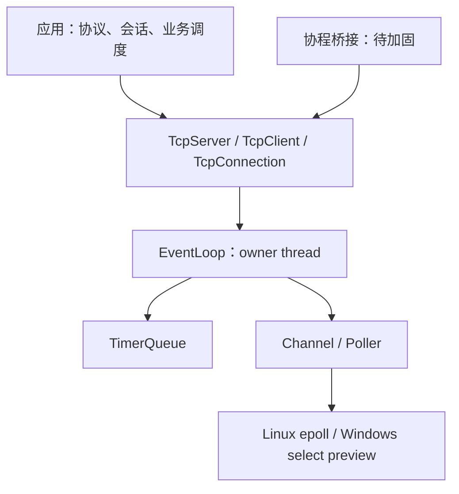

# Architecture Intent: Reactor Scope Reset

## 1. Intent

mini-trantor 的研发目标收敛为小型、可审计的 C++23 Reactor TCP 网络库。
本决策由 2026-09-12 项目审计及用户要求重新规划、裁剪偏离方向触发。
它替代 v2–v6、游戏网络 M1–M32 和旧执行清单中继续扩展功能面的计划。
版本编号和历史测试数量不能充当成熟度证明。

## 2. Responsibilities / Non-responsibilities

保留 EventLoop、Channel、Poller、Buffer、TCP 服务端/客户端、线程池、
TimerQueue、基础背压、轻量事件 hook，以及不绕过 EventLoop 的协程桥接。
TLS 是可选能力，DNS 和协程组合器暂按待加固能力维护；PacketFramer 是
无线程、无业务策略的字节工具。Linux 为主要验证平台，Windows select 为预览后端。

退出当前源码与安装接口：游戏 Session/Pipeline/LogicLoop、AOI/group 广播、
PayloadPool、游戏指标 exporter、HTTP/WebSocket/RPC 及其连接池、通用 transport
管理层、codec 生态、自研 KCP/UDP/PMTU/raw ICMP/FEC。历史实现以 Git 提交
`3eba368` 为恢复入口，不复制一套默认关闭却需要共同维护的运行时。
未来上层项目可通过 TCP 回调或字节接口接入；不得恢复对 core 的反向依赖。

## 3. Invariants

1. 默认构建和安装只包含当前支持范围；没有“实验标签但默认发布”的旁路。
2. TcpServer 只协调监听、连接与 worker 生命周期，不拥有玩家身份或广播路由。
3. 基础 MetricsHook 不声明 game/session/AOI 等业务类型。
4. 裁掉功能时一并撤下专属测试；保留能力的失败测试不得为通过率而删掉。
5. 测试的契约断言在 Debug 和 Release 中都必须生效。
6. 每项安全结论区分静态证据、实际复现和尚未验证。

## 4. Threading / Ownership / Lifecycle

保持 one-loop-per-thread、remove-before-destroy、跨线程 queueInLoop 规则。
TcpServer 的连接 map 属于 base loop；每条连接的状态、关闭回调和事件 hook
属于其 ioLoop。stop 必须先停止 accept，再将关闭工作投给各 owner loop，
最后退出并 join worker。用户事件回调允许发起 close/stop；遍历前必须转移
连接集合，避免重入修改正在遍历的 map。

协程帧销毁、DNS callbackLoop 生命周期、EventLoopThread 启停竞争属于
后续正确性阶段的阻塞项，不能由 scope 裁剪自动宣称解决。

## 5. Failure semantics

破坏性 API 裁剪发生于 0.1 开发期；旧应用需要保留旧提交或在应用层迁移。
不提供保留业务依赖的兼容空壳。TLS=OFF 不构建依赖 TLS 握手成功的测试。
平台未验证能力必须在文档和 CI 中明确，不能将编译成功描述为行为等价。

## 6. Contracts and review checklist

- CMake 包消费与源码范围检查阻止裁剪模块重新进入安装包。
- `tests/contract/event_loop/test_event_loop.cpp` 验证调度合同。
- `tests/contract/tcp_server/test_shutdown_ordering.cpp` 验证停服次序。
- 新增定向契约覆盖 owner-loop 关闭通知和通知次数。
- 全体保留的 contract/integration 测试继续运行，不以标签排除已有失败。
- 每次 core 变更仍回答所有权、重入、跨线程投递、测试映射五项 gate。

