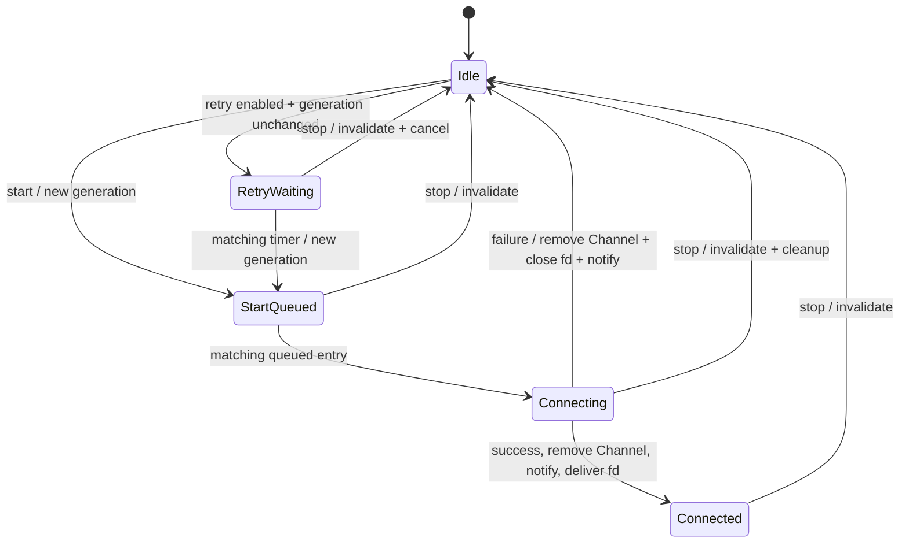
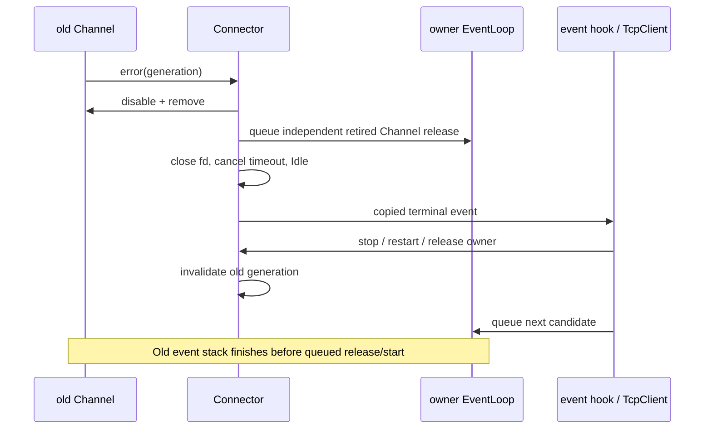

# Module Intent: Connector

## 1. Intent
Connector is the active-connect adapter for TcpClient,
symmetric to Acceptor's role for TcpServer.
It initiates non-blocking TCP connect, handles EINPROGRESS,
detects success or failure via writable-event polling,
and delivers the connected fd upward through a narrow callback boundary.

---

## 2. Responsibilities
- create a non-blocking socket and initiate connect
- handle EINPROGRESS by registering writable interest on a Channel
- detect connect completion or failure via getsockopt(SO_ERROR)
- deliver connected fd to upper layer (TcpClient) on the owner loop thread
- support configurable retry with backoff on connect failure
- clean up socket and Channel registration on failure, cancel, or destruction

---

## 3. Non-Responsibilities
- does not create TcpConnection
- does not own TcpClient or EventLoop
- does not implement application protocol logic
- does not perform DNS resolution
- does not manage post-connect I/O

---

## 4. Core Invariants
- Connector belongs to exactly one EventLoop
- Channel mutation happens only on the owner loop thread
- at most one connect attempt is in flight at any time
- start is always queued, including owner-thread calls; repeated start while
  queued, connecting, connected or waiting for retry is idempotent
- every queued start, readiness callback and timer belongs to one generation;
  stop/restart invalidates old work before cleanup or callback re-entry
- connected fd is either delivered upward or closed explicitly (no leak)
- retry backoff parameters are explicitly configurable
- construction validates ConnectorOptions; setRetryDelay rejects non-positive
  initial delay or a maximum smaller than the initial delay
- destruction removes Channel from Poller before releasing the socket
- a retired Channel is removed immediately and released by a separate owner-loop
  queue capture; its later release cannot reset a newer attempt's Channel

---

## 5. Collaboration
- owned by TcpClient
- uses Channel for writable-event notification during EINPROGRESS
- relies on EventLoop for Channel registration and timer-based retry delays
- delivers connected fd to TcpClient via a new-connection callback
- does not interact with TcpConnection directly

---

## 6. Threading Rules
- start() / stop() / restart() are owner-loop-thread-only operations
- Entry checks must precede phase or generation mutation; an off-owner call fails
  before changing connector state. Tests must marshal these calls explicitly.
- TcpClient marshals cross-thread calls through runInLoop before invoking
  Connector methods
- handleWrite / handleError (Channel callbacks) run on the owner loop thread
- retry timer callback runs on the owner loop thread
- event hooks may replace themselves, call start/stop/restart, or release the
  external Connector owner; dispatch holds an entry guard and a callback copy

---

## 7. Ownership Rules
- TcpClient owns Connector
- A Connector used for active attempts must be managed by shared_ptr; queued
  entries and readiness/timer callbacks acquire temporary guards from weak_ptr.
- Connector owns the connecting socket fd until it is delivered upward
  or closed on failure
- Connector owns its Channel registration during the connect attempt
- Channel must be removed before Connector destruction

---

## 8. Failure Semantics
- connect refused / network unreachable / timeout:
  close the socket, invoke error notification, optionally schedule retry
- EINTR during connect: retain the socket and observe completion through readiness
- getsockopt(SO_ERROR) non-zero after writable event: treat as connect failure
- self-connect detection (local addr == peer addr): close and retry
- destruction during pending connect: close socket, remove Channel, no callback;
  externally retained inert connectors may be released after the worker joins,
  but cleanup of live Channel/timers requires the living owner loop
- destruction during pending retry timer: cancel timer, no callback
- ConnectFailed / ConnectTimeout / SelfConnectDetected are terminal attempt
  notifications: fd is already closed, Channel removed, timeout cancelled and
  state() is kDisconnected before calling the hook
- options.enableRetry controls automatic retry independently of start/stop.
  It defaults to false. Retryable failures/self-connect/timeout schedule backoff
  only when the failure hook has not stopped or superseded that generation.
  Non-retryable immediate syscall errors are reported once without auto retry.
- socket creation failure is a terminal ConnectFailed too (including an
  unsupported address family); it must not terminate the process before a
  TcpClient can advance to the next DNS candidate
- Socket retains the fd while Channel and callback allocations prepare the
  registration. Ownership transfers only after registration. General Poller /
  TimerQueue allocation failure and reactor callback exception recovery remain
  part of the broader S1 exception-policy audit, not a completed strong guarantee.
- RetryScheduled fires after the timer is installed, so reentrant stop cancels it.
- ConnectSuccess fires after Channel removal and state publication, before fd
  delivery; stop/restart from this hook closes that old fd without delivering it
- restart cancels pending work and starts a fresh queued attempt, restoring the
  configured initial delay (including setRetryDelay), not a hardcoded default

---

## 9. State Machine
The public state remains a compact view:
- **kDisconnected**: idle, start queued, or retry waiting; no active socket/Channel
- **kConnecting**: attempt entered; ConnectAttempt runs before socket creation,
  followed by connect and writable registration when still current
- **kConnected**: successful socket removed from Poller; ConnectSuccess runs before
  the explicit fd transfer, and may stop/restart to reject that old success

Transitions:
- kDisconnected → kConnecting: start() called
- kConnecting → kConnected: writable event with SO_ERROR == 0
- kConnecting → kDisconnected: connect failure (with optional retry timer)
- kConnected → kDisconnected: stop() called (upper layer manages the connection)
- any state → kDisconnected: destruction

Internally Idle, StartQueued and RetryWaiting all report kDisconnected.
StartQueued enters Connecting before ConnectAttempt is dispatched. A stop in
that hook invalidates the generation before any socket is created. Reentrant
restart queues a fresh generation; it never recursively connects on that stack.

---

## 10. Extension Points
- pluggable backoff strategy (exponential, linear, fixed, no-retry)
- future coroutine-based connect awaitable
- future connection timeout via EventLoop timer

---

## 11. Test Contracts
- start() initiates non-blocking connect on owner loop thread
- successful connect delivers fd through callback on owner loop thread
- connect failure triggers retry with configured backoff delay
- stop() during pending connect closes socket and removes Channel
- stop() during pending retry cancels timer
- destroy during kConnecting state does not leak fd
- self-connect is detected and triggers retry
- no callback fires after destruction
- disabled retry emits one terminal event and no RetryScheduled
- failure hooks observe disconnected state and may stop/restart safely
- ConnectAttempt hook stop prevents socket creation and success notification
- stopping a RetryScheduled hook leaves no timer retaining the Connector
- a retry timer actually starts the next attempt; restart from RetryScheduled
  cancels the prior timer before the replacement attempt is queued
- repeated start, stop/start and restart cannot resurrect stale readiness/timers
- replacing an event or new-connection callback keeps its current captures alive
- `tests/contract/connector/test_connector_reentry.cpp` exercises these contracts
  through bound/refused and listening local endpoints on Linux and Windows

## 11.1 Core change gate (S1 callback boundary)
1. Owner: one EventLoop thread owns phase, generations, Channel and timers.
2. Ownership: callers own Connector; queued/readiness/timer callbacks borrow it
   through weak_ptr and hold a temporary entry guard. Retired Channel queue
   captures own only that removed Channel. Connected fd transfers at delivery.
3. Re-entry: event/new-connection callbacks may stop/restart/replace callbacks or
   release external owners. New attempts are queued and old generations reject.
4. Cross-thread: no new path; callers marshal start/stop/restart to the owner.
5. Tests: test_connector_reentry.cpp plus the retained test_connector.cpp retry,
   pending stop, callback delivery and wrong-thread contracts.

---

## 12. Review Checklist
- Is Connector still a thin connect adapter without business logic?
- Is the connecting Channel removed on the correct thread?
- Are connect failures explicit rather than silently dropped?
- Can connected fds leak on callback absence, failure, or teardown?
- Is the state machine transitions complete and documented?
- Is backoff configuration explicit and not buried in implementation?
