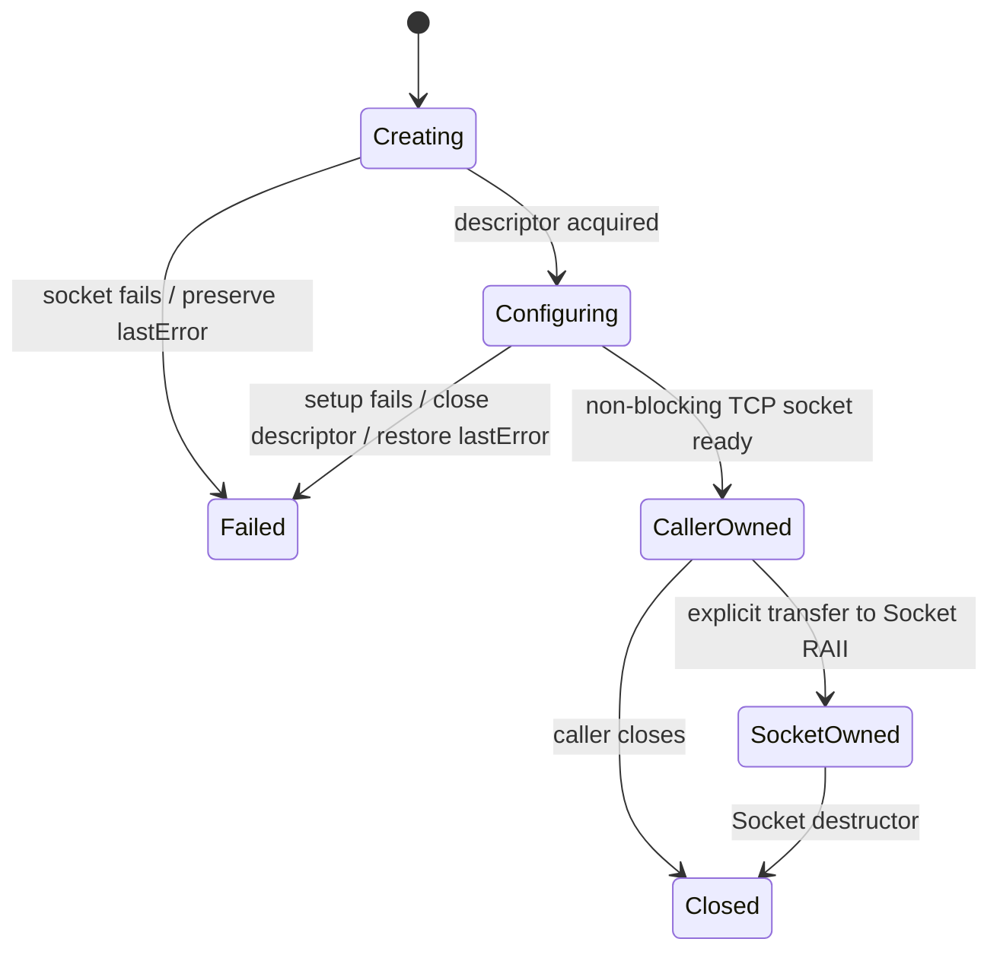

# Module Intent: Platform Runtime Boundary

## Intent

Platform runtime boundary isolates operating-system differences required by the
reactor core while keeping `EventLoop`, `Channel`, `TcpConnection`, and protocol
layers backend-neutral.

Linux and Windows may use different socket handles, wakeup primitives, and
poller backends, but they must expose the same owner-loop scheduling semantics
to upper layers.

This module is not a scheduler.
This module is not a connection lifecycle owner.
This module is not business logic.

---

## Responsibilities

- Define platform socket handle aliases through `mini/net/platform/SocketTypes.h`.
- Implement `SocketsOps` behind the stable public `mini/net/SocketsOps.h` entry.
- Create, write, drain, and close EventLoop wakeup descriptors per platform.
- Host concrete poller backends under `mini/net/poller/`.
- Select the default poller backend at build time through `Poller::newDefaultPoller()`.
- Keep unsupported platform capabilities explicit.

---

## Non-Responsibilities

- Does not own `EventLoop`, `Channel`, `Socket`, or `TcpConnection`.
- Does not invoke user callbacks.
- Does not choose thread-pool scheduling or connection placement.
- Does not hide cross-thread operations from `EventLoop::queueInLoop()`.
- Does not restore retired UDP/PMTU capabilities or expand the supported core scope.

---

## Core Invariants

- Public reactor semantics stay identical across Linux and Windows.
- `EventLoop` owns wakeup descriptors and closes them after removing the wakeup Channel.
- `Poller` observes `Channel` and never owns it.
- Platform socket functions never transfer ownership implicitly.
- `createNonblocking(family)` either returns a non-blocking TCP socket owned by
  its caller, or returns `kInvalidSocket` with the platform failure available
  through `lastError()` on that calling thread. Linux also sets close-on-exec.
- Failed non-blocking setup releases any partially created socket before returning,
  without replacing the original failure with a cleanup error.
- Platform-specific code must not leak backend event constants into user-facing APIs.
- Compatibility headers may forward old include paths, but implementation belongs in
  `platform/` or `poller/`.

---

## Collaboration

- `EventLoop` calls `platform::createWakeupFds()`, `writeWakeup()`, and `drainWakeup()`.
- `Socket`, `Acceptor`, `Connector`, `TcpConnection`, and DNS paths call
  `sockets::*` through the stable public header.
- `PollerFactory` chooses `SelectPoller` on Windows and `EPollPoller` on Linux.
- CMake selects exactly one socket implementation, one wakeup implementation, and
  one concrete poller backend for the target platform.

---

## Threading Rules

- Platform wakeup functions are part of the EventLoop cross-thread scheduling path.
- Unregistered socket creation is thread-neutral; the caller owns the returned
  descriptor and decides when to hand it to a loop-owned `Socket` or `Channel`.
- Registered descriptor creation and close follow the EventLoop owner lifecycle.
- Cross-thread wakeup writes are allowed only through `EventLoop::wakeup()`.
- Poller backend mutation remains owner-thread only.
- Synchronous capability queries may be thread-neutral only when they do not touch
  loop-owned descriptors.

---

## Ownership Rules

- `EventLoop` owns wakeup descriptors.
- `Socket` owns `SocketFd` unless `releaseFd()` explicitly transfers it.
- `Poller` owns only its backend kernel object, not `Channel`.
- `SocketsOps` functions observe descriptors passed by callers unless the function
  name explicitly creates or closes one.
- Windows WinSock process initialization is owned by the platform socket runtime.

---

## Failure Semantics

- `createNonblocking` reports socket creation or non-blocking setup failures to
  the caller. Unsupported address families are recoverable, allowing a TCP
  connection attempt to try its next resolved address candidate.
- `createNonblockingOrDie` delegates to that operation and retains its existing
  fail-fast policy; other fatal socket or poller setup entries remain unchanged.
- Windows process-wide WinSock initialization retains its existing fail-fast
  policy. The recoverable result applies after that runtime is initialized.
- Unsupported platform features must be reported as unsupported, not emulated
  silently.
- Would-block and interrupted errors must normalize to stable helper predicates.
- Wakeup drain failure is logged by `EventLoop` without changing callback ordering.

---

## Test Contracts

- `tests/contract/event_loop/test_event_loop.cpp` verifies wakeup and queued functor
  semantics.
- `tests/contract/poller/test_poller_contract.cpp` verifies backend-neutral poller
  registration behavior when enabled on the platform.
- TCP client/server/connection contract tests verify socket operation behavior
  through the public path.
- `tests/contract/net/test_socket_creation.cpp` verifies successful IPv4 TCP
  creation, non-blocking accept without a pending peer, invalid-family error
  preservation, and Linux non-blocking/close-on-exec descriptor flags.
- Windows VS2026 workflow verifies the Windows source selection and SelectPoller path.
- Linux CI/builds verify the Linux source selection and EPollPoller path.

---

## Review Checklist

- Does the change keep platform code under `mini/net/platform/` or `mini/net/poller/`?
- Does the public include path remain stable when practical?
- Which loop/thread owns the affected descriptors?
- Who owns and releases each descriptor/backend handle?
- Which callbacks may re-enter after platform events are translated?
- Which operations are allowed cross-thread, and are they still marshaled by EventLoop?
- Which test file verifies the behavior on each platform?

## Socket Creation Lifecycle

Linux performs creation and flag setup atomically in `socket`; Windows performs
the non-blocking setup after creation. No callback or loop registration happens
within this operation.

## Socket Creation Change Gate

1. **Owner thread:** creation is synchronous on the caller thread; once registered,
   the descriptor follows its Channel's owner-loop rules.
2. **Ownership/release:** success transfers the newly created descriptor explicitly
   to the caller; setup failure releases its temporary descriptor internally.
3. **Re-entry:** this operation invokes no user callbacks.
4. **Cross-thread:** separate unregistered sockets may be created independently;
   this grants no cross-thread access to a loop-owned socket. The reported error
   must be read on the same thread before another socket operation overwrites it.
5. **Contract:** `tests/contract/net/test_socket_creation.cpp` covers the public
   recoverable creation API on Linux and Windows.
